# 零散业务

网点电话：22818205

网店邮箱：gddgnczhyyb@gd.icbc.com.cn

## 打印回单

2387，选择**未打印**，如果是**已打印**需要主管授权（？）

## 打印流水

1334

## 9892

9144企业

9244个体工商户

## 查找地区或网点：

1032查找地区

1013查找网点

**以下是南城网点号：**

| 网点号   | 网点             | 电话     |
| -------- | ---------------- | -------- |
| 450      | 新基             |          |
| 206      | 东江之星（银丰） |          |
| 226      | 阳光             |          |
| 579      | 宏图             |          |
| 676      | 袁屋边           | 26997958 |
| 282      | 中信             |          |
| 161      | 金丰             |          |
| 1219     | 宏伟             |          |
| 211(581) | 营业部（元美）   | 22818205 |
| 213      | 分行营业部       | 22330261 |

**尽调与业务办理顺序**

若客户身份证能读取可先办业务再尽调，否则需要先尽调再办理业务

**客户电话询问信息**

公司员工也不能查询公司的有关信息，需要携带身份证、营业执照来现场查询信息。

# 变更

## 开始必做

**一般情况客户需要准备的材料：** 

- 营业执照[正本/副本]
- 法人身份证
- 代办身份证
- 《基本存款账户信息》[**基本户**]/《开户许可证》[**一般户**]
- 公司章程[**有限公司**，开户和变更才需要]
- 法人私章[更换法人需带新旧章]/法人签名[法人办理]
- 财务专用章
- 《登记许可证》/《核准通知书》[**工商局开具的变更证明**]
- 若公司已注销，需提供**《核准销户通知书》**（工商局注销后营业执照会被收回，由工商局出具）(《清税证明》：清完税才能销营业执照)，未注销提供**营业执照**

**特殊情况：**

- 若是公司来的是**分公司**，那么**营业执照、开户许可证、法人身份证、变更登记通知书**需要盖**总公司**的公章。
- **销户**可以先审批，可以寄材料，要先盖好章（怎么个先寄？）【收件地址：莞太路39号，东莞工行对公柜台，便签写上联系方式，需要2-3周】
- 若本网点是基本户，销户要先销掉一般户，正式销户的时候可以把账户的钱取出来
- 若客户已经在工商局注销：
  - 营业执照未注销：《登记通知书》+营业执照
  - 已注销：《登记通知书》+《清税证明》。**提供7572是否控制账户**，未控制需要截图**工商信息（吊销/注销）**以及特殊凭证。

### 7572

输入账户账号，查看是否被管控测试

### 7569

查看账户状态

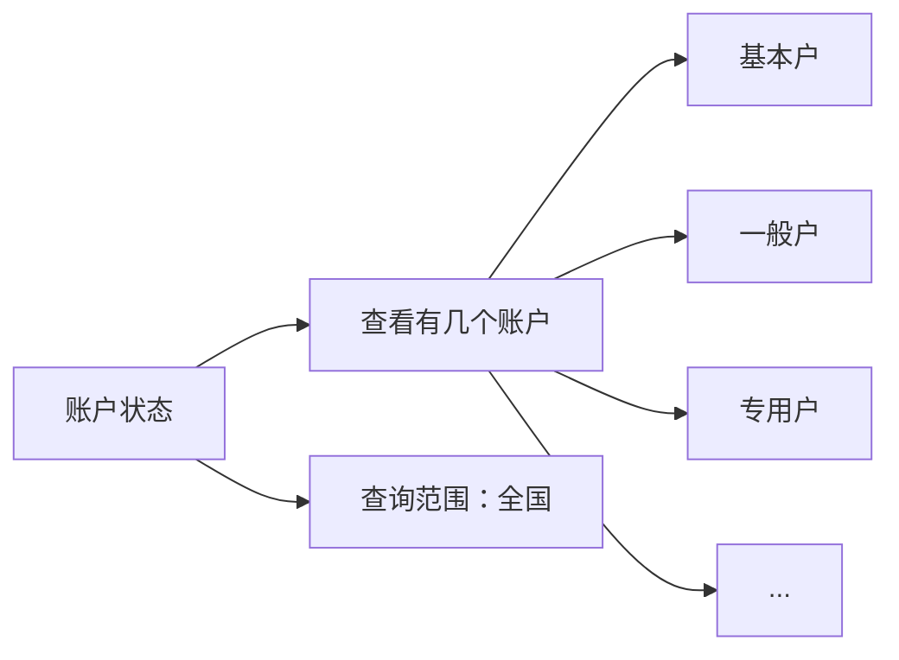

### 4102

输入账号，核对账户信息

工商网查询历史变更信息，系统和工商后面显示不出来对不了查看人行

### 7646（系统可能会自动跳转到该代码界面）

在身份证复印件上打印联网核查信息。**低于85%-90%**或者**返回黑白照片**要辅助证件

- 若公安系统返回的照片和芯片读取的照片不同，检查身份证有效期：
  - 没过期且系统是旧的身份证照片而客户带的是新的身份证，拨打**010-68775537**让公安更新照片（永久解决）或者提供辅助证件（先暂时用来办业务）
  - 没过期系统是新的身份证照片而客户带的是旧的身份证，不能办理

**辅助证件：**

| 户口本 | 机动车驾驶证 | 居住证 | 社会保障卡 | 护照 |
| ------ | ------------ | ------ | ---------- | ---- |
|        |              |        |            |      |
|        |              |        |            |      |
|        |              |        |            |      |

## 零散的注意点

### 一般会涉及的费用：

如果客户不来销户，系统会自动批量销掉已在工商局销户的账户，但时间未知，可以暂时不来销户，年费会一直产生，最后来销户时需要将费用一次性补齐。

| U盾                                     | 变更印鉴                                                     | 财智卡        | 网银      |
| --------------------------------------- | ------------------------------------------------------------ | ------------- | --------- |
| 年费￥100                               | 变更手续费￥100                                              | 一年费用￥360 | 年费￥100 |
| 每半年手续费￥5，默认备注方式为**记账** | ￥50硬件变更手续费（有撤销回执或者完整章）￥200（不能提供挂失印鉴，并由银行出具公函） |               |           |
| 每季度对账                              | 公章遗失要登报且全体股东面签；法人私章遗失法人面前           |               |           |

费用收取：

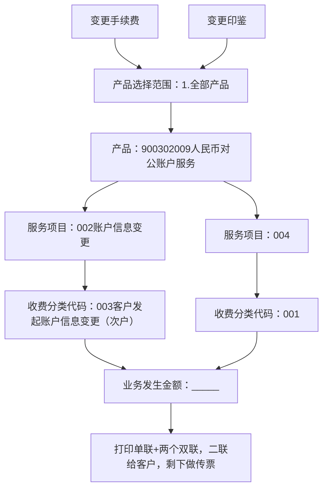

### 资料盖章

| 《财智账户卡业务申请书》 | 企业电子银行变更（注销）事项申请》 | 《撤销银行账户申请》 | 《企业客户证书业务申请书》 |
| ------------------------ | ---------------------------------- | -------------------- | -------------------------- |
| 一联盖章                 | 三联盖章                           | 一联盖章             | 一联盖章                   |
| 公章，财务章，法人私章   | 公章，财务章，法人私章             | 公章，法人私章       | 公章，财务章，法人私章     |

## 变更业务

**长期不动户**只有变更户名才需要先解长期不动户；其余可以先做变更业务再去解。

**特殊长期不动户**不会影响变更户名，可以先变更后解锁。

| 特殊长期不动户                                               | 长期不动户                                                   |
| ------------------------------------------------------------ | ------------------------------------------------------------ |
| 一年（含）以上未发生资金收付活动。但因业务需要，经账户营销部门批准不再按照有关参数值来检测设置不动户标志的单位银行结算账户 | 一年以上未发生资金收付活动，超过30天销户通知期且未办理销户手续的人民币单位银行结算账户 |
| （1）贷款专户 （2）账户余额超过五万元（含） （3）客户证券保证金账户 （4）优质、有潜力或业务的发展需要的客户的账户 （5）武警、军队客户开立的账户 （6）其他特殊用途的往来户 |                                                              |

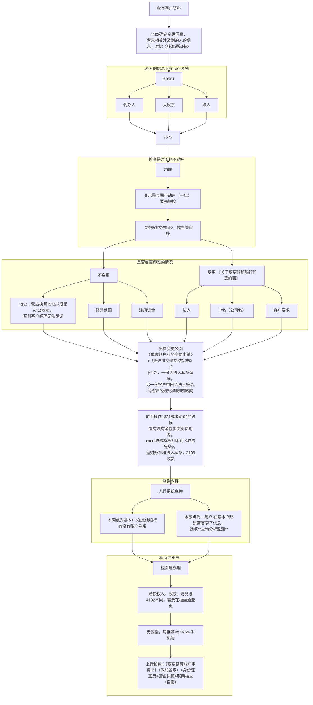

### 变更预留印鉴

在柜面通办理变更时会有一个联动变更印鉴，信息是最新的，但若印出来的卡作废，那么自行印出来的信息是旧的，无法办理。

**需办理材料：**

- 《关于变更预留银行印鉴的函》x2（一份留档，一份给印鉴中心）
- 《银行账户估算授权书》(法人亲办不用)
- 《收款凭证》单据（现金/转账变印鉴不用盖）

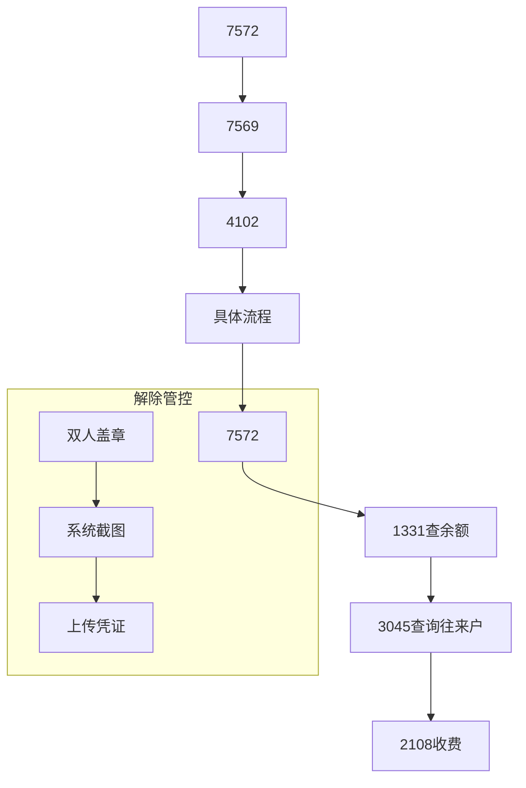

## U盾相关

- 若当场无法重置密码去对账，打印《补打银企对账申请书》，盖公章，我方向对账中心申请发送账单到客户邮箱完成对账
- 若客户使用U盾对账（网银对账），那就无法使用财智卡在智能终端机对账
- 网银可以自行修改U盾持有人、密码、手机号码

### 重置U盾密码

客户的U盾查找后显示证书过期，需要更换U盾。

客户说网银转账失败，先查三个代码，如果都没问题，就有以下两个方法解决

| 重置证书密码                 | 重新购买一个U盾证书   |
| ---------------------------- | --------------------- |
| 柜面通办理，输入八位数新密码 | 16.48                 |
| 办完立即生效                 | 需要走审批和95588回访 |

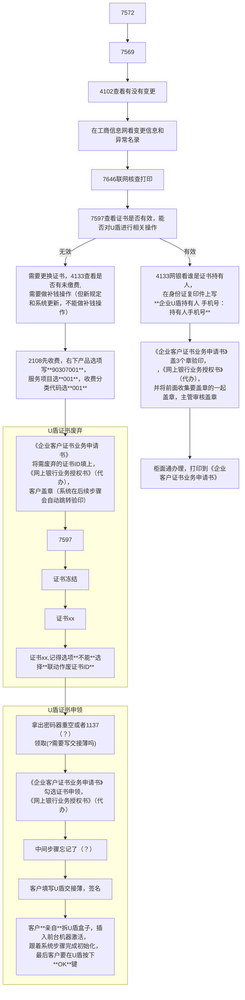

## 开卡业务

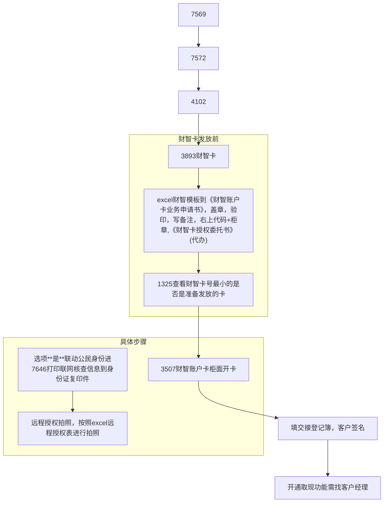

## 销户

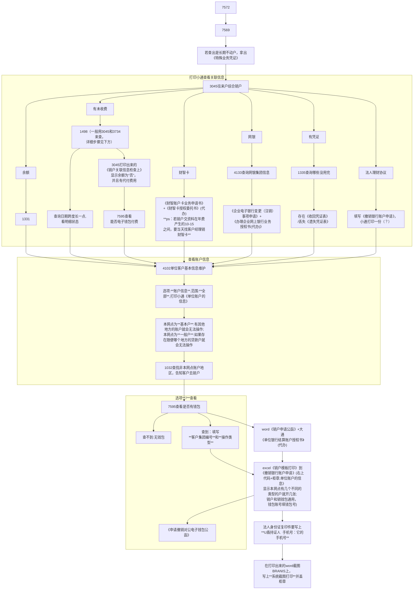

### 未缴费解决

对于查询未缴费，有两种方法：

| 方法一                                                       | 方法二                                                       |
| ------------------------------------------------------------ | ------------------------------------------------------------ |
| 3045查询“有尚未代付的对公收费”                               | 1498查询所有未交费用，**一般不用1498而是分成3045和3734来查**，1498主要用于在使用现金收费后去作废欠费记录的作用 |
| 3734查询“存在尚未收取的产品化对公付费明细”                   |                                                              |
| **最后**，这两个的费用都要写在3045打印的《销户关联信息检查上》 |                                                              |

如果3045打印出来的《销户关联信息检查上》显示余额为“否”，并且有代付费用，

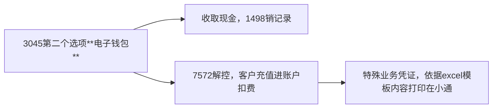

### 销户原因选择：

| 营业执照注销 | 基本户变更为一般户 | 其他情况 | 注销该银行账户 | 公司注销 |
| ------------ | ------------------ | -------- | -------------- | -------- |
| 关闭         | 转户               | 其他     | 账户不使用     | 公司注销 |

销户完成会打电话通知客户，客户也可以直接打电话过来。

销户收齐资料后交给主管。

### 最终销户

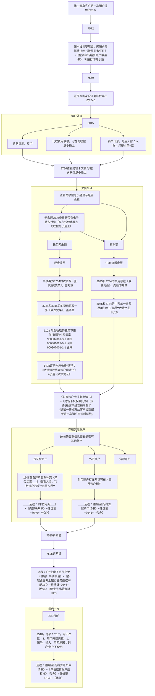

销支票-正常处理

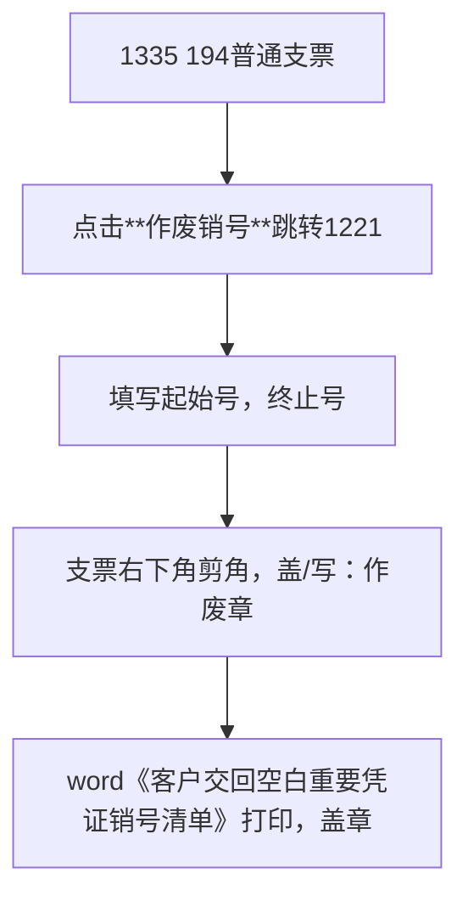

完成业务后打印传票：

《撤销银行结算账户申请书》

身份证7646

基本户开户许可证

市场监督局登记通知书/营业执照

《账户业务意愿核实书》（可无

机构信用代码证注销申请/营业执照

《销户申请书》

联络票（？

支款凭条（若有

## 调额

- 长期不用余额为0，若要网银调额需要账户有资金进入，有流水

- 调额按单笔的两倍或者按照余额作为参照

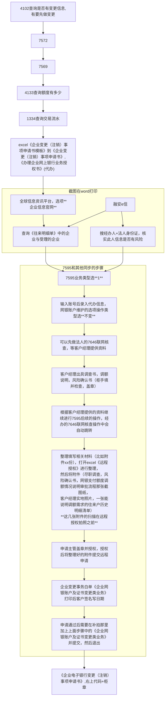

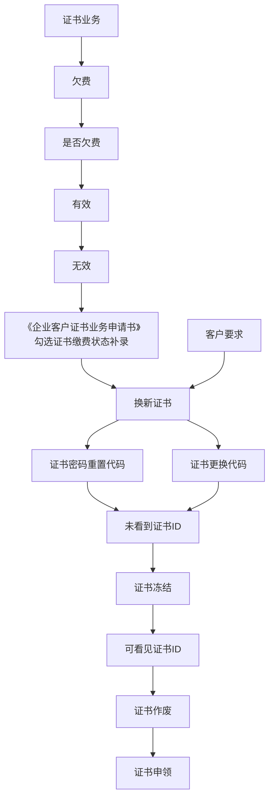

## 解控

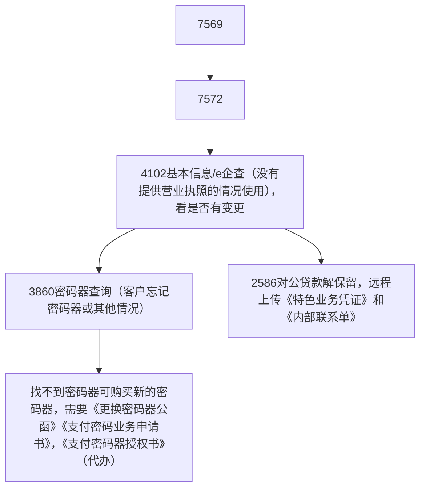

## 社保回单

点击**yhtview**，十日十日的搜

## 企业联网核查

客户经理发客户信息，7892进行企业信息联网核查，一页打印三个

# 支票 

## 支票购买

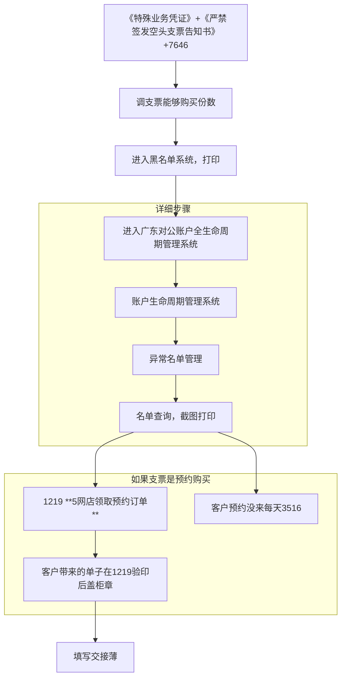

