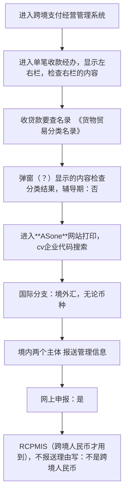
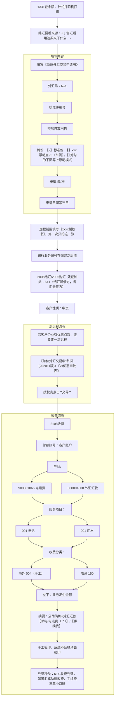

# 外汇

**ICBK(工行)CN(国家)BJ(北京)DG(东莞)**

```mermaid
graph TD
	A["进入跨境支付经营管理系统"]
	B["进入单笔收款经办，显示左右栏，检查右栏的内容"]
	C["收贷款要查名录  《货物贸易分类名录》"]
	D["弹窗（？）显示的内容检查分类结果，辅导期：否"]
	E["进入**ASone**网站打印，cv企业代码搜索"]
	F["国际分支：境外汇，无论币种"]
	G["境内两个主体  报送管理信息"]
	H["网上申报：是"]
	I["RCPMIS（跨境人民币才用到），不报送理由写：不是跨境人民币"]
	
	A --> B --> C --> D --> E --> F --> G --> H --> I
	
```

## 收费

```mermaid
graph TD
	A["1331查余额，针式打印机打印"]
	B["结汇要看来源：+；售汇看用途买来干什么：-"]
	C["填写《单位外汇交易申请书》"]
	D["外汇局：N/A"]
	E["核准件编号"]
	F["交易日写当日"]
	G["牌价  【√】标准价  【】xxx  浮动点95（举例）。打对勾的下面写上浮动模式"]
	H["审批  美/港"]
	I["申请日期写当日"]
	J["远程前要填写《xxxx授权书》，第一次只拍这一张"]
	K["银行业务编号在做完之后填"]
	L["2006结汇/2005购汇  凭证种类：641（结汇是借方，售汇是贷方）"]
    M["客户性质：中资"]
    N["若客户企业有优惠点数，还要走一次远程"]
    O["《单位外汇交易申请书》(202011版)+《xx优惠审批表》"]
    P["授权完点击**交易**"]
    Q["2108收费"]
    R["付款账号：客户账户"]
    S["产品:"]
    T["900301066 电讯费"]
    U["000004008 外汇汇款"]
    V["服务项目："]
    W["001 电讯"]
    X["001 汇出"]
    Y["收费分类："]
    Z["境外 004（手工）"]
    a["电讯 150"]
    b["左下：业务发生金额"]
    c["摘要：公司简称+外汇汇款【邮电/电讯费（？）】/【手续费】"]
    d["手工验印，系统不会联动去验印"]
    e["凭证种类：614 收费凭证，如果汇成功就收费，手续费三章小双联"]
    
	
	A --> B --> C
	
	subgraph 填写内容
		C --> D --> E --> F --> G --> H --> I
	end
	
	I --> J --> K --> L --> M --> N
	
	subgraph 走远程流程
		N --> O --> P
	end
	
	P --> Q
	
	subgraph 收费流程
		Q --> R --> S --> T --> V --> W --> Y --> Z --> b
		S --> U --> V --> X --> Y --> a --> b --> c --> d--> e
	end
	
	
```

