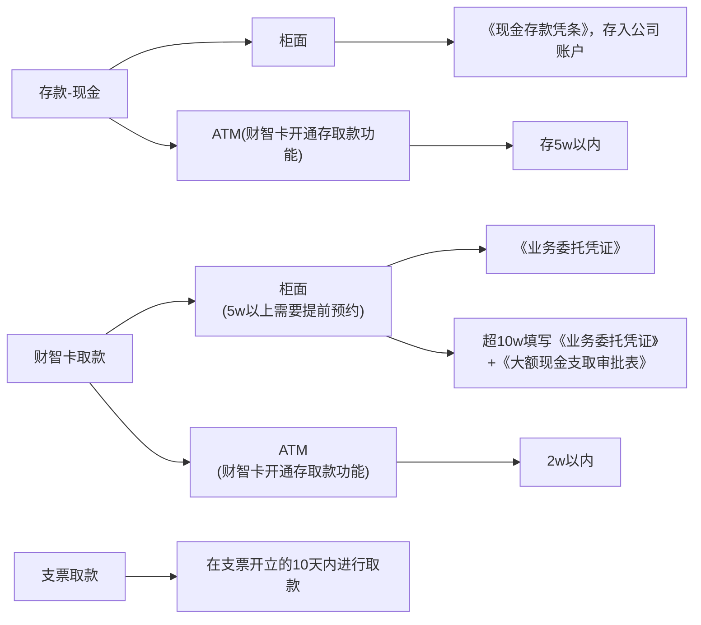
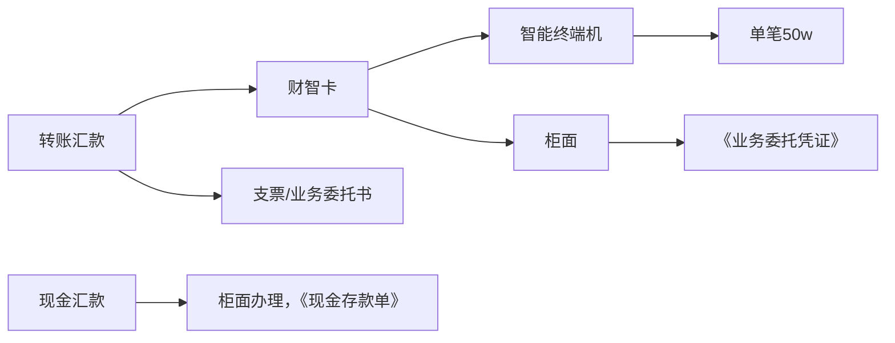

# 大堂对公

对公账户主要分为基本户、一般户、专用账户和临时账户

- 基本户：可取现
- 一般户：不可取现

- 专用账户：部分可开通取现功能，但是需要人民银行核准，一般为预算单位的零余额账户
- 临时账户：工程类的临时账户可开通取现功能，也需人民银行核准，很少存在开通取现功能的临时账户

## 对公(公司)存取款

```mermaid
graph LR
	A["存款-现金"]
	B["柜面"]
	C["《现金存款凭条》，存入公司账户"]
	D["ATM(财智卡开通存取款功能)"]
	E["存5w以内"]
	F["财智卡取款"]
	G["柜面<br>(5w以上需要提前预约)"]
	H["《业务委托凭证》"]
	I["超10w填写《业务委托凭证》+《大额现金支取审批表》"]
	J["ATM<br>(财智卡开通存取款功能)"]
	K["2w以内"]
	L["支票取款"]
	M["在支票开立的10天内进行取款"]
	
	A --> B --> C
	A --> D --> E
	F --> G --> H
	G --> I
	F --> J --> K
	L --> M
```

## 对公(公司)汇款

```mermaid
graph LR
	A["转账汇款"]
	B["财智卡"]
	C["智能终端机"]
	D["单笔50w"]
	E["柜面"]
	F["《业务委托凭证》"]
	G["支票/业务委托书"]
	H["现金汇款"]
	I["柜面办理，《现金存款单》"]
	
	A --> B --> C --> D
	B --> E --> F
	A --> G
	H --> I
	
	
```

## 