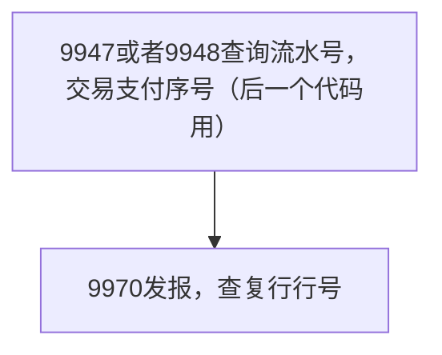
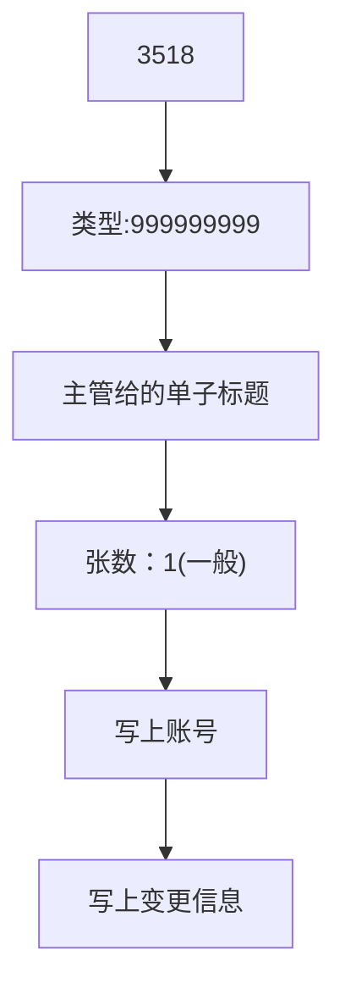

# 财政

## 发报

```mermaid
graph TD
	A["9947或者9948查询流水号，交易支付序号（后一个代码用）"]
	B["9970发报，查复行行号"]
	A --> B
```

## 变更操作员信息

```mermaid
graph TD
	A["3518"]
	B["类型:999999999"]
	C["主管给的单子标题"]
	D["张数：1(一般)"]
	E["写上账号"]
	F["写上变更信息"]
	
	A --> B --> C --> D --> E --> F
```

