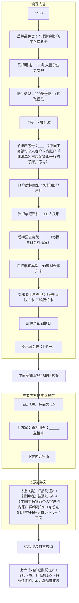
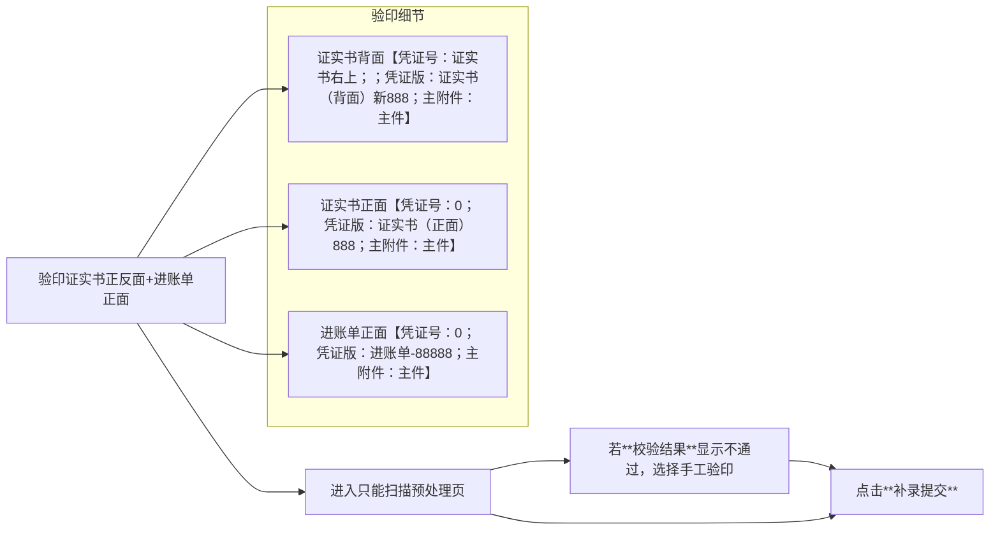

# 质押

## 质押大额存单贷款

# 定期支取

**业务集中**成功后打印6068，6066接收信息

**影像名称:证实书（背面）_新96**

| 大类：27-单位定期/通知/协议存款 | 小类：96-单位定期/通知/协议存款支取 |
| ------------------------------- | ----------------------------------- |
| 印密标志                        | 2.图章印鉴                          |
| 摘要                            | 0-正常                              |
| 证实书号                        | 证实书右上                          |
| 支取金额                        | 看单据                              |
| 收款人类型                      | 1-系统内账户                        |

**影像名称:广东支票新**

| 大类：27-单位定期/通知/协议存款 | 小类：95-单位定期/通知/协议存款存入 |
| ------------------------------- | ----------------------------------- |
| 存款种类                        | 1.单位定期                          |
| 结息方式                        | 1.利随本清                          |
| 许可证序号                      | ？                                  |
| 利率变动方式                    | 1.固定利率                          |
| 本金入账账户本他行标志          | 1.本行                              |
| 本金入账账号                    | 支票上写的出票人账号                |