# 零散业务

网点电话：22818205

网店邮箱：gddgnczhyyb@gd.icbc.com.cn

## 打印回单

2387，选择**未打印**，如果是**已打印**需要主管授权（？）

## 打印流水

1334

## 9892

9144企业

9244个体工商户

## 查找地区或网点：

1032查找地区

1013查找网点

**以下是南城网点号：**

| 网点号   | 网点             | 电话     |
| -------- | ---------------- | -------- |
| 450      | 新基             |          |
| 206      | 东江之星（银丰） |          |
| 226      | 阳光             |          |
| 579      | 宏图             |          |
| 676      | 袁屋边           | 26997958 |
| 282      | 中信             |          |
| 161      | 金丰             |          |
| 1219     | 宏伟             |          |
| 211(581) | 营业部（元美）   | 22818205 |
| 213      | 分行营业部       | 22330261 |

**尽调与业务办理顺序**

若客户身份证能读取可先办业务再尽调，否则需要先尽调再办理业务

**客户电话询问信息**

公司员工也不能查询公司的有关信息，需要携带身份证、营业执照来现场查询信息。

# 变更

## 开始必做

**一般情况客户需要准备的材料：** 

- 营业执照[正本/副本]
- 法人身份证
- 代办身份证
- 《基本存款账户信息》[**基本户**]/《开户许可证》[**一般户**]
- 公司章程[**有限公司**，开户和变更才需要]
- 法人私章[更换法人需带新旧章]/法人签名[法人办理]
- 财务专用章
- 《登记许可证》/《核准通知书》[**工商局开具的变更证明**]
- 若公司已注销，需提供**《核准销户通知书》**（工商局注销后营业执照会被收回，由工商局出具）(《清税证明》：清完税才能销营业执照)，未注销提供**营业执照**

**特殊情况：**

- 若是公司来的是**分公司**，那么**营业执照、开户许可证、法人身份证、变更登记通知书**需要盖**总公司**的公章。
- **销户**可以先审批，可以寄材料，要先盖好章（怎么个先寄？）【收件地址：莞太路39号，东莞工行对公柜台，便签写上联系方式，需要2-3周】
- 若本网点是基本户，销户要先销掉一般户，正式销户的时候可以把账户的钱取出来
- 若客户已经在工商局注销：
  - 营业执照未注销：《登记通知书》+营业执照
  - 已注销：《登记通知书》+《清税证明》。**提供7572是否控制账户**，未控制需要截图**工商信息（吊销/注销）**以及特殊凭证。

### 7572

输入账户账号，查看是否被管控测试

### 7569

查看账户状态

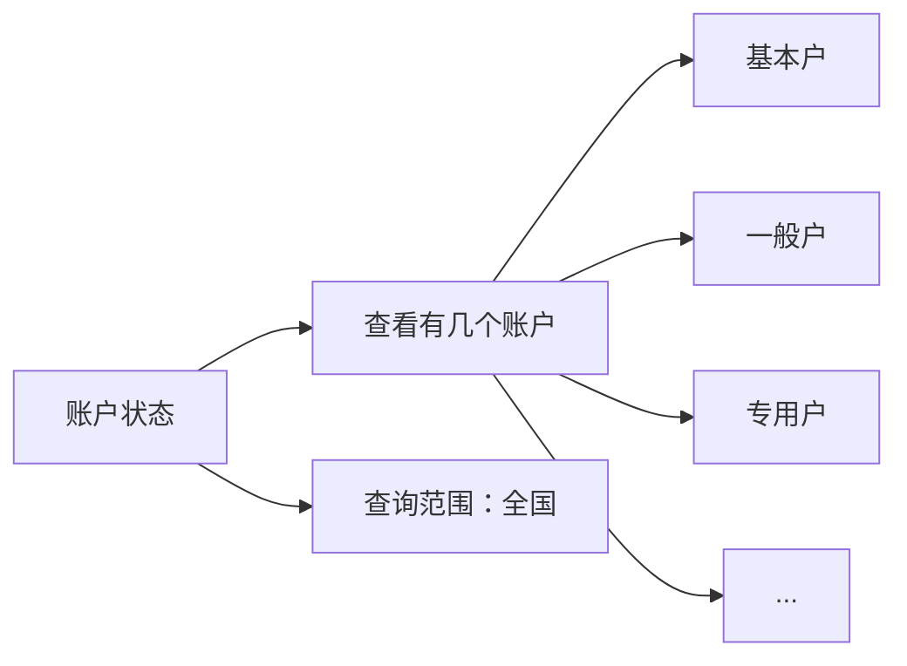


### 4102

输入账号，核对账户信息

工商网查询历史变更信息，系统和工商后面显示不出来对不了查看人行

### 7646（系统可能会自动跳转到该代码界面）

在身份证复印件上打印联网核查信息。**低于85%-90%**或者**返回黑白照片**要辅助证件

- 若公安系统返回的照片和芯片读取的照片不同，检查身份证有效期：
  - 没过期且系统是旧的身份证照片而客户带的是新的身份证，拨打**010-68775537**让公安更新照片（永久解决）或者提供辅助证件（先暂时用来办业务）
  - 没过期系统是新的身份证照片而客户带的是旧的身份证，不能办理

**辅助证件：**

| 户口本 | 机动车驾驶证 | 居住证 | 社会保障卡 | 护照 |
| ------ | ------------ | ------ | ---------- | ---- |
|        |              |        |            |      |
|        |              |        |            |      |
|        |              |        |            |      |

## 零散的注意点

### 一般会涉及的费用：

如果客户不来销户，系统会自动批量销掉已在工商局销户的账户，但时间未知，可以暂时不来销户，年费会一直产生，最后来销户时需要将费用一次性补齐。

| U盾                                     | 变更印鉴                                                     | 财智卡        | 网银      |
| --------------------------------------- | ------------------------------------------------------------ | ------------- | --------- |
| 年费￥100                               | 变更手续费￥100                                              | 一年费用￥360 | 年费￥100 |
| 每半年手续费￥5，默认备注方式为**记账** | ￥50硬件变更手续费（有撤销回执或者完整章）￥200（不能提供挂失印鉴，并由银行出具公函） |               |           |
| 每季度对账                              | 公章遗失要登报且全体股东面签；法人私章遗失法人面前           |               |           |

费用收取：

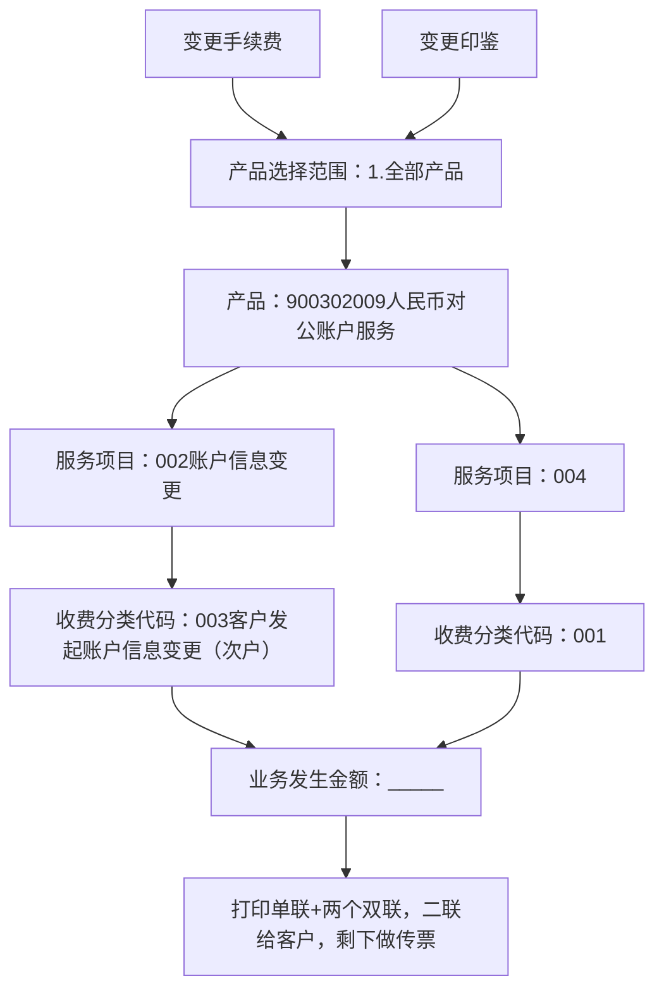


### 资料盖章

| 《财智账户卡业务申请书》 | 企业电子银行变更（注销）事项申请》 | 《撤销银行账户申请》 | 《企业客户证书业务申请书》 |
| ------------------------ | ---------------------------------- | -------------------- | -------------------------- |
| 一联盖章                 | 三联盖章                           | 一联盖章             | 一联盖章                   |
| 公章，财务章，法人私章   | 公章，财务章，法人私章             | 公章，法人私章       | 公章，财务章，法人私章     |

## 变更业务

**长期不动户**只有变更户名才需要先解长期不动户；其余可以先做变更业务再去解。

**特殊长期不动户**不会影响变更户名，可以先变更后解锁。

| 特殊长期不动户                                               | 长期不动户                                                   |
| ------------------------------------------------------------ | ------------------------------------------------------------ |
| 一年（含）以上未发生资金收付活动。但因业务需要，经账户营销部门批准不再按照有关参数值来检测设置不动户标志的单位银行结算账户 | 一年以上未发生资金收付活动，超过30天销户通知期且未办理销户手续的人民币单位银行结算账户 |
| （1）贷款专户<br>（2）账户余额超过五万元（含）<br>（3）客户证券保证金账户<br>（4）优质、有潜力或业务的发展需要的客户的账户<br>（5）武警、军队客户开立的账户<br>（6）其他特殊用途的往来户 |                                                              |

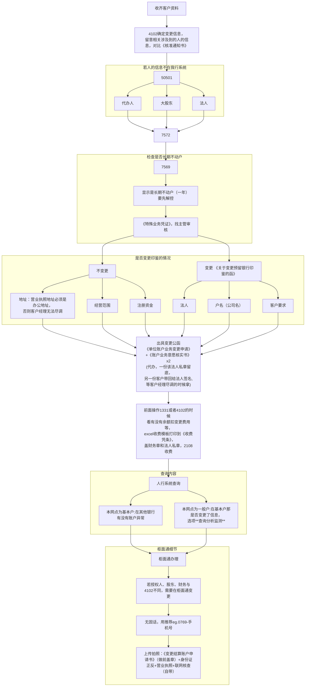

### 变更预留印鉴

在柜面通办理变更时会有一个联动变更印鉴，信息是最新的，但若印出来的卡作废，那么自行印出来的信息是旧的，无法办理。

**需办理材料：**

- 《关于变更预留银行印鉴的函》x2（一份留档，一份给印鉴中心）
- 《银行账户估算授权书》(法人亲办不用)
- 《收款凭证》单据（现金/转账变印鉴不用盖）

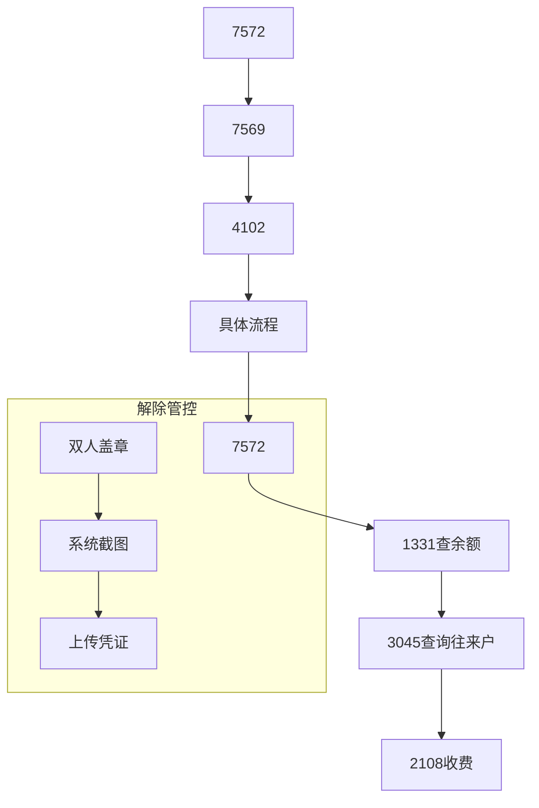

## U盾相关

- 若当场无法重置密码去对账，打印《补打银企对账申请书》，盖公章，我方向对账中心申请发送账单到客户邮箱完成对账
- 若客户使用U盾对账（网银对账），那就无法使用财智卡在智能终端机对账
- 网银可以自行修改U盾持有人、密码、手机号码

### 重置U盾密码

客户的U盾查找后显示证书过期，需要更换U盾。

客户说网银转账失败，先查三个代码，如果都没问题，就有以下两个方法解决

| 重置证书密码                 | 重新购买一个U盾证书   |
| ---------------------------- | --------------------- |
| 柜面通办理，输入八位数新密码 | 16.48                 |
| 办完立即生效                 | 需要走审批和95588回访 |

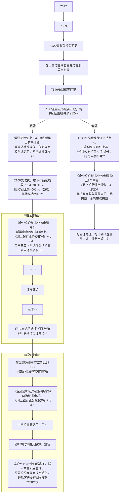

## 开卡业务

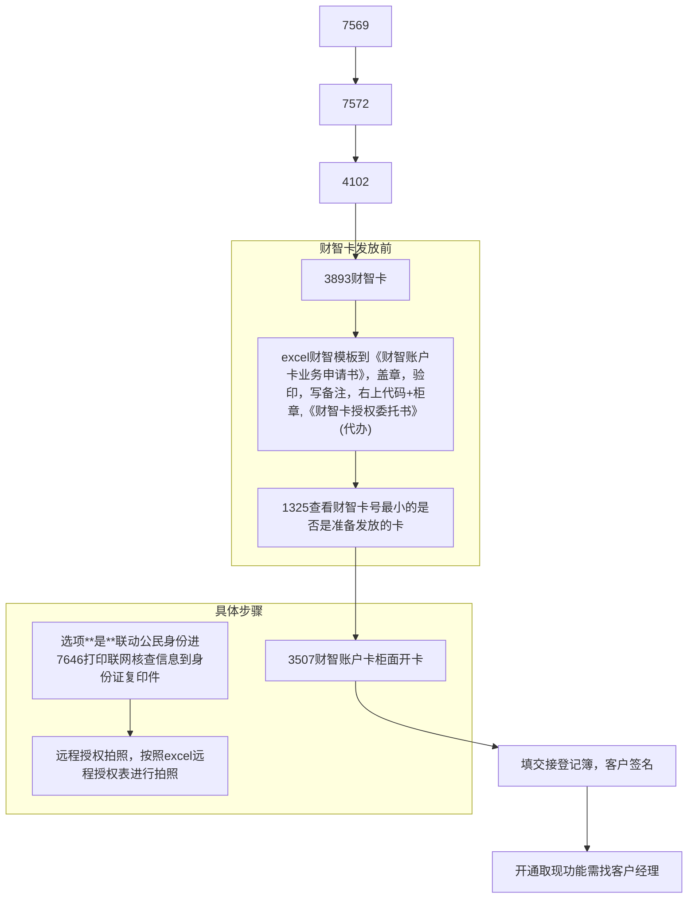

## 销户

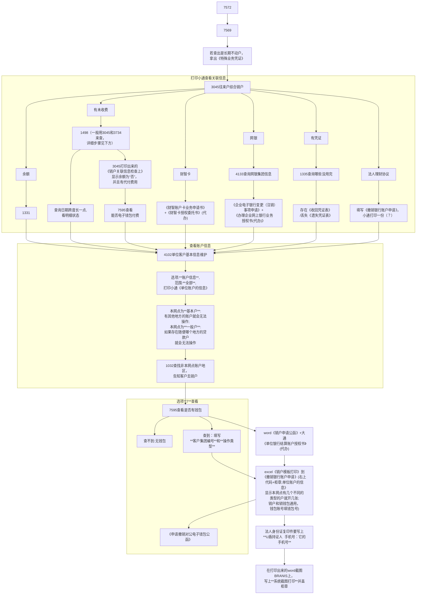

### 未缴费解决

对于查询未缴费，有两种方法：

| 方法一                                                       | 方法二                                                       |
| ------------------------------------------------------------ | ------------------------------------------------------------ |
| 3045查询“有尚未代付的对公收费”                               | 1498查询所有未交费用，**一般不用1498而是分成3045和3734来查**，1498主要用于在使用现金收费后去作废欠费记录的作用 |
| 3734查询“存在尚未收取的产品化对公付费明细”                   |                                                              |
| **最后**，这两个的费用都要写在3045打印的《销户关联信息检查上》 |                                                              |

如果3045打印出来的《销户关联信息检查上》显示余额为“否”，并且有代付费用，

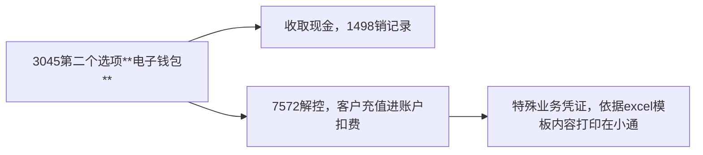

### 销户原因选择：

| 营业执照注销 | 基本户变更为一般户 | 其他情况 | 注销该银行账户 | 公司注销 |
| ------------ | ------------------ | -------- | -------------- | -------- |
| 关闭         | 转户               | 其他     | 账户不使用     | 公司注销 |

销户完成会打电话通知客户，客户也可以直接打电话过来。

销户收齐资料后交给主管。

## 调额

- 长期不用余额为0，若要网银调额需要账户有资金进入，有流水

- 调额按单笔的两倍或者按照余额作为参照

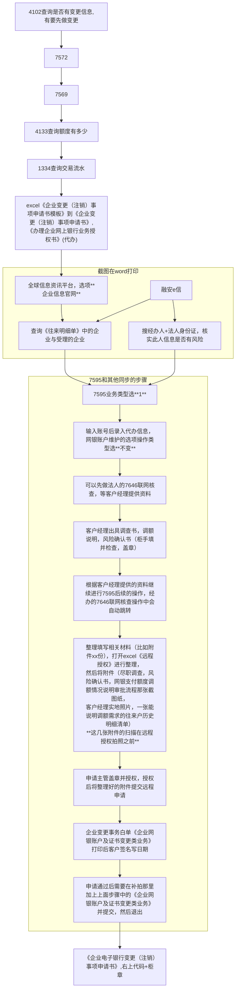

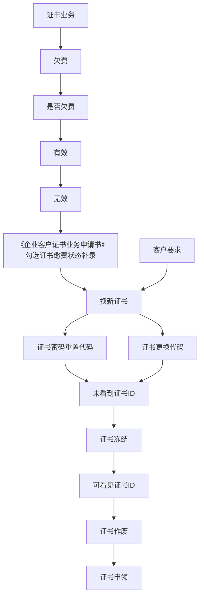

## 解控

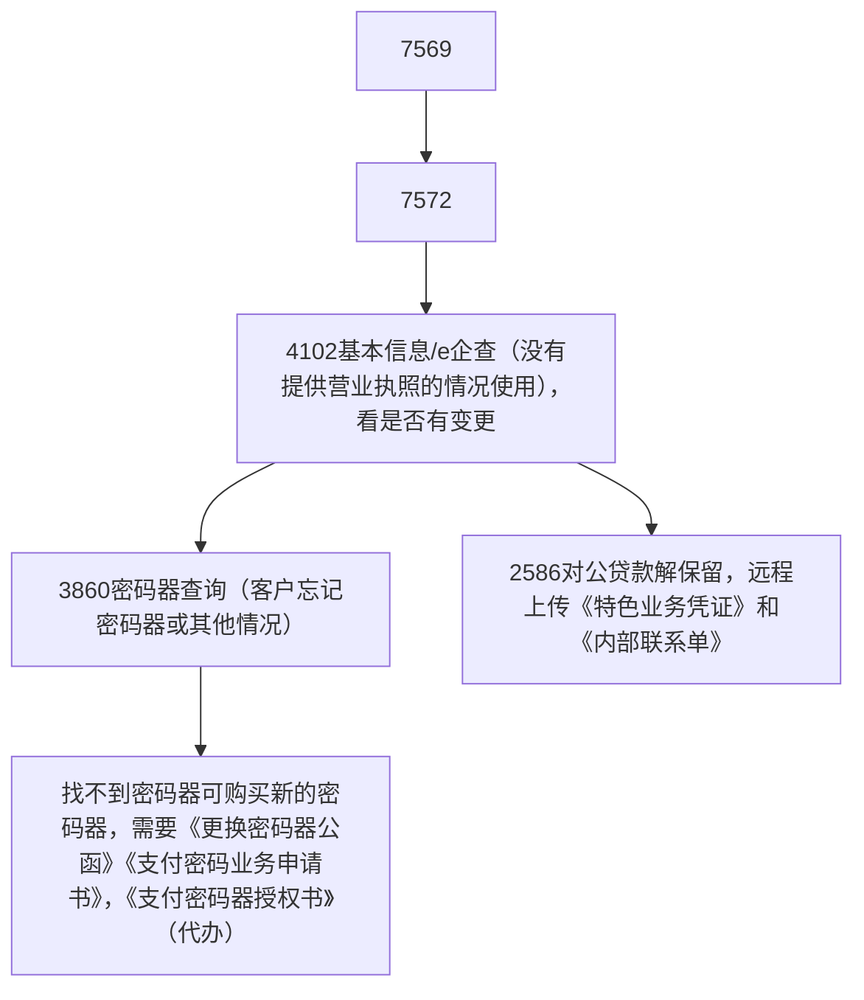

## 社保回单

点击**yhtview**，十日十日的搜

## 企业联网核查

客户经理发客户信息，7892进行企业信息联网核查，一页打印三个

# 支票 

## 支票购买

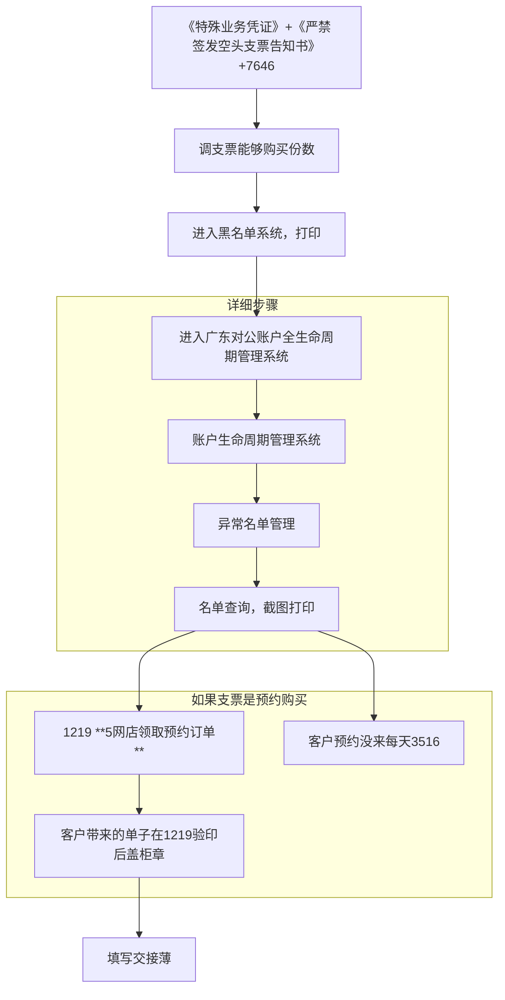


## 填写要求

## 支票取现


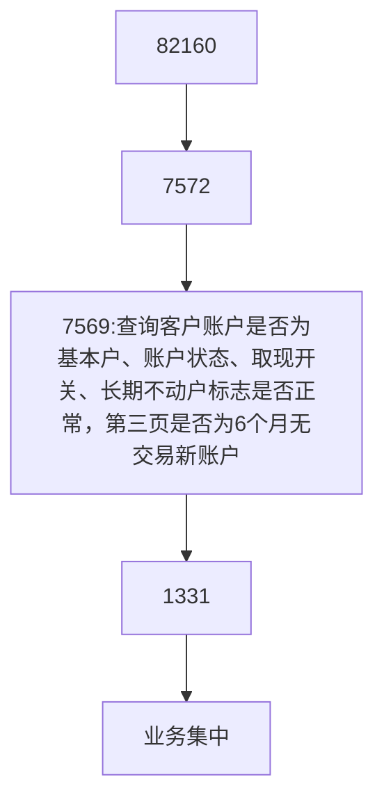


## 支票转账

### 本网点为付款行

（1）审票
      先审核票面信息，出票日期大小写，付款行名称是否是本网点，收款人，出票人账号，人民币大小写是否和数字（小写金额）相符，数字（小写金额）前是否有¥字符。用途是否有写（支付清算发报（跨行）：27个汉字，系统内（工行）汇款汇出：70个汉字）。
     检查票面是否有加盖企业预留印鉴。票面有“加验密码”字样的是否有填写支付密码？核对无误后在支票和进账单记账处加盖个人签章，若金额10万及以上需要主管盖章（支票和进账单）。

​      支票转账需填写进账单，核对进账单与支票填写信息是否一致。包括：出票人账号、出票人名称（支票票面印章上的公司名称）、付款行名称、收款人名称（写最后一手持票人）、收款人账号、收款行名称、金额大小写等信息。进账单日期不早于支票日期。
（若支票最后一手出票人，即最终收款人与票面收款人名称不一致，则需关注支票背书是否连续）    

（2）查询系统
     支票7572查询印鉴方式，是否有账户控制；7569查询长期不动户标志（第一页），账户状态是否有额度冻结（第一页），是否为6个月无交易新账户（第三页），1331查询账户可用余额是否足够（包括手续费）

   若收款人为同城工行，则需使用7569交易查询收款人账号与名称是否与系统一致，收款人通存通兑标志是否为：同城通存，是否为长期不动户？7569交易第三页是否为6个月无交易新账户？7572交易查询收款人是否有被管控信息，若为“不收不付”则无法办理入账。

   客户的印鉴方式为“密码器”或“密码单”的则需使用82160交易核验支票密码是否有误。


### 本网店为收款行，出票行为他行或异地工行（托收票）

（1）审票
     先审核票面信息，出票日期大小写，收款人是否在本网点开户？根据收款人账号判断收款人开户行。东莞工行地区号为：2010，账号的5-8位为网点号，如账号2010028309200012345，则0283为网点号，0283对应的网点为：道滘支行。
     核对进账单与支票填写信息是否一致。包括：出票人账号、出票人名称（支票票面印章上的公司名称）、付款行名称、收款人名称（写最后一手持票人）、收款人账号、收款行名称、金额大小写等信息。检查票面有“加验密码”字样的是否有填写支付密码？金额10万及以上需要主管盖章在进账单“复核”处盖章（支票不用盖经办和主管印章），支票背面需做委托收款。扫描前对支票背面加盖印鉴验印，账号输收款人账号。进账单日期不早于支票日期。（若支票最后一手出票人，即最终收款人与票面收款人名称不一致，则需关注支票背书是否连续）
  （2）查询系统：7569/7572交易查询收款账户状态是否正常，9859查询票面行号是否有效。
 （3）收费：每笔3元2108（900302010-8-1），和转账手续费2108-000004004电汇，根据金额，系统自动判定收费总金额，可交现金，可转账（客户需填写收费凭条且加盖印鉴，验印后收费），2108使用两个业务种类收费。


### 本网点为收款行，出票行为同城工行
（1）审票
    先审核票面信息，支票右上角付款行是否为同城工行？出票日期大小写，收款人是否在本网点开户？根据收款人账号判断收款人开户行。东莞工行地区号为：2010，账号的5-8位为网点号，如账号2010028309200012345，则0283为网点号，0283对应的网点为：道滘支行。
    先审核票面信息，出票日期大小写，收款人开户行是否是本网点，收款人，出票人账号，人民币大小写是否和数字（小写金额）相符，数字（小写金额）前是否有¥字符。用途是否有写（系统内：70个汉字）
     检查票面是否有加盖企业预留印鉴。票面有“加验密码”字样的是否有填写支付密码？核对无误后在支票和进账单记账处加盖个人签章，若金额10万及以上需要主管盖章（支票和进账单）。
      支票转账需填写进账单，核对进账单与支票填写信息是否一致。包括：出票人账号、出票人名称（支票票面印章上的公司名称）、付款行名称、收款人名称（写最后一手持票人）、收款人账号（确认为本网点开户）、收款行名称、金额大小写等信息。进账单日期不早于支票日期。（若支票最后一手出票人，即最终收款人与票面收款人名称不一致，则需关注支票背书是否连续）


（2）查询系统
	出票人： 7572查询出票人印鉴方式，是否有账户控制；7569查询长期不动户标志，账户状态是否有额度冻结，是否为6个月无交易新账户，通兑标志是否为同城通兑，1331查询账户可用是否足够（包括手续费）
	收款人：需使用7569交易查询收款人账号与名称是否与系统一致，是否为长期不动户？7569交易第三页是否为6个月无交易新账户？7572交易查询收款人是否有被管控信息，若为“不收不付”则无法办理入账。
	客户的印鉴方式为“密码器”或“密码单”的则需使用82160交易核验支票密码是否有误。支票背面需做委托收款。
	7572、7569、1331查询

# 业务委托书

## 业务委托书购买

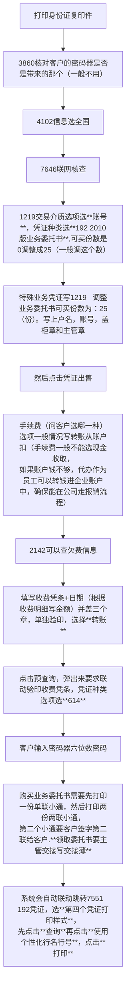

## 业务委托转账

1. 审票
    业务委托书为我行的转账凭证，需客户通过银行购买的重要支付凭证，只能用于转账，只能开户网点使用。

   （1） 委托日期的填写规定：小写填写即可，不能涂改；有效期：业务委托书日期原则上应为受理当日，三个工作日内非当天需客户在  委托书右上角日期处签名确认。对超过三个工作日的，应由客户在凭证上标注原因并签章确认。
   （2）左边为已打印的出票人信息，核实出票人是否为本网点开户，业务类型勾选转账汇款
   （3）其他填写规定：收款人：顶格填写；金额大写：顶格填写；金额小写：数字前需加“¥”
   （4）汇款方式需勾选，若“加急”则需客户签名确认，非加急请勾选“普通”。已勾选“加急”的需授权加急手续费，为原手续费基础上＋20%。
   （5）银行填写栏：费用收取需勾选，系统内同城工行不收费，其他若客户在账户上扣收手续费则选“联动收费”，若客户手续费支付现金则选“非联动收费”。
          受理（扫描）：经办人盖章，审核：≥10万主管盖章
   （6）收款人全称账号开户行是否清楚，开户银行也要写清楚省市，开户行名称处的省市应与“省市”填写处对应。不能出现开户行名称为”中国农业银行中山石歧支行“，省市处填写为”广东省佛山市“的情况。

2.查询系统
     支票7572查询印鉴方式，是否有账户控制；7569查询长期不动户标志（第一页），账户状态是否有额度冻结（第一页），是否为6个月无交易新账户（第三页），1331查询账户可用余额是否足够（包括手续费）
   若收款人为同城工行，则需使用7569交易查询收款人账号与名称是否与系统一致，收款人通存通兑标志是否为：同城通存，是否为长期不动户？7569交易第三页是否为6个月无交易新账户？7572交易查询收款人是否有被管控信息，若为“不收不付”则无法办理入账。
   客户的印鉴方式为“密码器”或“密码单”的则需使用82160交易核验支票密码是否有误。


# 财智卡

## 财智卡取现

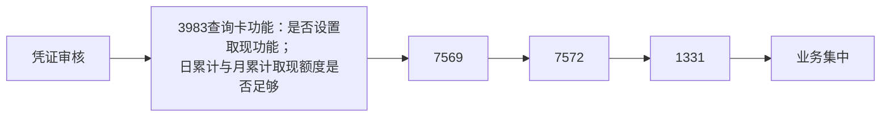


# 外汇

**ICBK(工行)CN(国家)BJ(北京)DG(东莞)**

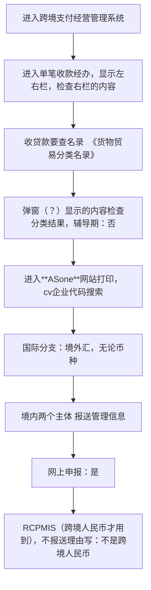

## 收费

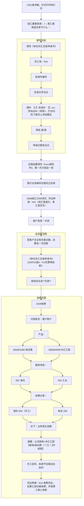

# 财政

## 发报

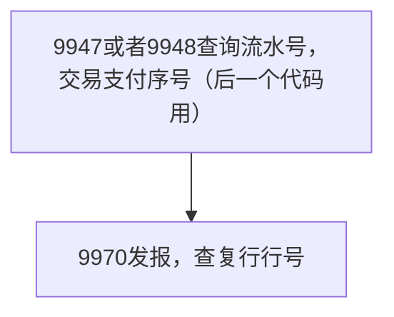

## 变更操作员信息

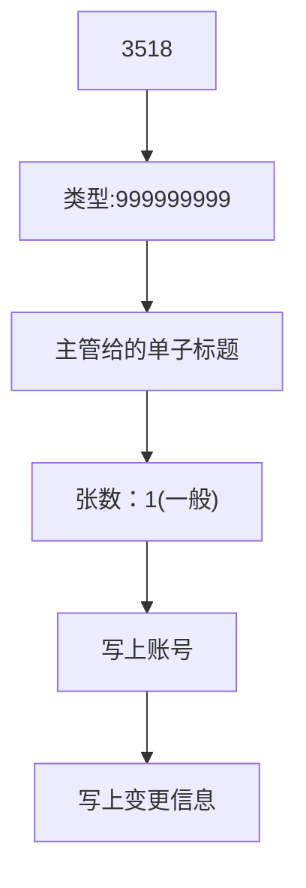


# 质押

## 质押大额存单贷款

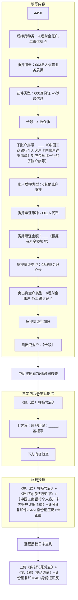

# 定期支取

**业务集中**成功后打印6068，6066接收信息

```mermaid
graph LR
	A["验印证实书正反面+进账单正面"]
	B["证实书背面【凭证号：证实书右上；；凭证版：证实书（背面）新888；主附件：主件】"]
	C["证实书正面【凭证号：0；凭证版：证实书（正面）888；主附件：主件】"]
	D["进账单正面【凭证号：0；凭证版：进账单-88888；主附件：主件】"]
	E["进入只能扫描预处理页"]
	F["若**校验结果**显示不通过，选择手工验印"]
	G["点击**补录提交**"]
	
	A --> B
	A --> C
	A --> D
	
	subgraph 验印细节
		B
		C
		D
	end
	
	A --> E --> F --> G
	E --> G
	
	
```


**影像名称:证实书（背面）_新96**

| 大类：27-单位定期/通知/协议存款 | 小类：96-单位定期/通知/协议存款支取 |
| ------------------------------- | ----------------------------------- |
| 印密标志                        | 2.图章印鉴                          |
| 摘要                            | 0-正常                              |
| 证实书号                        | 证实书右上                          |
| 支取金额                        | 看单据                              |
| 收款人类型                      | 1-系统内账户                        |


**影像名称:广东支票新**

| 大类：27-单位定期/通知/协议存款 | 小类：95-单位定期/通知/协议存款存入 |
| ------------------------------- | ----------------------------------- |
| 存款种类                        | 1.单位定期                          |
| 结息方式                        | 1.利随本清                          |
| 许可证序号                      | ？                                  |
| 利率变动方式                    | 1.固定利率                          |
| 本金入账账户本他行标志          | 1.本行                              |
| 本金入账账号                    | 支票上写的出票人账号                |

# 大堂对公

对公账户主要分为基本户、一般户、专用账户和临时账户

- 基本户：可取现
- 一般户：不可取现

- 专用账户：部分可开通取现功能，但是需要人民银行核准，一般为预算单位的零余额账户
- 临时账户：工程类的临时账户可开通取现功能，也需人民银行核准，很少存在开通取现功能的临时账户

## 对公(公司)存取款

```mermaid
graph LR
	A["存款-现金"]
	B["柜面"]
	C["《现金存款凭条》，存入公司账户"]
	D["ATM(财智卡开通存取款功能)"]
	E["存5w以内"]
	F["财智卡取款"]
	G["柜面<br>(5w以上需要提前预约)"]
	H["《业务委托凭证》"]
	I["超10w填写《业务委托凭证》+《大额现金支取审批表》"]
	J["ATM<br>(财智卡开通存取款功能)"]
	K["2w以内"]
	L["支票取款"]
	M["在支票开立的10天内进行取款"]
	
	A --> B --> C
	A --> D --> E
	F --> G --> H
	G --> I
	F --> J --> K
	L --> M
```

## 对公(公司)汇款

```mermaid
graph LR
	A["转账汇款"]
	B["财智卡"]
	C["智能终端机"]
	D["单笔50w"]
	E["柜面"]
	F["《业务委托凭证》"]
	G["支票/业务委托书"]
	H["现金汇款"]
	I["柜面办理，《现金存款单》"]
	
	A --> B --> C --> D
	B --> E --> F
	A --> G
	H --> I
	
	
```

## 《业务委托凭证》填写规定


```mermaid
graph TD
	A["业务类型勾选，转账选择**对外转账**"]
	B["持卡人信息填写"]
	C["持卡人为个人"]
	D["填写个人资料，携带卡+有效身份证件"]
	E["持卡人为单位"]
	F["填写单位资料，证件一般为**营业执照**"]
	G["经办人携带卡+有效身份证件，凭证要盖印鉴"]
	H["填写备注"]
	I["取现：**备用金**/**工资**"]
	J["转账：按实际用途填写<br>（注意跨行是否超27汉字，系统内是否超70汉字）"]
	
	A --> C
	A --> E
	subgraph 持卡人信息填写
    	C --> D
		E --> F --> G
	end
	D --> H
	G --> H
	subgraph 填写转账或者取现用途
		H --> I
		H --> J
	end
	
	
	
```

