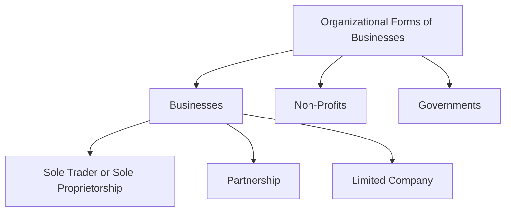
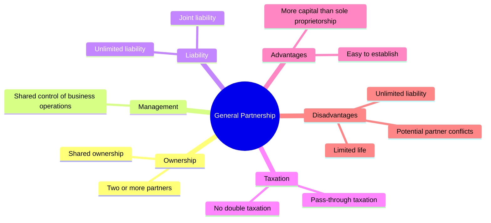
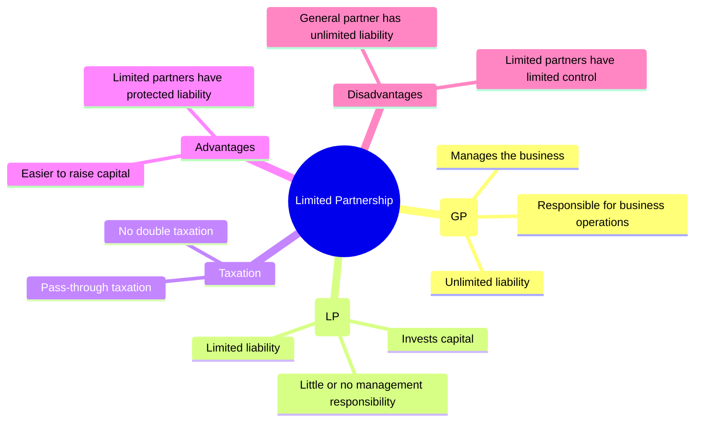
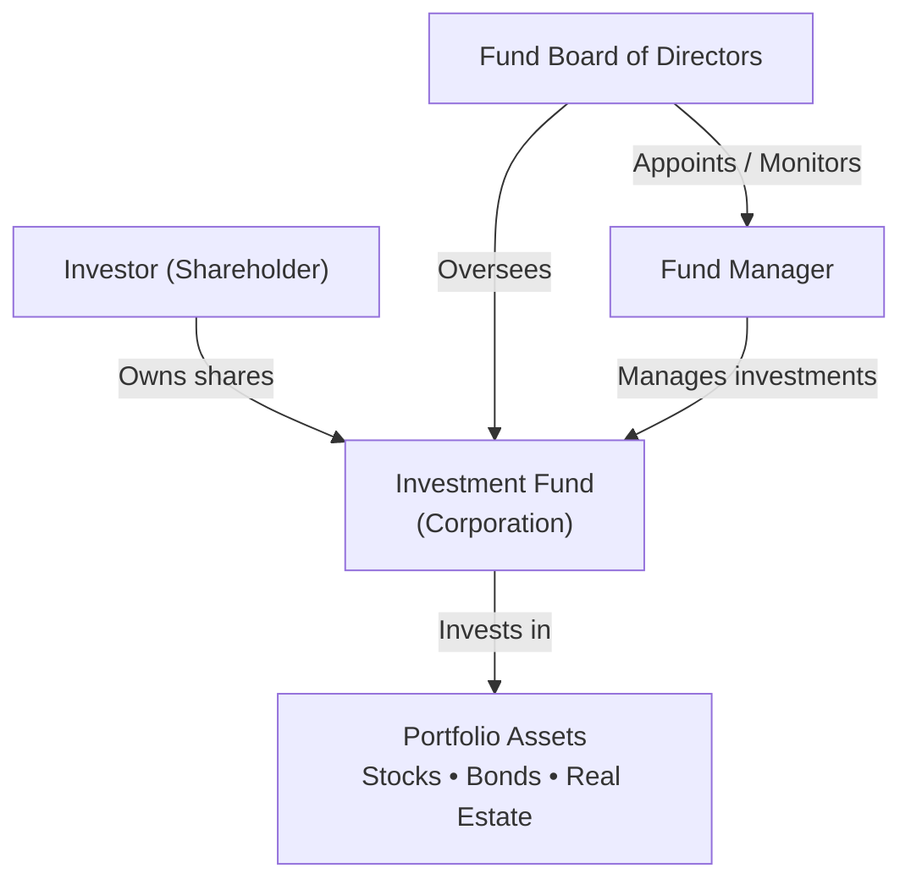
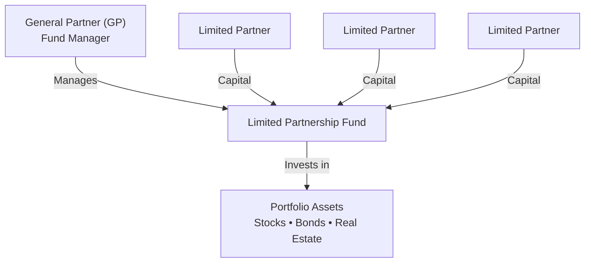
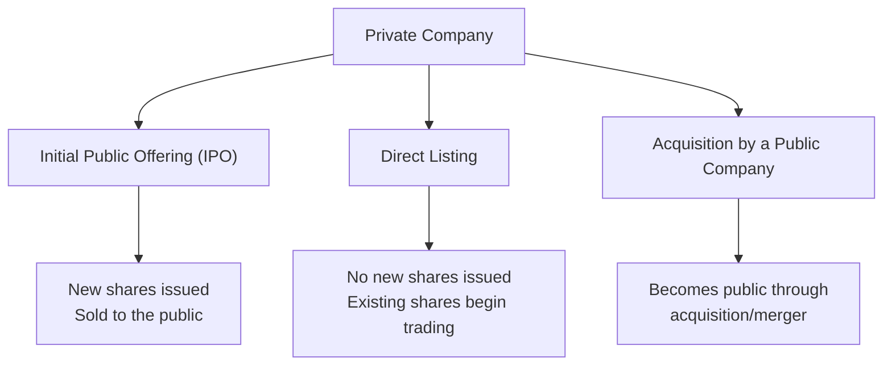
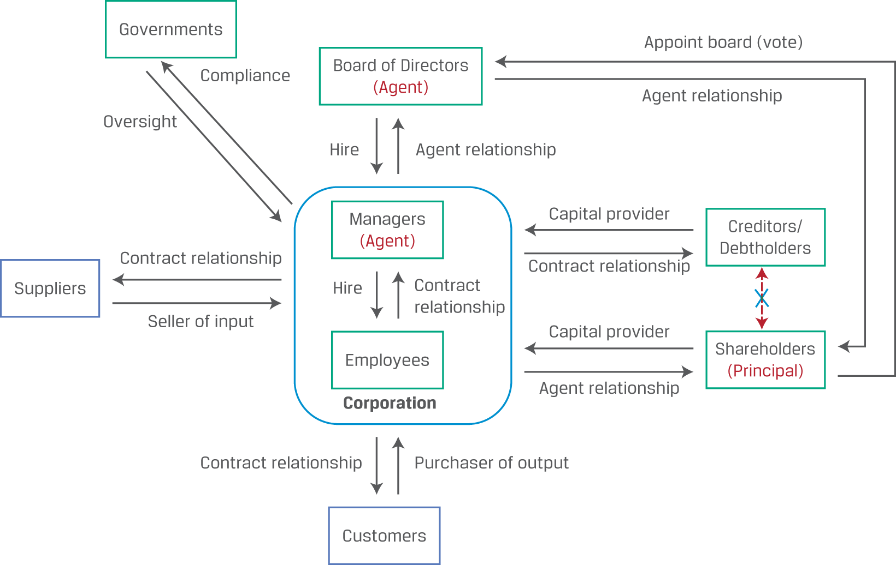
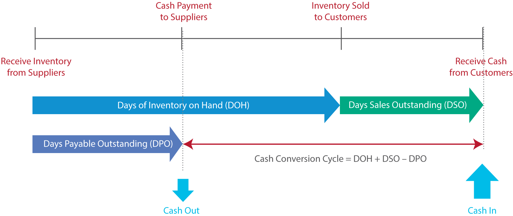
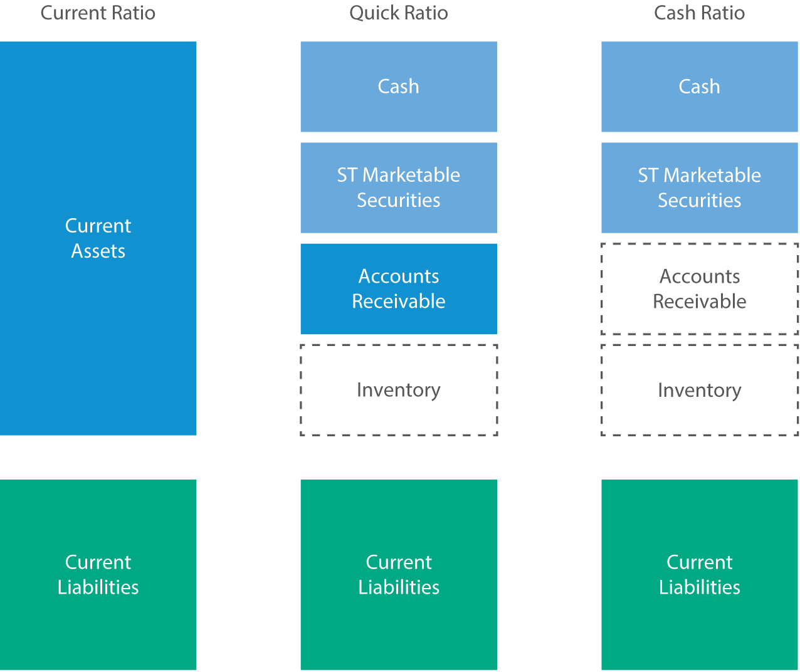
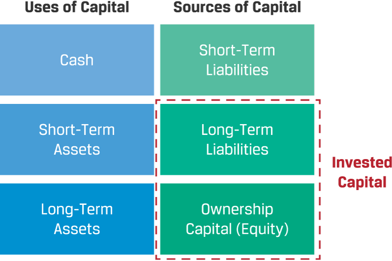

# Corporate Issuers
## Organizationl Forms，Corporate Issuer，Features，and Ownership
### 题目
1. Which of the following organizational forms provides for the least owner liability of business debts?

下列哪一种企业组织形式，对企业债务承担的所有者责任最小？

A. General partnership（普通合伙企业）
✅ B. Private limited company（私人有限公司）
C. Sole proprietorship（独资企业）
正确答案：B. Private limited company

---

2. 将下列企业特征（Business Attributes）与最合适的企业组织形式（Organizational Form）匹配。
Match the following business attributes with the most appropriate organizational form.

| Business Attribute | Organizational Form |
|--------------------|---------------------|
| A. Significant capital needs | 1. Limited Liability Partnership (LLP) |
| B. Single owner, desires simplicity | 2. Corporation |
| C. Company provides professional services | 3. Sole Proprietorship |

**正确答案：**

- **A → 2. Corporation**
- **B → 3. Sole Proprietorship**
- **C → 1. Limited Liability Partnership (LLP)**

| 题目关键词 | 第一反应 |
|------------|----------|
| Significant capital needs | Corporation |
| Raise capital | Corporation |
| Single owner | Sole Proprietorship |
| Simple / Easy to establish | Sole Proprietorship |
| Professional services | LLP |
| Law firm | LLP |
| Accounting firm | LLP |
| Consulting firm | LLP |

---

3. **True or False:** Partnerships are typically taxed at the **entity level** rather than at the **individual partner level**.

**答案：❌ False**

**Partnership = Pass-through Entity（穿透实体）**

- Partnership **本身不缴税**
- 利润直接分配给合伙人（Pass-through）
- 合伙人按**个人所得税（Personal Income Tax）**纳税

---

4. Match the applicable company characteristic with the category that best describes it (Publicly Held, Privately Held, or Both).

| Company Characteristic | Answer |
|------------------------|--------|
| Exchange listed | ✅ Publicly Held |
| Owner/manager overlaps | ✅ Privately Held |
| Registered | ✅ Publicly Held |
| Share liquidity | ✅ Publicly Held |
| Non-financial disclosure required | ✅ Both |
| Negotiated debt and equity sales | ✅ Privately Held |

**Publicly Held Company（上市公司）**

- ✅ Exchange listed（上市交易）
- ✅ Registered（向监管机构注册）
- ✅ High share liquidity（股票流动性高）
- ✅ Financial & Non-financial Disclosure（需披露财务和非财务信息）

**Privately Held Company（非上市公司）**

- ✅ Owner/Manager Overlap（所有者和管理者重合）
- ✅ Shares are illiquid（股票流动性低）
- ✅ Debt & Equity are privately negotiated（股权、债权私下协商交易）

---

5.The shareholder theory of corporate governance is _______________ than the stakeholder theory.
A. narrower
B. broader
正确答案： ✅ narrower

**Shareholder Theory（股东理论）**
企业的首要目标是最大化股东（shareholders）的利益。关注对象只有股东。范围较窄（narrower）。
**Stakeholder Theory（利益相关者理论）**
企业不仅要考虑股东，还要考虑所有利益相关者（stakeholders）。范围较广（broader）。
包括：
- Shareholders（股东）
- Employees（员工）
- Customers（客户）
- Suppliers（供应商）
- Creditors（债权人）
- Government（政府）
- Community（社区）
- Environment（环境）等

---
6.ESG factors are increasingly recognized as _______________ by analysts.
A. quantifiable
B. qualitative
正确答案： ✅ quantifiable
**Quantifiable（可量化的）✅**
- 可以用数据衡量
- 可以建立模型进行分析
- 可以纳入公司估值（valuation）
可以影响投资决策（investment decision-making）
例如：
- Carbon emissions（碳排放）
- Employee turnover（员工流失率）
- Board independence（董事会独立性）
- Workplace accidents（工伤率）
这些指标都可以被量化分析。

**Qualitative（定性的）❌**
指难以直接用数字衡量的信息，例如：
- 企业文化
- 品牌声誉
- 管理层领导力
虽然 ESG 中有些内容具有定性特征，但现代金融分析越来越倾向于将 ESG 指标量化。

---
7.Calculate returns on equity (ROE) for the period if the firms experience a 20% increase and a 20% decrease in revenue (from Question 1), assuming expenses remain unchanged.

教材答案（20% Increase in Revenue）：

|  | Equity-Financed | Debt- and Equity-Financed |
|---|---:|---:|
| Revenue | 120 | 120 |
| Operating Expenses | 70 | 70 |
| Interest Expense | 0 | 15 |
| Net Income | 50 | 35 |
| Total Equity | 100 | 25 |
| ROE | 50% | 140% |


我的错误理解 ❌
看到 Revenue 增加 20% 后，我认为 Total Equity 也应该增加。

例如我认为：

Equity-financed：Total Equity 应该由 100 → 120
Debt- and Equity-financed：Total Equity 应该由 25 → 30（或其他增加后的数字）
因此对教材仍然使用 100 和 25 作为 ROE 分母感到困惑。

正确理解 ✅
本题计算的是 one-period ROE（单一期间 ROE），分母使用期初（Beginning）Total Equity，不会因为当期利润增加而更新。
**ROE 公式：**
$$ROE=\frac{Net\ Income}{Total\ Equity}$$

- Revenue、Net Income → Income Statement（利润表）
- Total Equity → Balance Sheet（资产负债表）

---
8.**Compare the firm's returns on equity (ROE) if it finances the investment with debt, shares, or cash on hand. Discuss the results of the comparison.**

**已知条件**

- Revenue = 100
- Operating Expenses = 70
- New Investment = 20
- Return on New Investment = 30%
- Interest Rate on New Debt = 20%
- Ignore income taxes

**Initial Balance Sheet**

| Assets | | Liabilities & Equity | |
|---|---:|---|---:|
| Cash | 30 | Equity | 100 |
| Other Assets | 20 | | |
| LT Assets | 50 | | |

**我的错误**

不会判断 **Issue Shares、Borrow、Cash on Hand** 三种融资方式分别会影响哪些项目，导致不知道：

- 为什么三种方式的 **Revenue 都是 106**
- 为什么只有 **Borrow** 要扣 Interest
- 为什么 **Equity** 有时增加、有时保持不变

**正确思路**
**Step 1：计算新增 Revenue**

新增投资 = 20

投资回报率 = 30%

新增 Revenue：

$$
20 \times 30\% = 6
$$

因此：

$$
Revenue = 100 + 6 = 106
$$

> **投资项目相同，因此新增 Revenue 与融资方式无关。**

**Step 2：更新 Balance Sheet**
① Issue Shares（发行股票）

- Equity：100 → **120**
- Debt：0
- Cash 最终仍为30（发行股票收到20，再投资20）

② Borrow（借款）

- Debt：0 → **20**
- Equity：保持 **100**

③ Cash on Hand（使用现金）

- Cash：30 → **10**
- Equity：保持 **100**
- Debt：0

**Step 3：计算 Net Income**
**Issue Shares**

$$
\text{Net Income}=106-70=36
$$

**Borrow**

Interest：

$$
20 \times 20\%=4
$$

$$
\text{Net Income}=106-70-4=32
$$

**Cash on Hand**

无利息：

$$
\text{Net Income}=106-70=36
$$

**Step 4：计算 ROE**

$$
ROE=\frac{\text{Net Income}}{\text{Equity}}
$$

| Financing Method | Net Income | Equity | ROE |
|---|---:|---:|---:|
| Issue Shares | 36 | 120 | 30% |
| Borrow | 32 | 100 | 32% |
| Cash on Hand | 36 | 100 | 36% |

**本题考点**

**Issue Shares**

- Equity ↑
- Net Income ↑
- Equity 增加（Equity Dilution）
- **ROE 最低**

**Borrow**

- Equity 不变
- 有 Interest Expense
- 若：

$$
\text{Return on Investment}>\text{Interest Rate}
$$

则 Debt 会提高 ROE（Positive Financial Leverage）。

**Cash on Hand**

- Equity 不变
- 无 Interest Expense
- **ROE 最高**

**解题模板**

1. 计算新增 Revenue
   - Investment × Return on Investment

2. 更新 Balance Sheet
   - Issue Shares → Equity ↑
   - Borrow → Debt ↑
   - Cash on Hand → Cash ↓

3. 计算 Interest（只有 Borrow 有）

4. 计算 Net Income

$$
\text{Net Income}=\text{Revenue}-\text{Operating Expenses}-\text{Interest}
$$

5. 计算 ROE

$$
ROE=\frac{\text{Net Income}}{\text{Equity}}
$$

> **同一投资项目产生的收益相同，ROE 的差异来自融资方式：发股会增加 Equity（稀释 ROE），借款会增加 Interest（但可利用财务杠杆），使用现金既不增加 Equity，也没有利息，因此本题 ROE 最高。**

---
9.Corporate equity and debt holders share the same investor perspective with respect to:
公司股权投资者和债务投资者在哪一点上具有相同的投资视角？
A. maximum loss
B. investment risk
C. return potential
✅ 正确答案：A. maximum loss
**Investor Perspectives: Equity versus Debt**

| Attribute | Equity | Debt |
|---|---|---|
| Tenor | Indefinite | Term (e.g., 3 months, 10 years) |
| Return potential | Unlimited | Capped |
| Maximum loss | Initial investment | Initial investment |
| Investment risk | Higher | Lower |
| Desired outcome | Maximize firm value | Timely repayment |

---
10**ESG considerations are increasingly relevant for which of the following reasons?**  *(More than one correct option may be possible. Choose one answer that applies.)*

A. Many in the new generation of investors are demanding that investment strategies incorporate ESG factors.

B. ESG issues are having more material impacts on companies’ valuations.

C. Environmental and social issues are being treated as negative externalities.

**正确答案：A、B**
ESG considerations are of increasing importance for three reasons:
- The material financial impact of ESG factors on corporate issuers has risen. Both shareholders and debtholders have suffered substantial losses due to environmental disasters, social controversies, and governance deficiencies.
- Interest in the environmental and social impacts of investments has grown, particularly among younger clients, who increasingly demand that newly acquired or inherited wealth, as well as pension contributions, be managed with ESG considerations in mind.
-  As government stakeholders continue to prioritize climate change and social policies, revised regulations are forcing corporate issuers to adapt their business practices to meet more stringent ESG criteria.

---
10.**Which of the following board structures is most likely to be preferred by a minority shareholder?**

A. Majority independent and staggered elections.

B. Majority independent and full board election.

C. Majority inside and staggered elections.

**正确答案：B**

**Full board election ✅**

- 全体董事同时接受股东选举
- 股东更容易更换表现不佳的董事会
- 董事会问责性（Accountability）更强

**Staggered elections ❌**

- 每次只改选部分董事
- 管理层更稳定
- 股东较难更换董事会
- 不利于少数股东

---
11.**Complete each statement by selecting one of the following:**

- agent
- principal
- contractual
- principal-agent
- employer-employee

1. In a corporation, the board of directors is elected to act as a(n) ________.
2. In a corporation, shareholders are a(n) ________.
3. Customers have a(n) ________ relationship with a corporate issuer.

**正确答案：**
1. **agent**
2. **principal**
3. **contractual**

**Customers = Contractual relationship**
- 客户与公司之间是**合同关系（Contractual relationship）**，通过购买产品或服务形成权利和义务。

---
12. An <u>extraordinary general meeting (EGM)</u> may be called when requested by a specific minimum number of calling shareholders, as detailed in the company’s bylaws or charter.
特别股东大会

---
13.A <u>dispersed</u> corporate ownership structure involves many shareholders, none of whom can exercise control over the corporation.

---
14.**Which of the following best describes shareholder activists?** Shareholder activists:
A. Help stabilize a company’s strategic direction.
B. Have little effect on the company’s long-term investors.
C. Are unlikely to alter the composition of a company’s shareholder base.

**正确答案：A**
**Shareholder activists 的影响：**

| 行为 | 影响 |
|---|---|
| Restructure company | 重组公司 |
| Replace management | 更换管理层 |
| Sell non-core assets | 出售非核心资产 |
| Focus strategy | 聚焦核心业务 |
| Change shareholder base | 改变股东结构 |

---

15.投资分析师最担心哪种高管薪酬方案？
An investment analyst would likely be most concerned about an executive compensation plan that:
A. varies each year.
B. is consistent with the compensation plans of a company’s competitors.
C. is cash-based only, without an equity component.
缺少股权激励会导致：
Management interests ≠ Shareholders’ interests
可能产生：
Agency problem（代理问题）
Short-term focus（短期主义）
正确答案：C

---

16.题目：
Which of the following events or activities is most likely to be a drag on liquidity?
以下哪项最可能导致流动性受到拖累？
A. Inventory that becomes obsolete
B. Making payments to suppliers earlier
C. Offering a discount to customers who pay within 10 days
✅正确答案：A. Inventory that becomes obsolete

| 概念分类 | 英文术语 | 核心定义与机制 | 典型考试场景 / 例子 | 选项对应情况 |
| :--- | :--- | :--- | :--- | :--- |
| **拖累流动性** | **Drag on Liquidity** | **现金流入延迟或减少**。资金被滞留在资产中，无法按时变现。 | • 存货积压/过时 (Obsolete inventory)<br>• 应收账款回收缓慢 (Slow-paying receivables)<br>• 坏账增加 | **正确选项 (A)**<br>库存过时导致变现受阻 |
| **拉动流动性** | **Pull on Liquidity** | **现金流出加速或提前**。资金被快速支付或抽走，消耗现金。 | • 提前支付供应商货款 (Early supplier payments)<br>• 提前还债<br>• 银行削减信用额度 | **干扰项 (B)**<br>提前付款属于 Pull |
| **加速现金流入** | **Speed up Cash Inflow** | **优化/改善流动性**的操作。通过优惠吸引客户尽早支付现金。 | • 提供现金折扣 (Offering discounts for early payment, e.g., 10天内付款打折) | **干扰项 (C)**<br>现金折扣促进资金回收 |

**Drag = 钱进不来**
→ 坏账、过时库存
**Pull = 钱出去更快/借不到钱**
→ 提前付款、债务偿还、信用中断

---
17.**Net Working Capital Calculation（信用分析常用）：**
题目

Consider the following balance sheet for an issuer:

| 项目 | 金额 |
|---|---:|
| Cash | 100 |
| Marketable securities | 20 |
| Accounts receivable | 600 |
| Inventory | 800 |
| Prepaid expenses | 30 |
| Property, plant, and equipment | 10,000 |
| Intangibles | 500 |
| **Total assets** | **12,050** |
| Accounts payable | 980 |
| Accrued expenses | 70 |
| Short-term debt | 1,000 |
| Long-term debt | 2,000 |
| Shareholders’ equity | 8,000 |
| **Total liabilities and equity** | **12,050** |

The issuer’s **net working capital** is closest to:

A. -500  
B. 380  
C. 1,550  
计算过程

| 分类 | 项目 | 金额 |
|---|---|---:|
| **Current Assets（排除现金和有价证券）** | Accounts receivable | 600 |
|  | Inventory | 800 |
|  | Prepaid expenses | 30 |
|  | **Total operating current assets** | **1,430** |
| **Current Liabilities（排除短期债务）** | Accounts payable | 980 |
|  | Accrued expenses | 70 |
|  | **Total operating current liabilities** | **1,050** |
| **Net Working Capital** | 1,430 − 1,050 | **380** |

正确答案✅ **B. 380**

*NWC 只看“经营产生的钱”：*
买货、卖货产生的应收、库存、应付 → ✅算
借钱、还债、股东投资 → ❌不算
| 项目 | 中文 | 类型 | 含义 | 是否计入 Net Working Capital |
|---|---|---|---|---|
| Short-term debt | 短期债务 | Financing liability（融资负债） | 一年内需要偿还的借款，如短期银行贷款、商业票据 | ❌ 不计入经营性 NWC |
| Long-term debt | 长期债务 | Long-term financing（长期融资） | 一年以上到期的借款，如长期银行贷款、债券 | ❌ 不计入 NWC |
| Shareholders’ equity | 股东权益 | Equity（股东融资） | 股东投入资本 + 留存收益，代表公司净资产 | ❌ 不计入 NWC |
| Non-current assets | 非流动资产 / 长期资产 | Long-term assets（长期资产） | 用于长期经营的资产，不属于短期经营资金循环 | ❌ 不计入 NWC |
| Property, plant, and equipment (PP&E) | 不动产、厂房和设备（固定资产） | Tangible long-term assets（有形长期资产） | 公司用于生产经营的厂房、机器、设备等 | ❌ 不计入 NWC |
| Intangibles | 无形资产 | Intangible long-term assets（无形长期资产） | 没有实体形态但具有价值的资产，如专利、品牌、商誉 | ❌ 不计入 NWC |

---
18.**Keown Corporation is experiencing liquidity challenges. As an analyst, you note three recent trends related to Keown’s working capital:**
1. An increase in average days sales outstanding is a drag on liquidity.
2. An increase in days of inventory on hand is a drag on liquidity.
3. An increase in credit limits by lenders is a pull on liquidity.

**Which trend does not contribute to the firm’s liquidity challenges?**

- [ ] **A.** The change in average days sales outstanding
- [ ] **B.** The change in days of inventory on hand
- [x] **C.** The change in credit limits

| 概念分类 | 核心定义 | 机制本质 | 典型案例 | 对流动性的影响 |
| :--- | :--- | :--- | :--- | :--- |
| **流动性拖累**<br>*(Drags on Liquidity)* | 现金**流入变慢**或被滞留 | 资金变现周期拉长，回流受阻 | • **DSO 增加**（应收账款回款变慢）<br>• **DOH 增加**（存货积压/卖不出去）<br>• 坏账增加 | **加剧资金链紧张**<br>*(Drag)* |
| **流动性拉动**<br>*(Pulls on Liquidity)* | 现金**流出加速**或融资渠道受限 | 现金被迅速抽干或无法融资 | • 提前支付供应商货款<br>• 商业信用期限缩短<br>• **银行/债权人降低信用额度** | **加剧资金链紧张**<br>*(Pull)* |
---
19.短期筹资方式与营运资本成本比较
 题目关键信息
* **筹资需求**：短期资金 **CAD 200,000**（20 万加元），用于支付员工薪酬（Payroll）。
* **公司现有资产/负债状态**：
  * **应付账款（Accounts Payable）**：CAD 2,000,000，付款条款为 $2/10, \text{net } 30$（10 天内付款享 2% 现金折扣，最晚 30 天付清）。
  * **应收账款（Accounts Receivable）**：CAD 2,000,000。
  * **可变现证券（Marketable Securities）**：CAD 5,000,000。
* **核心问题**：对于 Keown 公司而言，采用哪种渠道筹集这 20 万加元最合理？

| 筹资来源 | 方式与动作 | 成本计算公式 | 实际成本 (CAD) | 评价与结论 |
| :--- | :--- | :--- | :--- | :--- |
| **A / B. 长期债/股票** | 发行长期证券 | 极高承销/发行费用 | 很高且耗时长 | ❌ 期限错配，不适用于短期薪酬 |
| **C. 应付账款** | 延迟付款并放弃 2% 折扣 | $200,000 \times 2\%$ | $4,000$ | ❌ 成本偏高（放弃折扣成本极高） |
| **D. 应收账款** | 按 10% 折扣保理/卖出 | $\frac{200,000}{1 - 0.10} \times 10\%$ | $22,222$ | ❌ 成本极高 |
| **E. 可变现证券** | **按 0.5% 手续费变现** | $200,000 \times 0.5\%$ | $\mathbf{1,000}$ | ✅ **最优解（成本最低、变现最快）** |

**各选项详细拆解与踩坑深度剖析**
选项 A & B：发行长期债券（Long-term Debt）或 发行普通股（Common Stock）
* **错误原因**：犯了严重的声音与**期限错配（Maturity Mismatch）**错误。
* **深度讲解**：
  * 发行股票或长期债券属于**资本结构（Capital Structure）级别的长期融资**，适用于建造厂房、收购企业等长期资本支出（CapEx）。
  * 薪酬（Payroll）是典型的**日常短期营运费用**。长期融资不仅发行流程繁琐、法律合规成本和承销费用极高，而且耗时动辄数月，根本不可能用来解决眼下的薪酬发放。

选项 C：延迟支付应付账款，放弃 2% 的现金折扣（Delay A/P and forgo 2% discount）
* **错误原因**：放弃现金折扣是一种非常昂贵的隐性融资方式。
* **深度讲解与计算**：
  * 条款 $2/10, \text{net } 30$ 意味着：如果在第 10 天付款，可以少付 2%；如果拖到第 30 天付，就要付全额。
  * 若为了省下 20 万现金发工资而延迟付款，公司损失的是这 20 万原本能拿到的 **2% 折扣**。
  * **直接清算成本**：
    $$\text{实际成本} = 200,000 \times 2\% = \mathbf{\text{CAD } 4,000}$$
  * *(拓展思维)*：如果折算成**年化隐性利率（Cost of Trade Credit）**：
    $$\text{年化利率} = \frac{\text{折扣\%}}{1 - \text{折扣\%}} \times \frac{365}{\text{延期天数}} = \frac{2\%}{98\%} \times \frac{365}{30 - 10} \approx \mathbf{36.73\%}$$
    年化成本高达 36.73%，属于极其不划算的融资渠道。

选项 D：按 10% 的折价出售应收账款（Sell A/R at a 10% discount）
* **错误原因**：未能正确理解“目标到手净现金”与“资产面值”的区别，导致成本极高。
* **核心易错点攻克（重点！）**：
  > ❓ **为什么不是 $200,000 \times 10\% = 20,000$？**
  * **答**：因为公司需要落袋为安的**净现金（Net Proceeds）必须是 20 万**。如果你只拿面值 20 万的应收账款去卖，打 9 折（扣除 10%）后，到手的现金只有：
    $$200,000 \times (1 - 10\%) = \text{CAD } 180,000$$
    **这根本不够支付 20 万的薪酬！**
  
* **正确计算逻辑（倒推法）**：
  1. 设需要卖出的应收账款面值为 $X$：
     $$X \times (1 - 10\%) = 200,000 \implies X \times 0.9 = 200,000$$
  2. 解得需卖出的面值：
     $$X = \frac{200,000}{0.9} = \mathbf{\text{CAD } 222,222.22}$$
  3. 计算实际付出的折价成本（面值 - 到手现金）：
     $$\text{实际成本} = 222,222.22 \times 10\% = \mathbf{\text{CAD } 22,222.22}$$
  * 发生高达 2.22 万的损失，成本过于昂贵！

选项 E：卖出可变现证券，支付 0.5% Brokerage Cost
* **正确原因**：交易成本最低、变现速度最快，且完全符合资产管理属性。
* **深度讲解与计算**：
  * 可变现证券（如国债、商业票据）本质上就是企业的 **“现金等价物 / 现金缓冲垫（Cash Buffer）”**，持有它们的目的就是为了随时应对突发的短期流动性需求。
  * **直接清算成本**：
    $$\text{实际成本} = 200,000 \times 0.5\% = \mathbf{\text{CAD } 1,000}$$
  * 仅需支付少量手续费即可即时获得 20 万现金，是所有选项中 **摩擦成本最小（1,000 < 4,000 < 22,222）** 且最合理的方案。
---
20.**题干**：When calculating IRR, the interim cash flows are assumed to be reinvested and earn a rate of return rate that is:
在计算 IRR（内部收益率）时，假设中间产生的现金流（interim cash flows）再投资时所获得的收益率是：
  * A. 低于 IRR
  * B. **与 IRR 相同（the same as IRR）**
  * C. 高于 IRR

正确答案：B
**IRR 的数学本质与再投资假设**
IRR（Internal Rate of Return）是使项目净现值等于零（$\text{NPV} = 0$）的折现率：

$$\text{NPV} = \sum_{t=0}^{n} \frac{CF_t}{(1 + \text{IRR})^t} = 0$$

在几何含义上，**只有当项目在生命周期内产生的每一笔中间现金流（$CF_1, CF_2, \dots$）都能以“等于 IRR 本身”的年化收益率进行再投资时，投资者在整个项目期间获得的实际几何年化回报率（Compound Rate of Return）才真正等于 IRR**。

**IRR vs. NPV 再投资假设对比**

| 指标 | 再投资收益率假设（Reinvestment Rate Assumption） | 假设合理性评价 |
| :--- | :--- | :--- |
| **IRR (内部收益率)** | 假设按 **IRR 本身** 重新投资 | **不太合理（过于乐观）**。<br>若项目的 IRR 极高（如 30%），现实中很难找到收益率同样高达 30% 的新项目进行再投资，因此 IRR 常会**高估**实际投资回报率。 |
| **NPV (净现值)** | 假设按 **资本成本 / 资金成本（Cost of Capital / WACC）** 重新投资 | **更合理、更保守**。<br>资本成本反映了市场上同等风险水平项目的基准回报率，现实中更容易实现。 |
---
21.ROIC 与 NPV/IRR 的数据来源与可获取性对比

> **原文**：When calculating ROIC, an independent analyst should add equity and long-term liabilities to calculate average invested capital. ROIC, unlike project NPV and IRR, can be calculated using data available to independent investment analysts.
>
> **翻译**：在计算投资资本回报率（ROIC）时，独立分析师应当将 **股东权益（Equity）** 与 **长期负债（Long-term liabilities）** 相加来计算平均投资资本。与单项项目的 NPV（净现值）和 IRR（内部收益率）不同，ROIC 可以利用外部独立投资分析师所获取的（公开财务）数据计算得出。

**投资资本（Invested Capital）的计算方式**
分析师评估公司总资本时，从 **融资端（资本来源）** 汇总：

$$\text{投资资本 (Invested Capital)} = \text{股东权益 (Equity)} + \text{长期负债 (Long-Term Liabilities)}$$

$$\text{ROIC} = \frac{\text{息前税后利润 (NOPAT)}}{\text{平均投资资本 (Average Invested Capital)}}$$

**ROIC 与 NPV/IRR 的信息可获取性对比**

| 指标 | 评价层面 | 数据来源 | 外部独立分析师能否计算？ |
| :--- | :--- | :--- | :--- |
| **ROIC** | **公司整体**（Company-wide） | 公司公开发布的**财务报表**（利润表与资产负债表） | ✅ **可以**（利用公开数据独立计算） |
| **NPV & IRR** | **具体单一项目**（Project-level） | 公司**内部非公开数据**（如预测的项目未来现金流、初始投入等） | ❌ **无法直接计算**（除非公司主动披露内部项目预测） |
---
22.公司资本配置（Capital Allocation）的最佳实践与误区

**题干**：XYZ 公司的年报中包含以下三条披露信息（Disclosures），其中哪一项**不符合**资本配置的最佳实践（Best Practices regarding Capital Allocation）？
  * **Disclosure 1**：“XYZ 管理层的薪酬激励基于‘每股收益增长率（EPS Growth Rate）超过目标值’。”
  * **Disclosure 2**：“XYZ 管理层在评估资本项目时，无论项目资金来自内部还是外部，都不改变要求的投资回报率（Required Rate of Return）。”
  * **Disclosure 3**：“在评估投资项目时，XYZ 根据剔除通胀影响后的现金流（Inflation-adjusted cash flows）编制预测，并使用实际折现率（Real rates）进行折现。”

**正确答案**：**A. Disclosure 1**（不符合最佳实践）

 ❌ Disclosure 1（违背最佳实践的原因）
* **核心误区**：以短期 **EPS 增长率** 作为管理层薪酬激励的唯一或核心指标。
* **为何错误**：
  1. **可能毁损长期价值**：一些净现值为正（NPV > 0）的优质长期项目，在实施初期（近几年）可能会**暂时拉低/减少 EPS**。如果薪酬绑定 EPS 增长，管理层会为了短期奖金而拒绝这些能为股东创造长期价值的好项目。
  2. **管理层道德风险**：管理层可以通过**大额股票回购（Share Buybacks）**或**盲目增加高风险债务杠杆**来虚高 EPS，而无需改善真实的经营效率。
* **最佳实践**：薪酬激励应包含长期视角，并结合能全面衡量资本使用效率与风险的指标（如 **ROIC** 或 **EVA**）。

✅ Disclosure 2（符合最佳实践的原因）
* **核心原理**：**资金的使用与资金的来源是相互独立的（Separation of Investment and Financing Decisions）**。
* **正确逻辑**：内部留存收益（Internal Capital）**并不是免费的**，它的机会成本就是股东权益资本成本（Cost of Equity）。如果不开设新项目，这些资金完全可以作为股利派发给股东。因此，**项目的要求回报率取决于该项目自身的风险（Risk-adjusted Return），而不是取决于资金是从内部掏还是从外部借**。

✅ Disclosure 3（符合最佳实践的原因）
* **核心原理**：**现金流与折现率必须保持一致性（Consistency Principle）**。
* **正确逻辑**：
  * **名义现金流（Nominal Cash Flows）** $\rightarrow$ 用 **名义折现率（Nominal Discount Rate）** 折现。
  * **实际现金流（Real / Inflation-adjusted Cash Flows）** $\rightarrow$ 用 **实际折现率（Real Discount Rate）** 折现。
  * 只要匹配得当，两种方式算出来的 NPV 是完全相同的，Disclosure 3 采用“实际现金流 + 实际折现率”，完全合规。
---
23.公司资本配置过程（Capital Allocation Process）的特征

**题干**：关于公司的资本配置过程（Capital Allocation Process），以下哪项表述是**正确**的？
  * **A. 涉及使用关于公司的大量专有、非公开信息（proprietary, non-public information）。**
  * **B. 旨在识别具有最高绝对非风险调整收益率（absolute non-risk-adjusted rate of returns）的项目。**
  * **C. 与构建投资管理组合（portfolio construction）的过程相比，使用的信息更少。**

**正确答案**：**A**

✅ A 选项（为什么正确）
* **核心原理**：资本配置是**公司内部管理层与董事会**做出的投资决策（如建造新厂房、开发新产品）。
* **信息优势**：内部管理人员（Insiders）不需要像外部分析师那样等待季报披露，他们可以使用**实时（Real-time）、更微观粒度（More granular）且高度保密的内部非公开数据（Proprietary, non-public information）**。

❌ B 选项（为什么错误）
* **核心误区**：错在“非风险调整（non-risk-adjusted）”。
* **正确逻辑**：资本配置的真正目标是追求**更高的风险调整后收益（Superior risk-adjusted returns）**。任何不考虑风险、仅追求绝对最高收益率的决策都是不合理的。

❌ C 选项（为什么错误）
* **核心误区**：错在“使用的信息更少（uses less information）”。
* **正确逻辑**：公司内部做资本配置时使用的信息**远多于、且远比外部分析师构建投资组合时更精细（More granular）**。外部分析师通常只能依赖公开财报及合法获取的非重大非公开信息（在公司或业务板块层面），而内部管理层掌握的是项目级别的微观实况。

| 比较维度 | 公司资本配置（Capital Allocation） | 外部投资组合构建（Portfolio Management） |
| :--- | :--- | :--- |
| **决策主体** | 公司内部管理层与董事会（Insiders） | 外部投资经理 / 分析师（Outsiders） |
| **信息来源** | **大量内部专有、非公开信息**（实时、微观） | 公开财务报表、公开研报（受合规限制） |
| **决策粒度** | **更精细**（深入到具体的单一项目级别） | 相对宏观（公司级别、业务板块级别） |
| **核心目标** | 追求**风险调整后的超额收益**（Risk-adjusted returns） | 追求风险与收益的最佳匹配（Efficient Frontier） |

---
24.**Capital Allocation Biases：Inertia / Sunk Cost / Pet Project**
An analyst is analyzing company XYZ and has gathered annual invested capital and ROIC for each of the three XYZ business segments.
| Segment | CapEx 20X0 ($m) | CapEx 20X1 ($m) | CapEx 20X2 ($m) | ROIC 20X0 | ROIC 20X1 | ROIC 20X2 |
|:---:|---:|---:|---:|---:|---:|---:|
| A | 264 | 282 | 303 | 7.50% | 7.10% | 6.80% |
| B | 297 | 318 | 340 | 10.00% | 8.90% | 7.10% |
| C | 211 | 226 | 242 | 6.90% | 7.80% | 9.00% |

Based on the information provided, XYZ’s management is most likely prone to which of the following biases?
A. Inertia
B. Sunk cost
C. Pet project

**答案：A. Inertia（惯性偏差）**
核心判断
> **Capital Investment ↑ + ROIC ↓ → Inertia**

本题：
- Segment A：投资 `264 → 282 → 303 ↑`，ROIC `7.5% → 7.1% → 6.8% ↓`
- Segment B：投资 `297 → 318 → 340 ↑`，ROIC `10.0% → 8.9% → 7.1% ↓`
- Segment C：投资 ↑，ROIC ↑
A、B 出现 **投入增加但回报下降**，说明管理层可能因为惯性继续向表现变差的业务配置资本。

**Inertia（惯性偏差）✅**
定义：管理层因为惯性，**继续按照过去的方式配置资本**，即使投资回报已经下降。
识别信号
> **Capital Investment ↑ / Static + ROIC ↓**

**Sunk Cost（沉没成本）❌**
定义：已经发生且无法收回的成本。
进行投资决策时，**过去已经发生的成本应该忽略**，只考虑未来的增量收益和成本。
识别信号
> “已经投入很多钱了，所以不能放弃。”

**Pet Project（宠儿项目）❌**
定义：管理层特别偏爱的某个项目，即使项目回报不好，也坚持投资。
识别信号
> **Management favorite + Poor economics**

**三种 Bias 对比**

| Bias | 核心特征 | 关键词 |
|---|---|---|
| **Inertia** | 回报下降仍继续投资 | **Investment ↑ + ROIC ↓** |
| **Sunk Cost** | 因为过去已经花钱，所以继续 | **Past cost → Future decision** |
| **Pet Project** | 管理层特别偏爱的项目 | **Management favorite** |

---
25. **Real Options**

题目：Which statement about real options is true?
A. Using option pricing models estimates an option’s value with the highest accuracy.
B. Real options allow companies to abandon an investment project if its profitability is poor.
C. Real options would allow a refinery to hedge future prices of crude oil needed for production.

**答案：B. Real options allow companies to abandon an investment project if its profitability is poor.**

**Real Option（实物期权）**
Real options 给企业在未来做决策的 **flexibility（灵活性）**。

常见类型：

- **Abandonment option**：项目表现不好时，可以放弃项目
- **Expansion option**：项目表现好时，可以扩大投资
- **Delay option**：可以推迟投资，等待更多信息
- **Switching option**：可以在不同生产方式/投入之间切换

本题：如果项目开始后发现盈利能力很差：
> 公司可以选择 **abandon（放弃）** 项目。
→ 这就是 **Abandonment Option**
所以 **B 正确**。

A. Option Pricing Models ❌
> Using option pricing models estimates an option’s value with the highest accuracy.

错误。
虽然可以使用 option pricing models 对 real options 定价，但问题在于：
- Real options 有很多 **unobservable inputs（不可观察的输入）**
- 例如：
  - Probability of future events
  - Timing of future events
  - 其他项目特定参数
因此：
> **复杂的模型 ≠ 更高的准确性**

C. Hedging Commodity Prices ❌

> Real options allow a refinery to hedge future crude oil prices.

错误。
Real options 的作用是：
> **提供未来决策的灵活性（flexibility）**

而不是：
> **对冲商品价格风险（hedging）**

例如炼油厂担心未来原油价格上涨：
- 使用 **financial options** → 可以 hedge crude oil price risk
- **Real options** → 提供投资/生产决策的 flexibility

**三个选项快速判断**

| 选项 | 判断 | 原因 |
|---|:---:|---|
| A | ❌ | Real options 有不可观察参数，模型复杂不代表准确 |
| B | ✅ | **Abandonment option** 允许项目表现差时放弃 |
| C | ❌ | 商品价格风险应使用 **financial options** 对冲 |

---
26.题目：Company XYZ is considering expanding its distribution center in a foreign country. The local government is working on a new environmental regulation that introduces subsidies and tax breaks for investments related to renewable energy. Once the new law is approved, XYZ could upgrade the distribution center at lower cost. If the company decides to wait for the new regulation to come into effect, it will have to bear project-related costs of $1.8 million. XYZ’s finance team estimates that if the company waits, the NPV of the project will be $9.7 million, compared to a current value of $8.9 million. Calculate option value.
Solution
To determine option value, we need to compare the project value with and without the option and additionally consider option cost.
```
Project NPV (with option) = $9.7 million.
Project NPV (without option) = $8.9 million.
Option cost = $1.8 million.
Project NPV (with option) = Project NPV (without option) – Option cost + Option value.
$9.7 million = $8.9 million – $1.8 million + Option value.
Option value = $2.6 million.
```

---
27.题目：
Nutry, Inc., has a capital structure of 30% debt and 70% equity, and interest expense is tax deductible. Debt investors require a before-tax return of 5%, and equity investors’ required return is 10%. If the marginal corporate tax rate is 20%, the WACC is closest to:
A. 5.9%.
B. 8.2%.
C. 8.5%.
Solution
B is correct. Nutry’s WACC is calculated as follows:

WACC = (Weighting of debt × Cost of debt) + (Weighting of equity × Cost of equity)
= (0.3)(5%)(1 – 0.2) + (0.70)(10%) = 8.2%.
Thus, the WACC for Nutry is 8.2%. The cost of debt is stated on an after-tax basis because interest expense is tax deductible in Nutry’s jurisdiction.

---
28.题目
The amount and type of financing needed or the weights in the WACC calculation depend on the issuer’s:
A. Business model（商业模式）
B. Financial leverage（财务杠杆）
C. Proportion of fixed cost to total costs（固定成本占总成本的比例）
正确答案
A. Business model（商业模式）
核心原因
商业模式决定企业需要多少资产和资金：
制造业、航空业等属于 capital intensive（资本密集型），融资需求较大。
软件、咨询业等属于 capital light（轻资产型），融资需求较小。
企业所处的生命周期也会影响融资类型：初创企业更依赖股权融资，成熟企业通常更容易进行债务融资。因此，商业模式和生命周期会影响 WACC 中的债务与股权权重。

---
29.股东价值与 WACC
题目： Shareholder value is increased by a ____ return on investment and a capital structure that results in a ____ WACC.
答案： higher；lower
理解： 投资回报率越高，资金创造的收益越多；WACC 越低，资金成本越低。两者都有助于增加股东价值。

---
30.题目：预计经营环境恶化、收入增长放缓时，Newtech 和 Oldtech 哪家公司的现金流及盈利变化更大？
A. Newtech
B. No difference
C. Oldtech
**答案：C. Oldtech**
**原因：** Oldtech 的固定成本占比高，**经营杠杆（operating leverage）高**。收入增长放缓时，固定成本难以同步减少，利润因此更容易大幅变化。Newtech 的变动成本占比较高，成本能随收入变化而调整，经营杠杆较低。

**易错点：** 不要仅凭 Oldtech 处于成熟期，就认定它的利润一定更稳定；本题要根据两家公司的**成本结构**判断。
---
---
---

### note
| 企业形式 | 所有者责任 | 是否需要用个人财产偿还债务 |
|----------|-----------|--------------------------|
| Sole Proprietorship（独资企业） | 无限责任（Unlimited Liability） | ✅ 是 |
| General Partnership（普通合伙企业） | 无限责任（Unlimited Liability） | ✅ 是（合伙人承担连带责任） |
| Private Limited Company（私人有限公司） | 有限责任（Limited Liability） | ❌ 否（一般仅以出资额为限） |



**Comparison of Business Organizational Forms**

| Feature | Sole Proprietorship | General Partnership | Limited Partnership | Corporation |
|---------|---------------------|---------------------|---------------------|-------------|
| **Legal Identity** | ❌ No separate legal identity | ❌ No separate legal identity | ❌ No separate legal identity | ✅ Separate legal entity |
| **Owner–Operator Relationship** | Owner operated | Partners operated | **GP** manages the business | Board of Directors & Management |
| **Owner Liability** | **Unlimited liability** | **Shared unlimited liability** | **GP:** Unlimited<br>**LP:** Limited | **Limited liability** |
| **Taxation** | **Pass-through taxation** | **Pass-through taxation** | **Pass-through taxation** | **Corporate tax + Dividend tax (Double Taxation)** |
| **Access to Financing** | Limited | Limited | Limited | Strongest access to capital |

| 属性（Attribute） | 中文 | 含义 |
|------------------|------|------|
| **Legal Identity** | 法律身份 | 企业是否具有独立于所有者的法律主体资格（Separate Legal Entity）。 |
| **Owner–Manager Relationship** | 所有者—管理者关系 | 企业所有者与经营管理者之间的关系，是否由所有者亲自管理或委托他人管理。 |
| **Owner Liability** | 所有者责任 | 所有者是否需要以个人财产承担企业债务（有限责任或无限责任）。 |
| **Taxation** | 税务 | 企业利润或亏损如何纳税，是否存在双重征税（Double Taxation）。 |
| **Access to Financing** | 融资能力 | 企业筹集资金、支持扩张及分散风险的能力。 |




**Investment Fund Organized as a Corporation**

**Investment Fund Organized as a Limited Partnership**

**Corporation vs Limited Partnership**
| Corporation Fund | Limited Partnership Fund |
|------------------|--------------------------|
| Investors are shareholders | Investors are Limited Partners (LPs) |
| Managed by Fund Manager | Managed by General Partner (GP) |
| Overseen by Board of Directors | No Board of Directors |
| Separate legal entity | Partnership structure |
| Shareholders have limited liability | LPs have limited liability; GP has unlimited liability |

**Financial Income vs. Economic Profit**
Financial Income（Net Income） 企业支付所有成本后的**会计利润**。
```text
Revenue
− Costs
− Interest
− Taxes
————————————————
= Net Income
```
可用于：
- Retained Earnings（留存收益）
- Dividends（股息）

Economic Profit 真正为股东创造的价值。
```text
Economic Profit
= Net Income− Required Return on Equity
```
 区别
| Financial Income | Economic Profit |
|------------------|-----------------|
| 会计利润 | 经济利润 |
| 扣除成本、利息、税 | 再扣除股东机会成本 |
| 是否盈利 | 是否真正创造价值 |

**Three Ways Private Companies Go Public**



**IPO**：自己上市，发行新股融资。
**Direct Listing**：自己上市，不发行新股。
**SPAC**：借壳上市，通过与一家已上市的 SPAC 合并或被其收购，实现上市。
在 CFA 一级中，SPAC （Special Purpose Acquisition Company）通常被归类到 通过被上市公司收购（Acquisition by a Public Company）实现上市 的方式。
- ✅ 已经上市（Public Company）
- ✅ 没有实际业务（No Operating Business）
- ✅ 成立的唯一目的就是收购一家私人公司。

**Dormant Listed Company vs. SPAC**

| Dormant Listed Company | SPAC (Special Purpose Acquisition Company) |
|-------------------------|--------------------------------------------|
| 原来有业务，现在基本停止经营 | 从成立开始就没有经营业务 |
| 保留上市资格 | 专门为了收购目标公司而设立并上市 |
| 可用于借壳上市（Reverse Takeover） | 可用于 SPAC 合并上市（SPAC Merger） |

**Principal-Agent and Other Relationships**


**Matters presented for a shareholder vote at EGMs are idiosyncratic but commonly include the following:**

- Special elections of board members, usually proposed by shareholders
- Amendments to bylaws or articles of association
- Mergers and acquisitions, takeovers, and asset sales
- Capital increases
- Voluntary firm liquidation

**The Cash Conversion Cycle**

**有效年利率（EAR, Effective Annual Rate）**
\[
EAR=\left(1+\frac{Discount}{1-Discount}\right)^{\frac{365}{Net-Discount\ days}}-1
\]

| 指标 | 公式 |
|---|---|
| Net Working Capital（净营运资本） | Accounts Receivable + Inventory − Accounts Payable |
| Net Working Capital as % of Sales（净营运资本占销售额比例） | Net Working Capital ÷ Sales |
| Days Sales Outstanding（应收账款周转天数） | Accounts Receivable ÷ Sales × 365 |
| Days Inventory on Hand（库存持有天数） | Inventory ÷ Cost of Goods Sold × 365 |
| Days Payable Outstanding（应付账款周转天数） | Accounts Payable ÷ Cost of Goods Sold × 365 |
| Cash Conversion Cycle（现金转换周期） | Days Sales Outstanding + Days Inventory on Hand − Days Payable Outstanding |

**Key Liquidity Ratios**

1. 流动比率（Current Ratio）
衡量企业用全部流动资产偿还短期债务的能力。

$$
\text{Current Ratio} = \frac{\text{Current Assets}}{\text{Current Liabilities}}
$$

2. 速动比率（Quick Ratio / Acid-Test Ratio）
从流动资产中**扣除变现能力较慢的存货（Inventory）**，衡量企业快速偿债的能力。

$$
\text{Quick Ratio} = \frac{\text{Cash} + \text{ST Marketable Securities} + \text{Accounts Receivable}}{\text{Current Liabilities}}
$$

> **简化形式（逻辑等价）：**
> 
> $$
> \text{Quick Ratio} = \frac{\text{Current Assets} - \text{Inventory}}{\text{Current Liabilities}}
> $$

3. 现金比率（Cash Ratio）
最为保守的指标，**仅保留流动性最高的现金和短期有价证券**，衡量极极端情况下的即期偿债能力。

$$
\text{Cash Ratio} = \frac{\text{Cash} + \text{ST Marketable Securities}}{\text{Current Liabilities}}
$$

**Cash Flows**

1. 经营活动现金流（Cash Flow from Operations, CFO）

$$
\begin{aligned}
\text{CFO} = & \ \text{Cash received from customers} \\
& + \text{Interest and dividends received on financial investments} \\
& - \text{Cash paid to employees and suppliers} \\
& - \text{Taxes paid to governments} \\
& - \text{Interest paid to lenders}
\end{aligned}
$$

2. 自由现金流（Free Cash Flow, FCF）

① 基础自由现金流
$$
\text{Free Cash Flow (FCF)} = \text{Cash Flow from Operations (CFO)} - \text{Investments in long-term assets}
$$

② 可供债权人与股权投资者分配的自由现金流
$$
\text{FCF (for Debt \& Equity)} = \text{CFO} - \text{Investments in long-term assets} + \text{Interest paid to lenders}
$$

**Conservative Working Capital Approach: Pros & Cons**

| Pros | Cons |
| :--- | :--- |
| **Stable, permanent financing** avoids rollover risk associated with short-term debt | **Long-term debt** typically involves a higher interest rate |
| **Financing costs** are known upfront | **High cost** of equity |
| **Certainty** of working capital needed to purchase the necessary inventory | **Permanent financing** eliminates the opportunity to borrow only as needed |
| **Extended payment term** reduces short-term cash needs for debt service | **A longer lead time** is often required to establish the financing position |
| **Higher flexibility** during market disruptions that can be covered by larger cash or marketable securities positions | **Long-term debt** may involve more restrictions on business operations |

**Aggressive Working Capital Approach: Pros & Cons**

| Pros | Cons |
| :--- | :--- |
| **Lower financing cost** | **Interest expense may fluctuate** as rates on short-term financing change |
| **Flexibility to borrow only as needed** reduces overall interest expense | **May result in higher short-term cash needs** to satisfy debt maturities |
| **Short-term debt usually involves fewer restrictions** on business operations | **Rollover risk of short-term debt** increases bankruptcy risk, particularly during market disruptions |
| **Flexibility to refinance** if rates decline | **May have to rely on more costly trade credit**, tighten customer credit, or sell receivables if unable to refinance at favorable terms |

**Moderate Working Capital Approach: Pros & Cons**

| Pros | Cons |
| :--- | :--- |
| **Lower financing cost** versus conservative approach; **lower risk** than aggressive approach | **Access to short-term capital may be limited** for seasonal or growth needs |
| **Flexibility to increase financing** for seasonal requirements or growth as needed | **Uncertain cost of short-term debt** for variable needs during market disruptions |
| **Diversified sources of funding**, with a more disciplined approach to balance sheet management | **May have to rely on more costly trade credit** to meet seasonal or growth needs if unable to refinance at favorable terms |

**Return on Invested Capital（ROIC）**

- **ROIC（投入资本回报率）**，也称 **ROCE（资本使用回报率）**
- 衡量管理层投入的**全部资本的盈利能力**
- 通常使用**年度税后利润**，因此 ROIC 是年度指标

$$
ROIC=\frac{\text{After-tax Profit}}{\text{Invested Capital}}
$$

为什么使用 ROIC？
- 分析师通常无法获得单个项目的详细现金流
- 因此难以独立计算或审计项目的 **NPV / IRR**
- ROIC 可利用公司整体财务数据，衡量**整体资本配置效率**

Invested Capital

- 分母代表企业投入的**总资本**
- **不包括 Working Capital（营运资本）**


> **核心：ROIC = 税后利润 ÷ 投入资本**

**Real option**
Project NPV = NPV (without options) – Option cost + Option value.

**Operating leverage**
$$
Operating leverage = \frac{Fixed costs}{Total costs}
$$
$$
Interest coverage = \frac{Profit before interest and taxes}{Interest expense}
$$
**企业生命周期与债务类型**

| 企业阶段 | 对应债务 | 原因 |
|---|---|---|
| Startup（初创期） | ii. Convertible（可转换债务） | 风险高、现金流不稳定，融资方式有限。 |
| Growth（成长期） | iii. Secured（有担保债务） | 经营风险有所下降，但自由现金流可能仍为负，债权人需要担保。 |
| Mature（成熟期） | i. Unsecured（无担保债务） | 自由现金流稳定且可预测，企业有能力获得无担保融资。 |


### 生词
financial acumen 财务敏锐度
joint ventures 合资企业
brokerage account 证券账户
empirical evidence 实证证据
accredited investors  合格投资者
sophisticated investors 经验丰富的投资者
domicile 住所
pertinent information 相关信息
Mandated Disclosures 强制信息披露
photovoltaics market 光伏市场
venture capital 风险投资
proxeed 收益
dormant listed company 休眠上市公司
the sophistication for understanding 理解所需的敏锐度
incumbent 现任者
emerging economies 
stewardship 管理责任
claim against 对...索偿权
compromised 遭到破坏
vested interest 既得利益
vested interest 酬劳
stewardship 受托责任、监管责任
espousing 倡导
pilferage 盗窃
sabotage 破坏
inception 开端
prudence 谨慎
simultaneous elections 同步选举
constant reassessment 持续重新评估
attrition 自然减员
controversy 争议
constituency 利益群体
preside 主持
retention 留存率
bespoke 定制的、量身定制的
Whistleblower schemes 
soundness 稳健性
substantial 相当大的
industrial waste contamination 工业废弃物污染
ocal resource depletion 当地资源枯竭
litigation 诉讼
carcinogenic 致癌的
vulnerable 脆弱的
lax cybersecurity 网络安全措施松懈
disgorgement of profits 利润返还
substantial upheaval 重大动荡
ingredient 配料
unduly 不恰当的
Entrenchment 固守
Tactics 战术
frustrated  沮丧
idiosyncratic 特立独行
ballot 选票
Shareholder Activism 股东维权
shareholder derivative lawsuits 股东代表诉讼
Hostile takeover 恶意收购
Tender offer 要约收购
Bond Indenture 债券契约
ad hoc committee  特别委员会、临时委员会
integrity 诚信
appraises 评估
contingent on 取决于
rational 合理的
Whistleblowers 举报人
preferential 优惠的
deliberately manipulated 蓄意操纵
blatant 公然
conspiracy 阴谋 
Employee attrition 人员流失率
affiliates 附属机构
off-the-rack 现成服装
eschew 避开
upfront deposits 预付定金
installment payments 分期付款
deteriorating 恶化
apparel 服装
perishable 易腐的
pitfall 陷阱
standalone basis 单独计算
salvage value 残值
press release 新闻稿
inception 开端
Capital-Intensive Businesses 资本密集型企业
semiconductor wafers 半导体晶圆
fungible 可互换的
obviating 消除
subscription 订阅

### Glossary
**A**
Accredited investors
Investors that meet certain minimum regulatory net worth or other requirements in order to invest in certain types of alternative assets.

Ad hoc committee
A small group of lenders or bondholders who negotiate with an issuer on debt restructuring and refinancing before the issuer submits a final proposal to the wider group of all lenders and bondholders.

Agency costs
Direct and indirect costs borne by the principal in a principal-agent relationship owing primarily to information asymmetries. Agency costs include the costs of monitoring and assessing the agent as well as missed opportunities.

Annual general meeting (AGM)
A yearly meeting of the corporate board of directors and shareholders, typically held in person and digitally, during which votes on directors, compensation plans, shareholder resolutions, and any other matters properly brought forward at the meeting are held. Issuer management may also make presentations and hold events.

Abandonment option
The option to terminate an investment at some future time if the financial results are disappointing.

Amortization
The process of allocating the cost of intangible long-term assets having a finite useful life to accounting periods; the allocation of the amount of a bond premium or discount to the periods remaining until bond maturity.

**B**
Board of directors
A body or individual selected by a limited company’s member(s) or shareholder(s), in a manner determined by the company’s charter, that manages the company. Typically, for larger companies, boards of directors appoint and oversee executive management.

Businesses
Organization entities formed and managed for the purpose of providing a return or economic benefits to its investors and owners.

Bondholders
Investors in an entity’s securitized debt claims, such as commercial paper, notes, and bonds. Common types of bondholders include investment funds and institutional investors.

Bond indenture
A legal document between a bond issuer and investors that governs each party’s rights and responsibilities.

**C**
Companies
Organization entities formed and managed for the purpose of providing a return or economic benefits to its investors and owners.

Corporate issuers
Limited companies or corporations that seek financing in financial markets by, for example, issuing debt or equity securities.

Corporations
Another term for limited companies, though often used to refer to public limited companies. See limited company, private limited company, and public limited company.

Controlling shareholder
An individual or entity that owns a majority of the voting rights in a corporation.

Cash conversion cycle
The amount of time between an issuer paying its suppliers in cash and receiving cash from its customers.

Cash flow from operations
A cash profit measure over a period for an issuer’s primary business activities. It includes cash from customers as well as interest and dividends received from financial investments, less cash paid to employees and suppliers as well as taxes paid to governments and interest paid to lenders.

Cash ratio
A measure of liquidity that is the ratio of cash and marketable securities to current liabilities.

Current ratio
A measure of liquidity that is the ratio of current assets to current liabilities.

Capital allocation
The process that companies use for decision making on capital investments—those projects with a life of one year or longer.

Capital investments
An expenditure for an asset or resource with a useful life of more than one year.


**D**
Debt
A claim against an entity to receive cash, stock, or other assets at a future date. From the perspective of the debtor or borrower, an obligation to pay cash, stock, or other assets at a future date. Generally, debt claims are unconditional and are senior to equity claims.

Direct listing
Where the equity of a security is floated on the public markets directly, without underwriters, reducing the complexity and cost of the transaction.

Dividends
Distributions of profits and/or net assets from a corporation to its shareholders. While often in cash, dividends can be also be paid in stock or assets, such as property.

Double taxation
Income is taxed twice.

Dilution
An increase in the number of shares outstanding from share issuance that decreases the percentage of shares owned by existing shareholders.

Dual-class structure
A capital structure that includes at least two classes of equity shares with unequal voting rights.

Days of inventory on hand (DOH)
The average number of days it would take to sell the amount of inventory on hand. It is calculated as either the ending or average balance of inventories divided by (cost of goods sold/days in the period).

Days payable outstanding (DPO)
The average number of days it takes a company to pay its suppliers. It is calculated as either the ending or average balance of accounts payable divided by (cost of goods sold/days in the period).

Days sales outstanding (DSO)
The average number of days it takes for a company to receive payment from customers who purchase goods or services on credit. It is calculated as either the ending or average balance of accounts receivable divided by (revenues/days in the period).

Drag on liquidity
An action or event that reduces available funds or delays cash inflows.

Depreciation
The process of systematically allocating the cost of long-lived (tangible) assets to the periods during which the assets are expected to provide economic benefits.

**E**
Equity
Ownership interest in an entity. A residual claim on the assets of an entity after more senior claims, such as debt, have been satisfied. Also known as net assets.

Exchange
A rules-based, open access market venue where financial instruments are traded, with price and volume transparency accessible by issuers, investors, and their intermediaries.

Employee stock ownership plan (ESOP)
A type of employee benefit plan in which a company sets up a trust fund to receive contributions of newly issued shares or cash to buy existing shares. Contributions are tax deductible up to certain limits. Shares in the trust fund are allocated to individual employees based on relative pay or a formula.

Extraordinary general meetings (EGMs)
Meetings besides an AGM of the corporate board and shareholders, typically held to deliberate and vote on urgent matters. Corporate charters and bylaws specify who can call an EGM and under what conditions.

Exercise
The decision to transact the underlying by an option holder.


**F**
Free float
The portion of a listed company’s equity securities that are not held by insiders, strategic investors, sponsors, founders, and so on, that are more freely available for trading.

Financial leverage
The use of debt in the capital structure. Measured using ratios such as operating income to operating income less interest expense, total assets to total equity, or debt to equity.

Free cash flow
The actual cash that would be available to the company’s investors after making all investments necessary to maintain the company as an ongoing enterprise (also referred to as free cash flow to the firm); the internally generated funds that can be distributed to the company’s investors (e.g., shareholders and bondholders) without impairing the value of the company.

**G**
General partners (GPs)
Private fund managers responsible for sourcing and deploying capital from limited partner investors over an investment life cycle and distributing returns to those investors over a finite investment holding period.

General partnership
A business organizational form owned entirely by general partners.

Growth option
The option to make additional investments in a project at some future time if the financial results are strong. Also called an expansion option.

**H**
Human capital
The present value of an individual’s future expected labor income.

Hostile takeover
When a potential acquirer seeks to acquire a company (the target) against the wishes of the target’s board of directors. Typically, a tender offer is used to carry out the hostile takeover, against which a board might use a poison pill in its defense.

Hurdle rate
Also called “preferred return.” The minimum rate of return on investment that a fund must reach before a GP receives carried interest.

**I**
Initial public offering (IPO)
The first issuance of common shares to the public by a formerly private corporation.

Independent directors
Members of a corporation’s board of directors who do not have an employment or familial relationship with the company, nor do they have a relationship that would impair their independence such as an economic interest in a vendor or competitor of the company.

Inside directors
Members of a corporation’s board of directors who are not independent. Typically, inside directors are employees or founders (and their family) of the company.

Internal rate of return (IRR)
The uniform discount rate for a series of cash flows over n periods that returns a net present value of zero.

Internal rate of return (IRR)
The uniform discount rate for a series of cash flows over n periods that returns a net present value of zero.

**L**
Limited company
A business organizational form owned by shareholders or members with limited liability who elect a board of directors to appoint management. Generally, limited companies have indefinite life and easier transfer of ownership interests than limited partnerships.

Limited liability partnership (LLP)
A business organizational form available in some jurisdictions owned entirely by limited partners with limited liability.

Limited partnership
Closed-end form of ownership frequently used in private market funds in which private market fund investors, or limited partners, commit capital that is invested, managed, and distributed by a private market fund manager, or general partner, over an investment holding period.

Limited partners (LPs)
Outside investors in a private market fund who own a fractional interest in a limited, closed-end partnership managed by a general partner based on the investment commitment and other terms set out in a limited partner agreement.

Liquidity
The extent to which a company is able to meet its short-term obligations using cash flows and those assets that can be readily transformed into cash.


**M**
Material
(materiality) Refers to information that is decision-useful for a reasonable investor.

Minority shareholder
An individual or entity that owns less than a majority of the voting rights in a corporation.

Maintenance capital expenditures
Investments in assets to keep them in operation or increase their efficiency without extending their useful lives.

Match funding
Financing an asset with a source, such as a loan or bond, that is aligned with certain attributes of the asset, such as duration and the respective streams of income and financing costs.

**N**
Negative externalities
A cost to a third party because of the production or consumption of a good or service.

Net working capital
Working capital excluding short-term items unrelated to business operations, such as cash, marketable securities, and short-term debt.

Net present value (NPV)
The present value of an investment’s cash inflows (benefits) minus the present value of its cash outflows (costs).

**O**
Organizational form
A legal and tax classification of a business, specific to a jurisdiction, that determines the organization’s legal identity, owner–manager relationship, owner liability, taxation, and access to financing.

Operating cycle
The length of time between a company’s acquisition of goods or raw materials and the collection of cash from sales to customers.

**P**
Pass-through businesses
Businesses that, by virtue of their organizational form and/or other legal and regulatory attributes, do not pay entity-level taxes on income or loss; income or loss is passed through to owners, who pay personal taxes.

Private company
A company, typically a limited company, that does not list its equity securities on an exchange.

Private limited company
A type of limited company in many jurisdictions with pass-through taxation but restrictions on the number of shareholders or members and on the transfer of ownership interest.

Private placement
A sale of debt or equity securities to a small group of investors on an unregulated basis. The terms of the offering are negotiated by the issuer and investors.

Public limited companies
A type of limited company in many jurisdictions with entity-level taxation but no restrictions on the number of shareholders or transferability of ownership interest; the most suitable organizational form for a company that seeks to go public.

Public (listed) company
A company with its equity securities traded on an exchange.

Physical risks
Economic and financial losses from the increase in the severity and frequency of extreme weather due to climate change—for example, the loss of coastal real estate from a storm.

Private debtholders
Investors in an entity’s non-securitized debt claims, such as a loan or lease. The most common type of private debtholder is a bank.

Poison pill
Officially known as a shareholder rights plan, a poison pill is a hostile-takeover defense adopted by boards of directors according to rules specified in the corporate charter. There are several types of poison pills. Generally, they allow shareholders, excluding the shareholder making the hostile bid and their affiliates, to buy newly issued shares at a discounted price. The share issuance would dilute the bidder’s ownership percentage, rendering it impossible for the bidder to attain control.

Principal-agent relationship
An arrangement in which one party (the agent) has authority to act for or on behalf of another party (the principal). Such an arrangement imposes a duty on the agent to act in the principal’s best interest.

Proxy contest
When a shareholder or group of shareholders campaigns for certain matters they have submitted to a shareholder vote, often a slate of directors who oppose the incumbent board and management. The incumbent board and management simultaneously campaign for their side.

Proxy voting
A form of casting a ballot in an election in which a voter authorizes a representative to vote on their behalf according to instructions. In corporate elections, proxy ballots are cast by shareholders that direct a representative, typically the corporate secretary, to enter their votes as instructed.

Pull on liquidity
An action or event that accelerates cash outflows.

Pet projects
A capital investment that is pursued by management but is not economically justifiable by a disinterested party. Motivations for pet projects include self-dealing and vanity.

Price-setting option
The option to adjust prices when demand or supply varies from what is forecast.

Production flexibility option
The option to alter production when demand varies from what is forecast.

**Q**
Quick ratio
A measure of liquidity that is the ratio of cash, marketable securities, and receivables to current liabilities.

**R**
Real option
A right, but not an obligation, for management to make a decision with respect to a capital investment that alters future cash flows from the original forecasted scenario.

Return on invested capital (ROIC)
A measure of the profitability of a company relative to the amount of capital invested by the equityholders and debtholders.

**S**
Security
Evidence of equity or debt interest or in an entity or a related right, such as a derivative. Often standardized to conform to security exchange requirements.

Shareholders
Hold a direct equity position in a firm, and both individual persons and financial institutions can be shareholders. The term comes from the individual or investment firm literally having a share of the company. It is most commonly used when talking about the rights and responsibilities that come with being an “owner” of a company, such as stewardship, voting, and engagement. This differentiates it from a situation where an individual or an investment firm lends money or invests in a bond (in other words, they are not an equityholder of a company). Because bond investors do not have a share and are not owners of a company, they cannot vote. Nonetheless, expectations around engagement are increasing for those who invest in loans and bonds as well, making the difference between the two terms more subtle.

Shares
Units of ownership interest in a limited company.

Sophisticated investors
Individuals or entities that are permitted in a jurisdiction to trade unregistered or, generally, less regulated securities, including shares of privately held companies; also called accredited investors.

Special purpose acquisition company
A “blank check” company that exists solely for the purpose of acquiring an unspecified private company within a predetermined period or return capital to investors.

Stock exchange
An exchange in which equity securities are traded. See exchanges.

Shareholder theory of corporate governance
Espoused by Milton Friedman in his famous 1970 essay, the shareholder theory holds that the objective of a business is to increase profits and shareholder value.

Staggered board
A structure of board elections in which only part of the board is elected simultaneously—for example, only one-third of the board may be up for election each year, so the board can be replaced over three years, not in one year if all seats were elected annually. This structure fosters greater continuity of board members but is an obstacle for shareholders seeking to effect change.

Stakeholders
Any party with an interest, financial or non-financial, in an entity or its actions.

Stakeholder theory of corporate governance
An expansion of the shareholder theory of corporate governance under which the objective of a business is to maximize value for, and balance the interests of, a broad group of stakeholders, including shareholders, employees, society, and the non-human environment.

Stranded assets
A resource that is no longer economically valuable owing to changes in demand, regulations, or availability of substitutes—for example, a newly discovered oil well that will not be brought into production.

Supervisory board
In some jurisdictions, a corporation’s board of directors is formally composed of a supervisory board and a management board. The supervisory board appoints and oversees the management board and often includes representatives of employees and other non-shareholder stakeholders.

Share class
Types of equity securities that have different voting rights—for example, an issuer may issue Class A shares that carry one vote per share and Class B shares that carry ten votes per share.

Shareholder activism
A range of actions by a corporation’s shareholders that are intended to result in some change in the corporation, typically a change in the board of directors, management, or business strategy.

Shareholder derivative lawsuit
A legal action by a shareholder on behalf of a company, not the shareholder personally, against a third party. Often, the third party is a director or manager who the shareholder believes has harmed the company.

Statement of cash flows
A financial statement that details the movement of cash over a period. The statement is classified into operating, investing, and financing activities.

Sunk costs
A cost that has already been incurred.

**T**
Transition risks
Economic and financial losses from the transition to a lower-carbon economy in response to climate change—for example, the abandonment of an oil well that is no longer economical.

Tender offer
A solicitation by a current or prospective shareholder to other shareholders to acquire a substantial percentage, including 100%, of shares at a specified price. This action is usually undertaken by a potential acquirer whose bid was rejected by the issuer’s board of directors, prompting the potential acquirer to appeal directly to shareholders.

Total working capital
The difference between current assets and current liabilities.

**V**
Voting rights
The power of shareholders to cast votes in corporate elections for directors and other matters submitted to a shareholder vote.