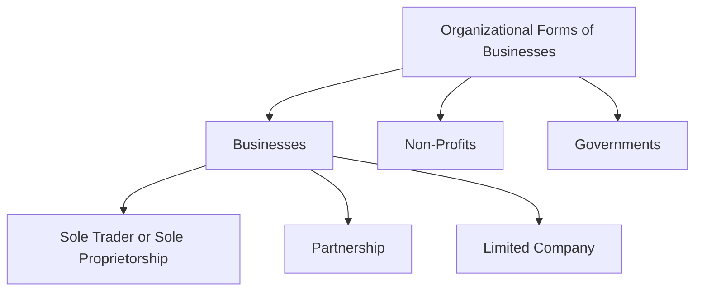
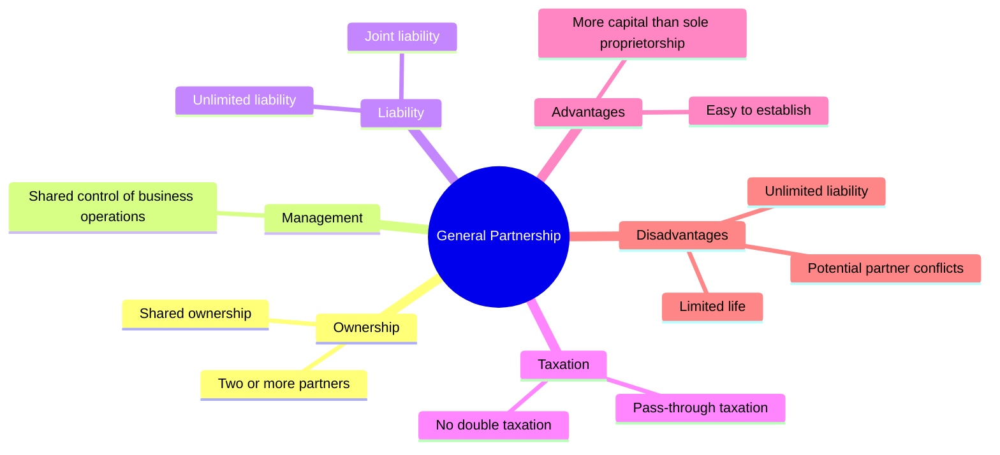
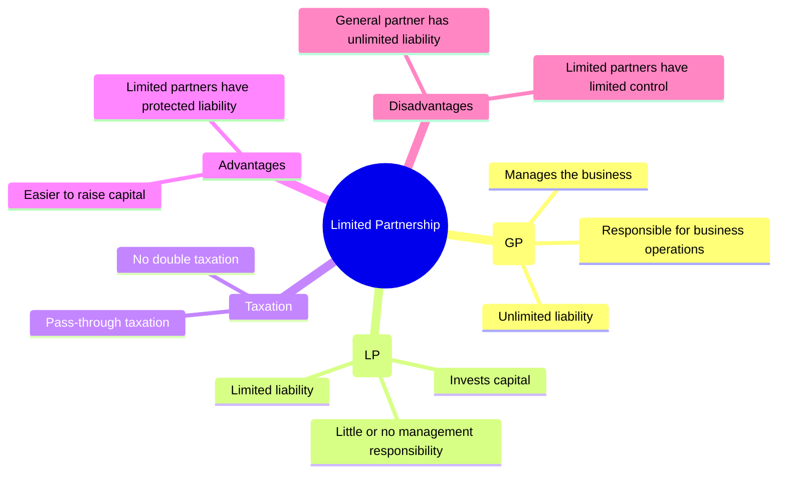
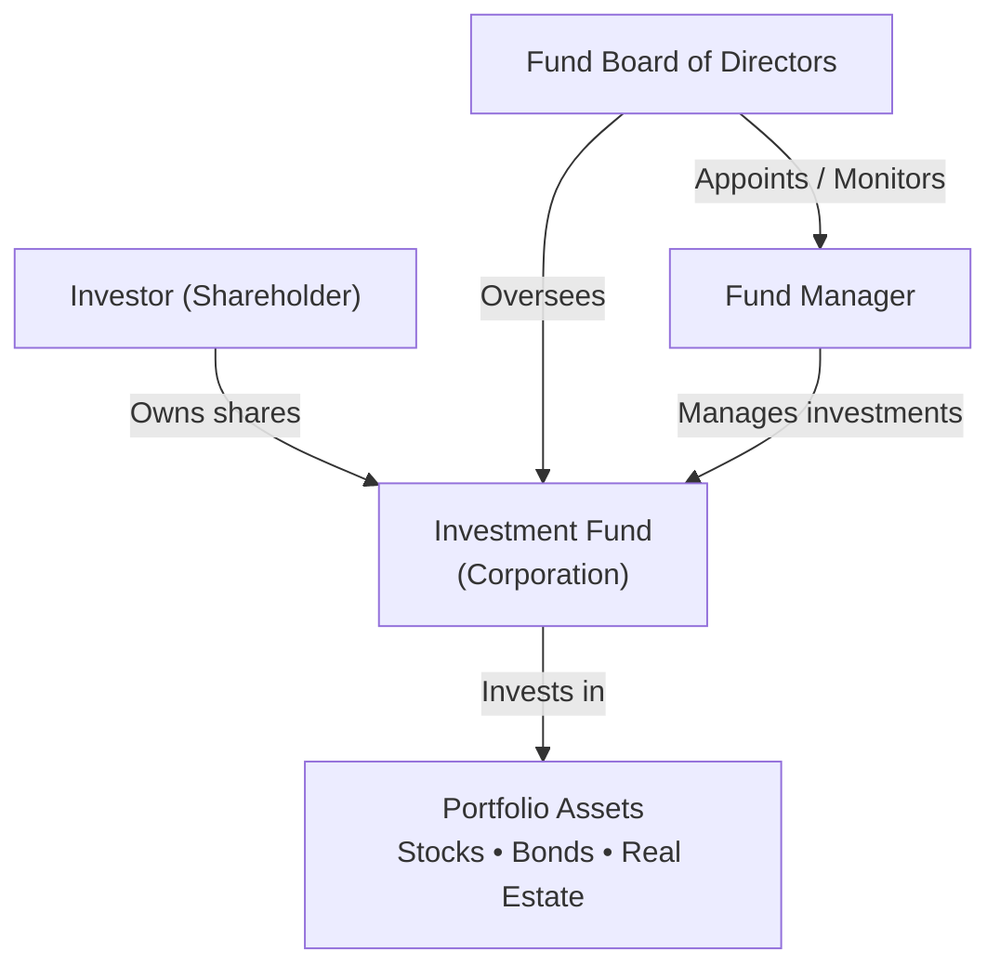
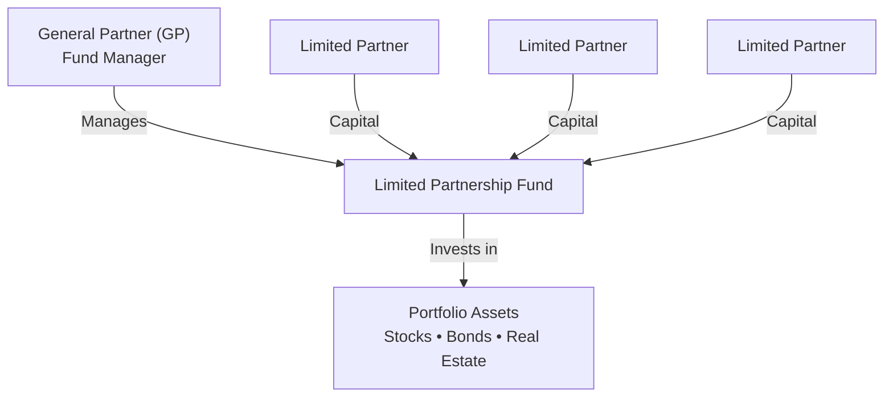
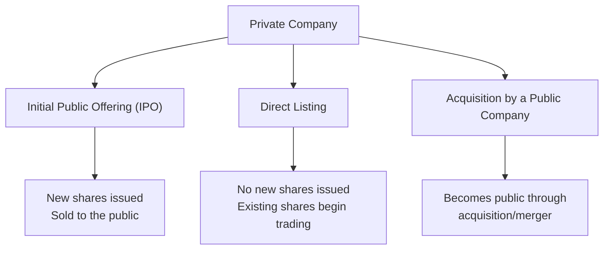

# Corporate Issuers
## Organizationl Forms，Corporate Issuer，Features，and Ownership
### 题目
1. Which of the following organizational forms provides for the least owner liability of business debts?

下列哪一种企业组织形式，对企业债务承担的所有者责任最小？

A. General partnership（普通合伙企业）
✅ B. Private limited company（私人有限公司）
C. Sole proprietorship（独资企业）
正确答案：B. Private limited company

---

2. 将下列企业特征（Business Attributes）与最合适的企业组织形式（Organizational Form）匹配。
Match the following business attributes with the most appropriate organizational form.

| Business Attribute | Organizational Form |
|--------------------|---------------------|
| A. Significant capital needs | 1. Limited Liability Partnership (LLP) |
| B. Single owner, desires simplicity | 2. Corporation |
| C. Company provides professional services | 3. Sole Proprietorship |

**正确答案：**

- **A → 2. Corporation**
- **B → 3. Sole Proprietorship**
- **C → 1. Limited Liability Partnership (LLP)**

| 题目关键词 | 第一反应 |
|------------|----------|
| Significant capital needs | Corporation |
| Raise capital | Corporation |
| Single owner | Sole Proprietorship |
| Simple / Easy to establish | Sole Proprietorship |
| Professional services | LLP |
| Law firm | LLP |
| Accounting firm | LLP |
| Consulting firm | LLP |

---

3. **True or False:** Partnerships are typically taxed at the **entity level** rather than at the **individual partner level**.

**答案：❌ False**

**Partnership = Pass-through Entity（穿透实体）**

- Partnership **本身不缴税**
- 利润直接分配给合伙人（Pass-through）
- 合伙人按**个人所得税（Personal Income Tax）**纳税

---

4. Match the applicable company characteristic with the category that best describes it (Publicly Held, Privately Held, or Both).

| Company Characteristic | Answer |
|------------------------|--------|
| Exchange listed | ✅ Publicly Held |
| Owner/manager overlaps | ✅ Privately Held |
| Registered | ✅ Publicly Held |
| Share liquidity | ✅ Publicly Held |
| Non-financial disclosure required | ✅ Both |
| Negotiated debt and equity sales | ✅ Privately Held |

**Publicly Held Company（上市公司）**

- ✅ Exchange listed（上市交易）
- ✅ Registered（向监管机构注册）
- ✅ High share liquidity（股票流动性高）
- ✅ Financial & Non-financial Disclosure（需披露财务和非财务信息）

**Privately Held Company（非上市公司）**

- ✅ Owner/Manager Overlap（所有者和管理者重合）
- ✅ Shares are illiquid（股票流动性低）
- ✅ Debt & Equity are privately negotiated（股权、债权私下协商交易）

---

5.The shareholder theory of corporate governance is _______________ than the stakeholder theory.
A. narrower
B. broader
正确答案： ✅ narrower

**Shareholder Theory（股东理论）**
企业的首要目标是最大化股东（shareholders）的利益。关注对象只有股东。范围较窄（narrower）。
**Stakeholder Theory（利益相关者理论）**
企业不仅要考虑股东，还要考虑所有利益相关者（stakeholders）。范围较广（broader）。
包括：
- Shareholders（股东）
- Employees（员工）
- Customers（客户）
- Suppliers（供应商）
- Creditors（债权人）
- Government（政府）
- Community（社区）
- Environment（环境）等

---
6.ESG factors are increasingly recognized as _______________ by analysts.
A. quantifiable
B. qualitative
正确答案： ✅ quantifiable
**Quantifiable（可量化的）✅**
- 可以用数据衡量
- 可以建立模型进行分析
- 可以纳入公司估值（valuation）
可以影响投资决策（investment decision-making）
例如：
- Carbon emissions（碳排放）
- Employee turnover（员工流失率）
- Board independence（董事会独立性）
- Workplace accidents（工伤率）
这些指标都可以被量化分析。

**Qualitative（定性的）❌**
指难以直接用数字衡量的信息，例如：
- 企业文化
- 品牌声誉
- 管理层领导力
虽然 ESG 中有些内容具有定性特征，但现代金融分析越来越倾向于将 ESG 指标量化。

---
7.Calculate returns on equity (ROE) for the period if the firms experience a 20% increase and a 20% decrease in revenue (from Question 1), assuming expenses remain unchanged.

教材答案（20% Increase in Revenue）：

|  | Equity-Financed | Debt- and Equity-Financed |
|---|---:|---:|
| Revenue | 120 | 120 |
| Operating Expenses | 70 | 70 |
| Interest Expense | 0 | 15 |
| Net Income | 50 | 35 |
| Total Equity | 100 | 25 |
| ROE | 50% | 140% |


我的错误理解 ❌
看到 Revenue 增加 20% 后，我认为 Total Equity 也应该增加。

例如我认为：

Equity-financed：Total Equity 应该由 100 → 120
Debt- and Equity-financed：Total Equity 应该由 25 → 30（或其他增加后的数字）
因此对教材仍然使用 100 和 25 作为 ROE 分母感到困惑。

正确理解 ✅
本题计算的是 one-period ROE（单一期间 ROE），分母使用期初（Beginning）Total Equity，不会因为当期利润增加而更新。
**ROE 公式：**
$$ROE=\frac{Net\ Income}{Total\ Equity}$$

- Revenue、Net Income → Income Statement（利润表）
- Total Equity → Balance Sheet（资产负债表）

---
8.**Compare the firm's returns on equity (ROE) if it finances the investment with debt, shares, or cash on hand. Discuss the results of the comparison.**

**已知条件**

- Revenue = 100
- Operating Expenses = 70
- New Investment = 20
- Return on New Investment = 30%
- Interest Rate on New Debt = 20%
- Ignore income taxes

**Initial Balance Sheet**

| Assets | | Liabilities & Equity | |
|---|---:|---|---:|
| Cash | 30 | Equity | 100 |
| Other Assets | 20 | | |
| LT Assets | 50 | | |

**我的错误**

不会判断 **Issue Shares、Borrow、Cash on Hand** 三种融资方式分别会影响哪些项目，导致不知道：

- 为什么三种方式的 **Revenue 都是 106**
- 为什么只有 **Borrow** 要扣 Interest
- 为什么 **Equity** 有时增加、有时保持不变

**正确思路**
**Step 1：计算新增 Revenue**

新增投资 = 20

投资回报率 = 30%

新增 Revenue：

$$
20 \times 30\% = 6
$$

因此：

$$
Revenue = 100 + 6 = 106
$$

> **投资项目相同，因此新增 Revenue 与融资方式无关。**

**Step 2：更新 Balance Sheet**
① Issue Shares（发行股票）

- Equity：100 → **120**
- Debt：0
- Cash 最终仍为30（发行股票收到20，再投资20）

② Borrow（借款）

- Debt：0 → **20**
- Equity：保持 **100**

③ Cash on Hand（使用现金）

- Cash：30 → **10**
- Equity：保持 **100**
- Debt：0

**Step 3：计算 Net Income**
**Issue Shares**

$$
\text{Net Income}=106-70=36
$$

**Borrow**

Interest：

$$
20 \times 20\%=4
$$

$$
\text{Net Income}=106-70-4=32
$$

**Cash on Hand**

无利息：

$$
\text{Net Income}=106-70=36
$$

**Step 4：计算 ROE**

$$
ROE=\frac{\text{Net Income}}{\text{Equity}}
$$

| Financing Method | Net Income | Equity | ROE |
|---|---:|---:|---:|
| Issue Shares | 36 | 120 | 30% |
| Borrow | 32 | 100 | 32% |
| Cash on Hand | 36 | 100 | 36% |

**本题考点**

**Issue Shares**

- Equity ↑
- Net Income ↑
- Equity 增加（Equity Dilution）
- **ROE 最低**

**Borrow**

- Equity 不变
- 有 Interest Expense
- 若：

$$
\text{Return on Investment}>\text{Interest Rate}
$$

则 Debt 会提高 ROE（Positive Financial Leverage）。

**Cash on Hand**

- Equity 不变
- 无 Interest Expense
- **ROE 最高**

**解题模板**

1. 计算新增 Revenue
   - Investment × Return on Investment

2. 更新 Balance Sheet
   - Issue Shares → Equity ↑
   - Borrow → Debt ↑
   - Cash on Hand → Cash ↓

3. 计算 Interest（只有 Borrow 有）

4. 计算 Net Income

$$
\text{Net Income}=\text{Revenue}-\text{Operating Expenses}-\text{Interest}
$$

5. 计算 ROE

$$
ROE=\frac{\text{Net Income}}{\text{Equity}}
$$

> **同一投资项目产生的收益相同，ROE 的差异来自融资方式：发股会增加 Equity（稀释 ROE），借款会增加 Interest（但可利用财务杠杆），使用现金既不增加 Equity，也没有利息，因此本题 ROE 最高。**

---
9.Corporate equity and debt holders share the same investor perspective with respect to:
公司股权投资者和债务投资者在哪一点上具有相同的投资视角？
A. maximum loss
B. investment risk
C. return potential
✅ 正确答案：A. maximum loss
**Investor Perspectives: Equity versus Debt**

| Attribute | Equity | Debt |
|---|---|---|
| Tenor | Indefinite | Term (e.g., 3 months, 10 years) |
| Return potential | Unlimited | Capped |
| Maximum loss | Initial investment | Initial investment |
| Investment risk | Higher | Lower |
| Desired outcome | Maximize firm value | Timely repayment |


### note
| 企业形式 | 所有者责任 | 是否需要用个人财产偿还债务 |
|----------|-----------|--------------------------|
| Sole Proprietorship（独资企业） | 无限责任（Unlimited Liability） | ✅ 是 |
| General Partnership（普通合伙企业） | 无限责任（Unlimited Liability） | ✅ 是（合伙人承担连带责任） |
| Private Limited Company（私人有限公司） | 有限责任（Limited Liability） | ❌ 否（一般仅以出资额为限） |



**Comparison of Business Organizational Forms**

| Feature | Sole Proprietorship | General Partnership | Limited Partnership | Corporation |
|---------|---------------------|---------------------|---------------------|-------------|
| **Legal Identity** | ❌ No separate legal identity | ❌ No separate legal identity | ❌ No separate legal identity | ✅ Separate legal entity |
| **Owner–Operator Relationship** | Owner operated | Partners operated | **GP** manages the business | Board of Directors & Management |
| **Owner Liability** | **Unlimited liability** | **Shared unlimited liability** | **GP:** Unlimited<br>**LP:** Limited | **Limited liability** |
| **Taxation** | **Pass-through taxation** | **Pass-through taxation** | **Pass-through taxation** | **Corporate tax + Dividend tax (Double Taxation)** |
| **Access to Financing** | Limited | Limited | Limited | Strongest access to capital |

| 属性（Attribute） | 中文 | 含义 |
|------------------|------|------|
| **Legal Identity** | 法律身份 | 企业是否具有独立于所有者的法律主体资格（Separate Legal Entity）。 |
| **Owner–Manager Relationship** | 所有者—管理者关系 | 企业所有者与经营管理者之间的关系，是否由所有者亲自管理或委托他人管理。 |
| **Owner Liability** | 所有者责任 | 所有者是否需要以个人财产承担企业债务（有限责任或无限责任）。 |
| **Taxation** | 税务 | 企业利润或亏损如何纳税，是否存在双重征税（Double Taxation）。 |
| **Access to Financing** | 融资能力 | 企业筹集资金、支持扩张及分散风险的能力。 |




**Investment Fund Organized as a Corporation**

**Investment Fund Organized as a Limited Partnership**

**Corporation vs Limited Partnership**
| Corporation Fund | Limited Partnership Fund |
|------------------|--------------------------|
| Investors are shareholders | Investors are Limited Partners (LPs) |
| Managed by Fund Manager | Managed by General Partner (GP) |
| Overseen by Board of Directors | No Board of Directors |
| Separate legal entity | Partnership structure |
| Shareholders have limited liability | LPs have limited liability; GP has unlimited liability |

**Financial Income vs. Economic Profit**
Financial Income（Net Income） 企业支付所有成本后的**会计利润**。
```text
Revenue
− Costs
− Interest
− Taxes
————————————————
= Net Income
```
可用于：
- Retained Earnings（留存收益）
- Dividends（股息）

Economic Profit 真正为股东创造的价值。
```text
Economic Profit
= Net Income− Required Return on Equity
```
 区别
| Financial Income | Economic Profit |
|------------------|-----------------|
| 会计利润 | 经济利润 |
| 扣除成本、利息、税 | 再扣除股东机会成本 |
| 是否盈利 | 是否真正创造价值 |

**Three Ways Private Companies Go Public**



**IPO**：自己上市，发行新股融资。
**Direct Listing**：自己上市，不发行新股。
**SPAC**：借壳上市，通过与一家已上市的 SPAC 合并或被其收购，实现上市。
在 CFA 一级中，SPAC （Special Purpose Acquisition Company）通常被归类到 通过被上市公司收购（Acquisition by a Public Company）实现上市 的方式。
- ✅ 已经上市（Public Company）
- ✅ 没有实际业务（No Operating Business）
- ✅ 成立的唯一目的就是收购一家私人公司。

**Dormant Listed Company vs. SPAC**

| Dormant Listed Company | SPAC (Special Purpose Acquisition Company) |
|-------------------------|--------------------------------------------|
| 原来有业务，现在基本停止经营 | 从成立开始就没有经营业务 |
| 保留上市资格 | 专门为了收购目标公司而设立并上市 |
| 可用于借壳上市（Reverse Takeover） | 可用于 SPAC 合并上市（SPAC Merger） |

### 生词
financial acumen 财务敏锐度
joint ventures 合资企业
brokerage account 证券账户
empirical evidence 实证证据
accredited investors  合格投资者
sophisticated investors 经验丰富的投资者
domicile 住所
pertinent information 相关信息
Mandated Disclosures 强制信息披露
photovoltaics market 光伏市场
venture capital 风险投资
proxeed 收益
dormant listed company 休眠上市公司
the sophistication for understanding 理解所需的敏锐度
incumbent 现任者
emerging economies 
stewardship 管理责任
claim against 对...索偿权

### Glossary
**A**
Accredited investors
Investors that meet certain minimum regulatory net worth or other requirements in order to invest in certain types of alternative assets.

**B**
Board of directors
A body or individual selected by a limited company’s member(s) or shareholder(s), in a manner determined by the company’s charter, that manages the company. Typically, for larger companies, boards of directors appoint and oversee executive management.

Businesses
Organization entities formed and managed for the purpose of providing a return or economic benefits to its investors and owners.

**C**
Companies
Organization entities formed and managed for the purpose of providing a return or economic benefits to its investors and owners.

Corporate issuers
Limited companies or corporations that seek financing in financial markets by, for example, issuing debt or equity securities.

Corporations
Another term for limited companies, though often used to refer to public limited companies. See limited company, private limited company, and public limited company.

**D**
Debt
A claim against an entity to receive cash, stock, or other assets at a future date. From the perspective of the debtor or borrower, an obligation to pay cash, stock, or other assets at a future date. Generally, debt claims are unconditional and are senior to equity claims.

Direct listing
Where the equity of a security is floated on the public markets directly, without underwriters, reducing the complexity and cost of the transaction.

Dividends
Distributions of profits and/or net assets from a corporation to its shareholders. While often in cash, dividends can be also be paid in stock or assets, such as property.

Double taxation
Income is taxed twice.

**E**
Equity
Ownership interest in an entity. A residual claim on the assets of an entity after more senior claims, such as debt, have been satisfied. Also known as net assets.

Exchange
A rules-based, open access market venue where financial instruments are traded, with price and volume transparency accessible by issuers, investors, and their intermediaries.

**F**
Free float
The portion of a listed company’s equity securities that are not held by insiders, strategic investors, sponsors, founders, and so on, that are more freely available for trading.

**G**
General partners (GPs)
Private fund managers responsible for sourcing and deploying capital from limited partner investors over an investment life cycle and distributing returns to those investors over a finite investment holding period.

General partnership
A business organizational form owned entirely by general partners.

**I**
Initial public offering (IPO)
The first issuance of common shares to the public by a formerly private corporation.

**L**
Limited company
A business organizational form owned by shareholders or members with limited liability who elect a board of directors to appoint management. Generally, limited companies have indefinite life and easier transfer of ownership interests than limited partnerships.

Limited liability partnership (LLP)
A business organizational form available in some jurisdictions owned entirely by limited partners with limited liability.

Limited partnership
Closed-end form of ownership frequently used in private market funds in which private market fund investors, or limited partners, commit capital that is invested, managed, and distributed by a private market fund manager, or general partner, over an investment holding period.

Limited partners (LPs)
Outside investors in a private market fund who own a fractional interest in a limited, closed-end partnership managed by a general partner based on the investment commitment and other terms set out in a limited partner agreement.

**O**
Organizational form
A legal and tax classification of a business, specific to a jurisdiction, that determines the organization’s legal identity, owner–manager relationship, owner liability, taxation, and access to financing.

**P**
Pass-through businesses
Businesses that, by virtue of their organizational form and/or other legal and regulatory attributes, do not pay entity-level taxes on income or loss; income or loss is passed through to owners, who pay personal taxes.

Private company
A company, typically a limited company, that does not list its equity securities on an exchange.

Private limited company
A type of limited company in many jurisdictions with pass-through taxation but restrictions on the number of shareholders or members and on the transfer of ownership interest.

Private placement
A sale of debt or equity securities to a small group of investors on an unregulated basis. The terms of the offering are negotiated by the issuer and investors.

Public limited companies
A type of limited company in many jurisdictions with entity-level taxation but no restrictions on the number of shareholders or transferability of ownership interest; the most suitable organizational form for a company that seeks to go public.

Public (listed) company
A company with its equity securities traded on an exchange.

**S**
Security
Evidence of equity or debt interest or in an entity or a related right, such as a derivative. Often standardized to conform to security exchange requirements.

Shareholders
Hold a direct equity position in a firm, and both individual persons and financial institutions can be shareholders. The term comes from the individual or investment firm literally having a share of the company. It is most commonly used when talking about the rights and responsibilities that come with being an “owner” of a company, such as stewardship, voting, and engagement. This differentiates it from a situation where an individual or an investment firm lends money or invests in a bond (in other words, they are not an equityholder of a company). Because bond investors do not have a share and are not owners of a company, they cannot vote. Nonetheless, expectations around engagement are increasing for those who invest in loans and bonds as well, making the difference between the two terms more subtle.

Shares
Units of ownership interest in a limited company.

Sophisticated investors
Individuals or entities that are permitted in a jurisdiction to trade unregistered or, generally, less regulated securities, including shares of privately held companies; also called accredited investors.

Special purpose acquisition company
A “blank check” company that exists solely for the purpose of acquiring an unspecified private company within a predetermined period or return capital to investors.

Stock exchange
An exchange in which equity securities are traded. See exchanges.

**V**
Voting rights
The power of shareholders to cast votes in corporate elections for directors and other matters submitted to a shareholder vote.