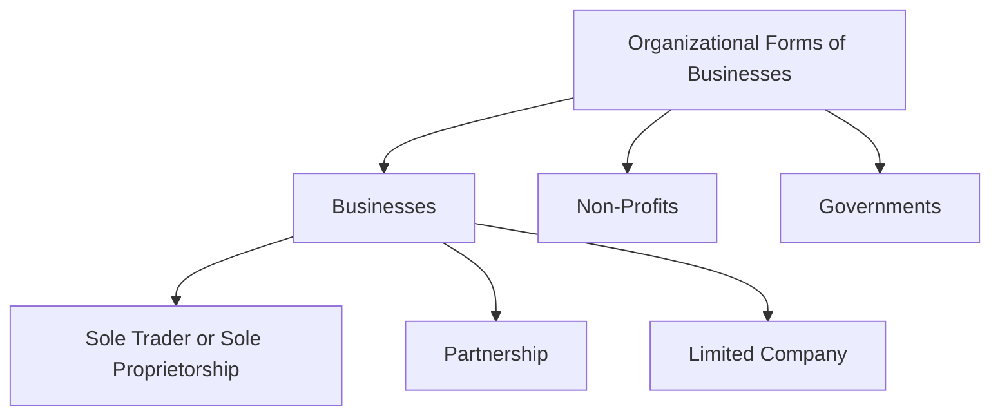
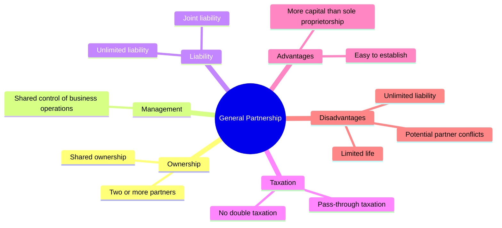
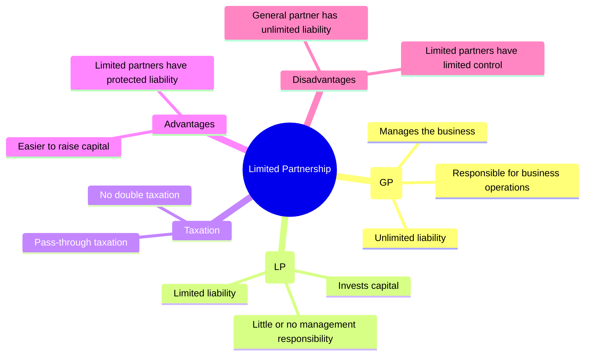
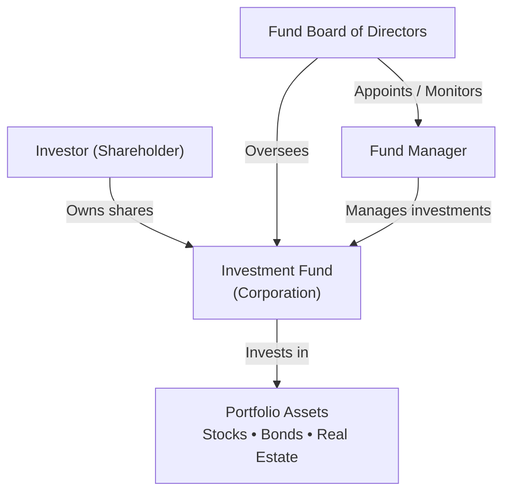
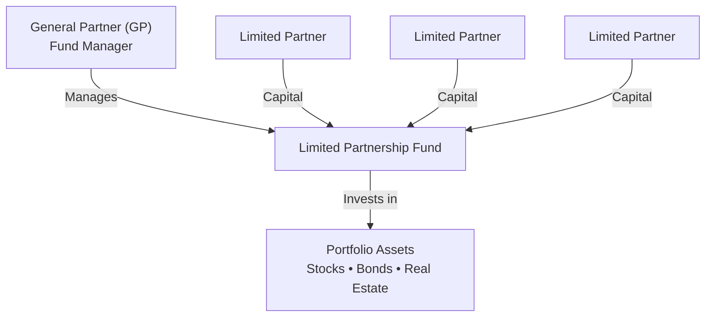
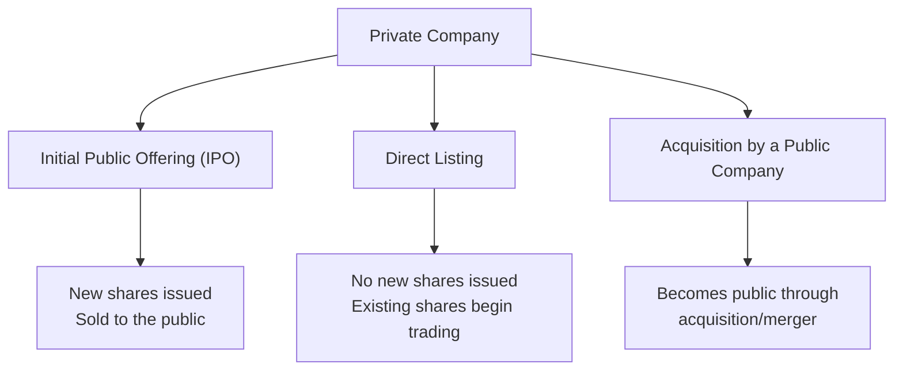

# Corporate Issuers
## Organizationl Forms，Corporate Issuer，Features，and Ownership
### 题目
1. Which of the following organizational forms provides for the least owner liability of business debts?

下列哪一种企业组织形式，对企业债务承担的所有者责任最小？

A. General partnership（普通合伙企业）
✅ B. Private limited company（私人有限公司）
C. Sole proprietorship（独资企业）
正确答案：B. Private limited company

---

2. 将下列企业特征（Business Attributes）与最合适的企业组织形式（Organizational Form）匹配。
Match the following business attributes with the most appropriate organizational form.

| Business Attribute | Organizational Form |
|--------------------|---------------------|
| A. Significant capital needs | 1. Limited Liability Partnership (LLP) |
| B. Single owner, desires simplicity | 2. Corporation |
| C. Company provides professional services | 3. Sole Proprietorship |

**正确答案：**

- **A → 2. Corporation**
- **B → 3. Sole Proprietorship**
- **C → 1. Limited Liability Partnership (LLP)**

| 题目关键词 | 第一反应 |
|------------|----------|
| Significant capital needs | Corporation |
| Raise capital | Corporation |
| Single owner | Sole Proprietorship |
| Simple / Easy to establish | Sole Proprietorship |
| Professional services | LLP |
| Law firm | LLP |
| Accounting firm | LLP |
| Consulting firm | LLP |

---

3. **True or False:** Partnerships are typically taxed at the **entity level** rather than at the **individual partner level**.

**答案：❌ False**

**Partnership = Pass-through Entity（穿透实体）**

- Partnership **本身不缴税**
- 利润直接分配给合伙人（Pass-through）
- 合伙人按**个人所得税（Personal Income Tax）**纳税

---

4. Match the applicable company characteristic with the category that best describes it (Publicly Held, Privately Held, or Both).

| Company Characteristic | Answer |
|------------------------|--------|
| Exchange listed | ✅ Publicly Held |
| Owner/manager overlaps | ✅ Privately Held |
| Registered | ✅ Publicly Held |
| Share liquidity | ✅ Publicly Held |
| Non-financial disclosure required | ✅ Both |
| Negotiated debt and equity sales | ✅ Privately Held |

Publicly Held Company（上市公司）

- ✅ Exchange listed（上市交易）
- ✅ Registered（向监管机构注册）
- ✅ High share liquidity（股票流动性高）
- ✅ Financial & Non-financial Disclosure（需披露财务和非财务信息）

### Privately Held Company（非上市公司）

- ✅ Owner/Manager Overlap（所有者和管理者重合）
- ✅ Shares are illiquid（股票流动性低）
- ✅ Debt & Equity are privately negotiated（股权、债权私下协商交易）

### note
| 企业形式 | 所有者责任 | 是否需要用个人财产偿还债务 |
|----------|-----------|--------------------------|
| Sole Proprietorship（独资企业） | 无限责任（Unlimited Liability） | ✅ 是 |
| General Partnership（普通合伙企业） | 无限责任（Unlimited Liability） | ✅ 是（合伙人承担连带责任） |
| Private Limited Company（私人有限公司） | 有限责任（Limited Liability） | ❌ 否（一般仅以出资额为限） |



**Comparison of Business Organizational Forms**

| Feature | Sole Proprietorship | General Partnership | Limited Partnership | Corporation |
|---------|---------------------|---------------------|---------------------|-------------|
| **Legal Identity** | ❌ No separate legal identity | ❌ No separate legal identity | ❌ No separate legal identity | ✅ Separate legal entity |
| **Owner–Operator Relationship** | Owner operated | Partners operated | **GP** manages the business | Board of Directors & Management |
| **Owner Liability** | **Unlimited liability** | **Shared unlimited liability** | **GP:** Unlimited<br>**LP:** Limited | **Limited liability** |
| **Taxation** | **Pass-through taxation** | **Pass-through taxation** | **Pass-through taxation** | **Corporate tax + Dividend tax (Double Taxation)** |
| **Access to Financing** | Limited | Limited | Limited | Strongest access to capital |

| 属性（Attribute） | 中文 | 含义 |
|------------------|------|------|
| **Legal Identity** | 法律身份 | 企业是否具有独立于所有者的法律主体资格（Separate Legal Entity）。 |
| **Owner–Manager Relationship** | 所有者—管理者关系 | 企业所有者与经营管理者之间的关系，是否由所有者亲自管理或委托他人管理。 |
| **Owner Liability** | 所有者责任 | 所有者是否需要以个人财产承担企业债务（有限责任或无限责任）。 |
| **Taxation** | 税务 | 企业利润或亏损如何纳税，是否存在双重征税（Double Taxation）。 |
| **Access to Financing** | 融资能力 | 企业筹集资金、支持扩张及分散风险的能力。 |




**Investment Fund Organized as a Corporation**

**Investment Fund Organized as a Limited Partnership**

**Corporation vs Limited Partnership**
| Corporation Fund | Limited Partnership Fund |
|------------------|--------------------------|
| Investors are shareholders | Investors are Limited Partners (LPs) |
| Managed by Fund Manager | Managed by General Partner (GP) |
| Overseen by Board of Directors | No Board of Directors |
| Separate legal entity | Partnership structure |
| Shareholders have limited liability | LPs have limited liability; GP has unlimited liability |

**Financial Income vs. Economic Profit**
Financial Income（Net Income） 企业支付所有成本后的**会计利润**。
```text
Revenue
− Costs
− Interest
− Taxes
————————————————
= Net Income
```
可用于：
- Retained Earnings（留存收益）
- Dividends（股息）

Economic Profit 真正为股东创造的价值。
```text
Economic Profit
= Net Income− Required Return on Equity
```
 区别
| Financial Income | Economic Profit |
|------------------|-----------------|
| 会计利润 | 经济利润 |
| 扣除成本、利息、税 | 再扣除股东机会成本 |
| 是否盈利 | 是否真正创造价值 |

**Three Ways Private Companies Go Public**



**IPO**：自己上市，发行新股融资。
**Direct Listing**：自己上市，不发行新股。
**SPAC**：借壳上市，通过与一家已上市的 SPAC 合并或被其收购，实现上市。
在 CFA 一级中，SPAC （Special Purpose Acquisition Company）通常被归类到 通过被上市公司收购（Acquisition by a Public Company）实现上市 的方式。
- ✅ 已经上市（Public Company）
- ✅ 没有实际业务（No Operating Business）
- ✅ 成立的唯一目的就是收购一家私人公司。

**Dormant Listed Company vs. SPAC**

| Dormant Listed Company | SPAC (Special Purpose Acquisition Company) |
|-------------------------|--------------------------------------------|
| 原来有业务，现在基本停止经营 | 从成立开始就没有经营业务 |
| 保留上市资格 | 专门为了收购目标公司而设立并上市 |
| 可用于借壳上市（Reverse Takeover） | 可用于 SPAC 合并上市（SPAC Merger） |

### 生词
financial acumen 财务敏锐度
joint ventures 合资企业
brokerage account 证券账户
 empirical evidence 实证证据
 accredited investors  合格投资者
 sophisticated investors 经验丰富的投资者
 domicile 住所
 pertinent information 相关信息
 Mandated Disclosures 强制信息披露
 photovoltaics market 光伏市场
 venture capital 风险投资
 proxeed 收益
 dormant listed company 休眠上市公司
 the sophistication for understanding 理解所需的敏锐度
 