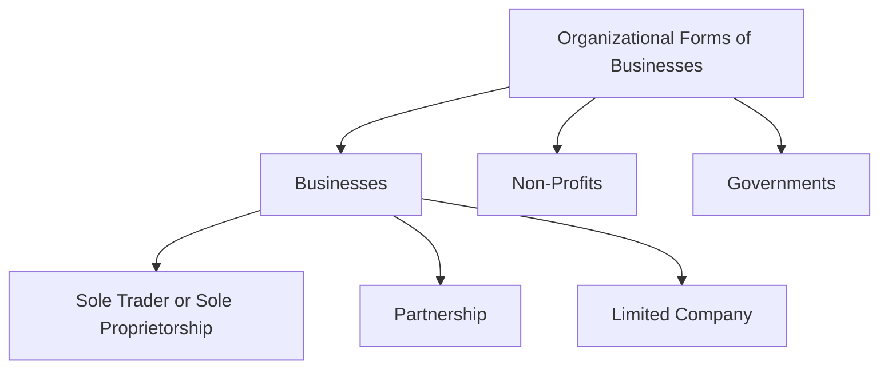
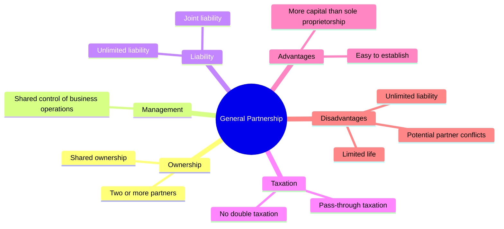
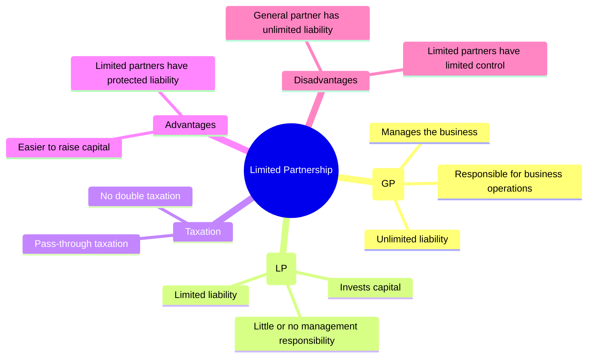

# Corporate Issuers
## Organizationl Forms，Corporate Issuer，Features，and Ownership
### 题目
Which of the following organizational forms provides for the least owner liability of business debts?

下列哪一种企业组织形式，对企业债务承担的所有者责任最小？

A. General partnership（普通合伙企业）
✅ B. Private limited company（私人有限公司）
C. Sole proprietorship（独资企业）
正确答案：B. Private limited company

### note
| 企业形式 | 所有者责任 | 是否需要用个人财产偿还债务 |
|----------|-----------|--------------------------|
| Sole Proprietorship（独资企业） | 无限责任（Unlimited Liability） | ✅ 是 |
| General Partnership（普通合伙企业） | 无限责任（Unlimited Liability） | ✅ 是（合伙人承担连带责任） |
| Private Limited Company（私人有限公司） | 有限责任（Limited Liability） | ❌ 否（一般仅以出资额为限） |

**Comparison of Business Organizational Forms**

| Feature | Sole Proprietorship | General Partnership | Limited Partnership | Corporation |
|---------|---------------------|---------------------|---------------------|-------------|
| **Legal Identity** | ❌ No separate legal identity | ❌ No separate legal identity | ❌ No separate legal identity | ✅ Separate legal entity |
| **Owner–Operator Relationship** | Owner operated | Partners operated | **GP** manages the business | Board of Directors & Management |
| **Owner Liability** | **Unlimited liability** | **Shared unlimited liability** | **GP:** Unlimited **LP:** Limited | **Limited liability** |
| **Taxation** | **Pass-through taxation** | **Pass-through taxation** | **Pass-through taxation** | **Corporate tax + Dividend tax (Double Taxation)** |
| **Access to Financing** | Limited | Limited | Limited | Strongest access to capital |

| 属性（Attribute） | 中文 | 含义 |
|------------------|------|------|
| **Legal Identity** | 法律身份 | 企业是否具有独立于所有者的法律主体资格（Separate Legal Entity）。 |
| **Owner–Manager Relationship** | 所有者—管理者关系 | 企业所有者与经营管理者之间的关系，是否由所有者亲自管理或委托他人管理。 |
| **Owner Liability** | 所有者责任 | 所有者是否需要以个人财产承担企业债务（有限责任或无限责任）。 |
| **Taxation** | 税务 | 企业利润或亏损如何纳税，是否存在双重征税（Double Taxation）。 |
| **Access to Financing** | 融资能力 | 企业筹集资金、支持扩张及分散风险的能力。 |

### 生词
financial acumen 财务敏锐度
joint ventures 合资企业