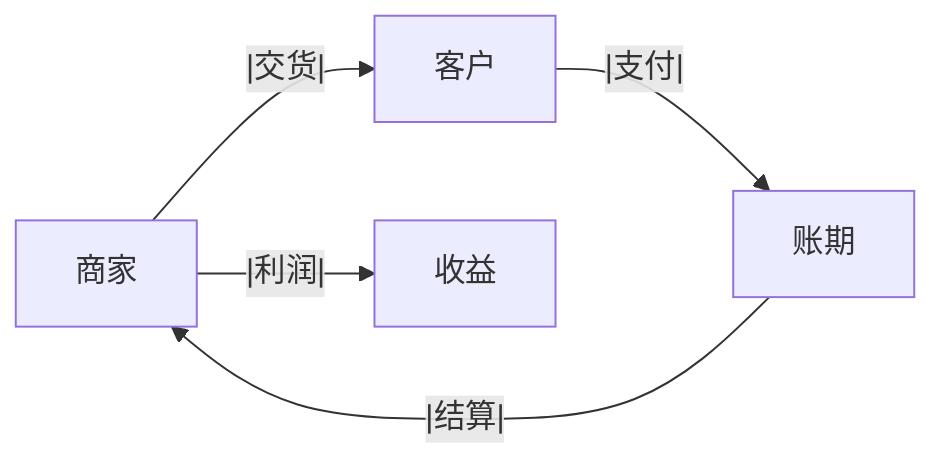
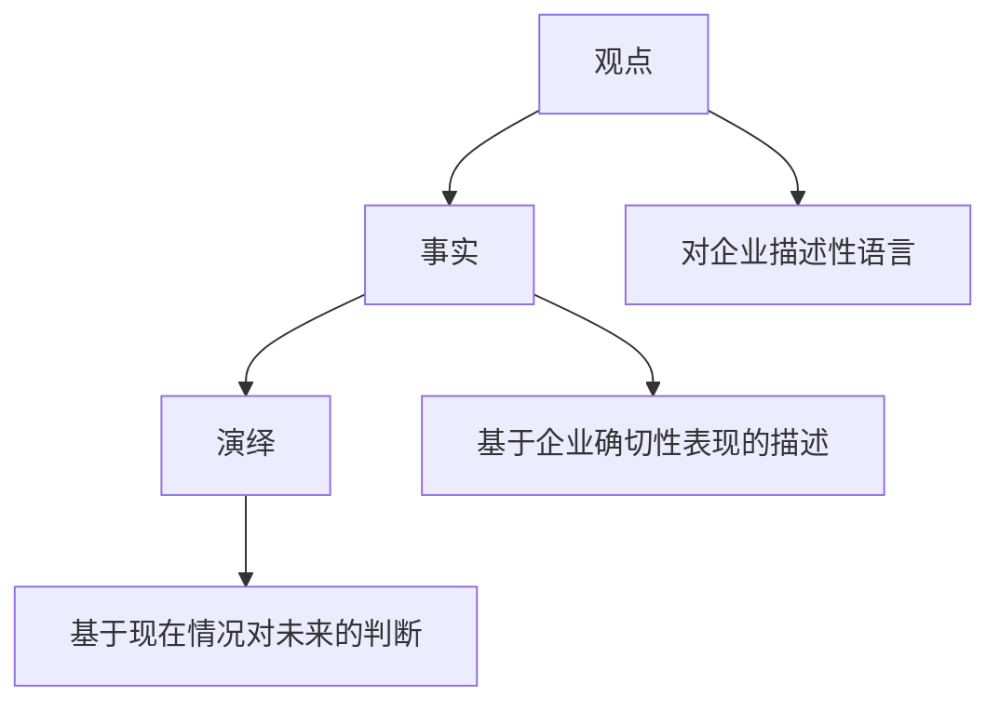

# Chapter 1

## 商业模式

::: info
货币资金和银行贷款相当，一方面高额银行贷款，另一方面账面又显示又大额的货币资金
:::

::: tip
**货币资金**
大额货币资金指的是企业账面上显示的 现金及银行存款数额较大，通常包括：
- 库存现金
- 银行存款（活期、定期）
- 其他货币资金（如受限存款、备用金等）
:::

在财务报表中，如果企业一方面有 高额银行贷款，另一方面账面上却显示 大额货币资金，这可能是一个 财务异常现象，通常涉及以下几种可能的情况：

1. 资金“空转”或“包装”

目的：人为制造资金充裕的假象，增强企业的财务健康度，使外界误以为公司流动性良好。

方式：企业从银行借款后，并未真正用于生产经营，而是直接存入银行，造成“贷款增加的同时，货币资金也增加”的表象。

2. 贷款未真实使用

情况：可能是企业申请贷款时，银行要求存入一定比例的保证金，导致货币资金与贷款同时增加。

风险：资金并未真正流入企业经营，可能只是财务操作上的“循环”。

3. 规避财务指标

情况：部分企业为了优化财务指标（如流动比率、现金流状况等），可能利用短期贷款提高账面资金，掩盖潜在的财务压力。

风险：如果企业真实经营情况不佳，这种做法可能导致未来现金流断裂的风险。

4. 资金可能涉及利益输送

情况：如果企业长期保持这种状态，可能意味着公司在进行不透明的资金运作，例如：

关联方循环贷款（即资金从银行贷款后，流向关联方再回流）。

通过货币资金掩盖实际的财务亏损。

**如何判断是否异常？**

观察资金流向：检查企业的资金流入流出是否正常，是否真正用于生产经营。

对比现金流量表：如果企业 经营性现金流入较少，但融资性现金流入巨大，可能说明资金并未投入生产，而是通过借贷维持现金余额。

关注贷款用途：如果企业长期维持高额贷款与高额货币资金共存，且贷款未用于扩大生产经营，需警惕资金空转的可能性。

::: tip
***财务费用差异异常，明显偏高 ***

说明企业的财务费用相比正常水平有 异常增高 的情况。财务费用主要包括：
- 利息支出（贷款利息、债券利息）
- 汇兑损益（外币借款的汇率变动）
- 手续费及佣金（银行手续费、融资服务费等）
:::

::: info
其他应收款占比相对较小；其他应付款逐年减少，显示出公司在花“力气”规范经营方式
:::

1. 其他应收款占比相对较小

解释：
**其他应收款** 指的是**与主营业务无关**的款项，比如员工借款、关联方资金往来、押金、备用金、代垫款项等。

- 占比较小 说明公司减少了这些非主营业务的资金占用，提升了 资金使用效率。
- 也可能表示公司减少了与关联方之间的非正常资金往来，降低了财务风险。

积极信号：
- 资金回笼加快，减少坏账风险。
- 资金运用更聚焦在主营业务，提高经营效率。

2. 其他应付款逐年减少

解释：
**其他应付款**通常指的是**企业非正常经营负债**，包括应付押金、暂收款、代收代付款项、关联方往来款等。

- 逐年减少 说明企业逐步清理了历史遗留债务，减少了不必要的资金往来，财务管理更加规范。
- 也可能表示企业减少了对关联方或其他单位的依赖，更独立地运营。

积极信号：
- 经营透明度提升，减少财务不规范问题。
- 降低潜在财务风险，增强财务稳健性。

# Chapter 2

## 尽职调查

尽职调查（Due Diligence）是指在进行投资决策之前，对公司、产品或服务进行全面评估和研究的过程。

## 逻辑框架

::: tip
**IPO**

IPO（Initial Public Offering）是指股票首次公开上市的过程，是上市公司向公众公开出售股票的一种方式。IPO的目的是为了吸引投资者，让投资者能够通过股票购买上市公司的股票。
:::

# Chapter 3

