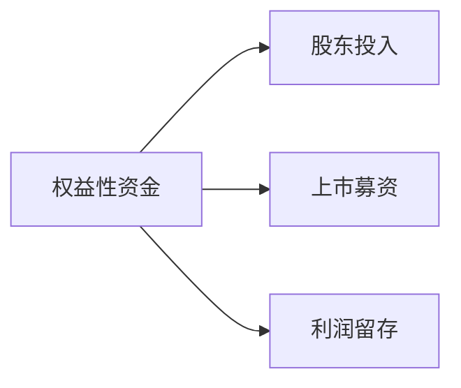
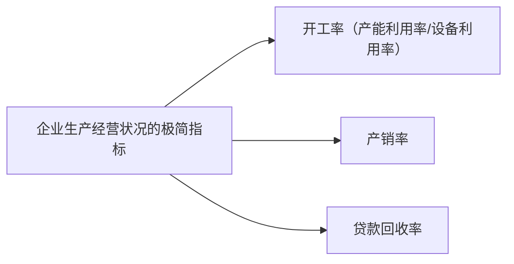

## Chapter 2

### 黑天鹅理论

黑天鹅理论是一种概率理论，它认为在随机事件中，有些事件是不可预测的，这些事件被称为“黑天鹅”。

黑天鹅理论的基本假设是，随机事件的概率分布是不均匀的，即有些事件的概率非常小，而有些事件的概率非常大。

### 平滑定理

平滑定理是一种概率理论，它认为在随机事件中，有些事件的概率是可以预测的，这些事件被称为“平滑事件”。

平滑定理的基本假设是，随机事件的概率分布是均匀的，即所有事件的概率都是相等的。

## Chaper 5

### 劣后级有限合伙人（LP）

私募基金或结构化产品中一种特殊的投资者类别，其核心特征是在收益分配和亏损承担顺序上处于“次级”地位。以下是关于劣后级 LP 的详细解析：

**核心特点**

1. 分配顺序劣后

- 在基金收益分配时，劣后级 LP 需等待优先级 LP（如银行、保险等保守型投资者）优先获得约定回报后，才能参与剩余收益分配。

- 亏损承担时，劣后级 LP 需先吸收损失，直至其出资额耗尽后，优先级 LP 才会承担后续亏损。

2. 风险与收益的双重放大

- 高风险：因其承担“第一损失”，若基金亏损，劣后级 LP 可能损失全部本金。

- 高回报：若基金表现优异，劣后级 LP 可获取扣除优先级固定收益后的超额收益（类似杠杆效应）。

3. 有限合伙人身份

- 劣后级 LP 仍属于有限合伙人，不参与基金日常管理，仅承担有限责任（以出资额为限）。

| **优势**                               | **风险**                         |
| -------------------------------------- | -------------------------------- |
| 潜在超额收益（杠杆效应）               | 本金损失风险极高                 |
| 吸引优先级资金，扩大基金规模           | 收益分配高度依赖基金整体表现     |
| 可能获得 GP 让渡的附加权益（如跟投权） | 流动性差，退出依赖基金清算或转让 |

## Chaper 6

**国内企业“负债累累”**

1. 企业权益性资金来源过窄，债务性资金来源泛滥。

::: warning
扩张过度、债务过重、产能过剩、利润过薄、杠杠率过高
:::

Chaper 8

