# 1
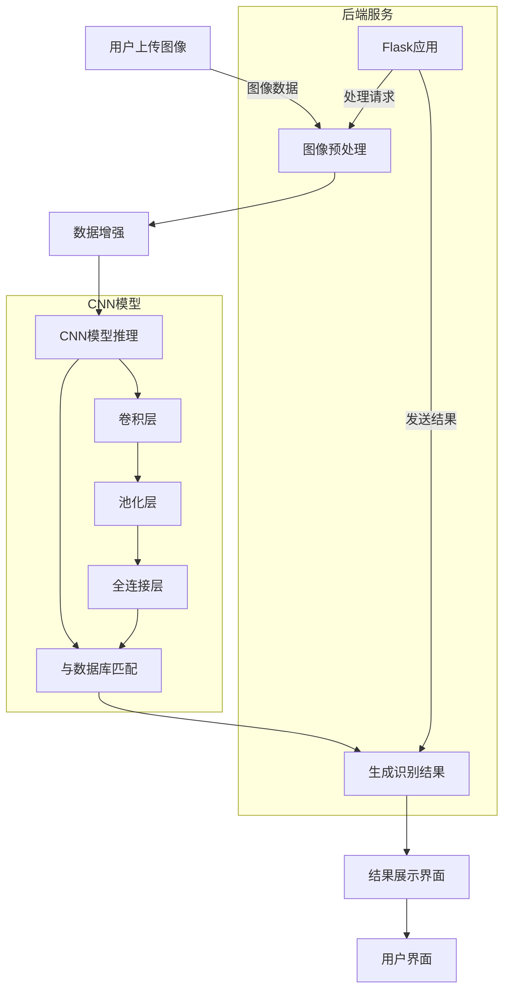
# 2
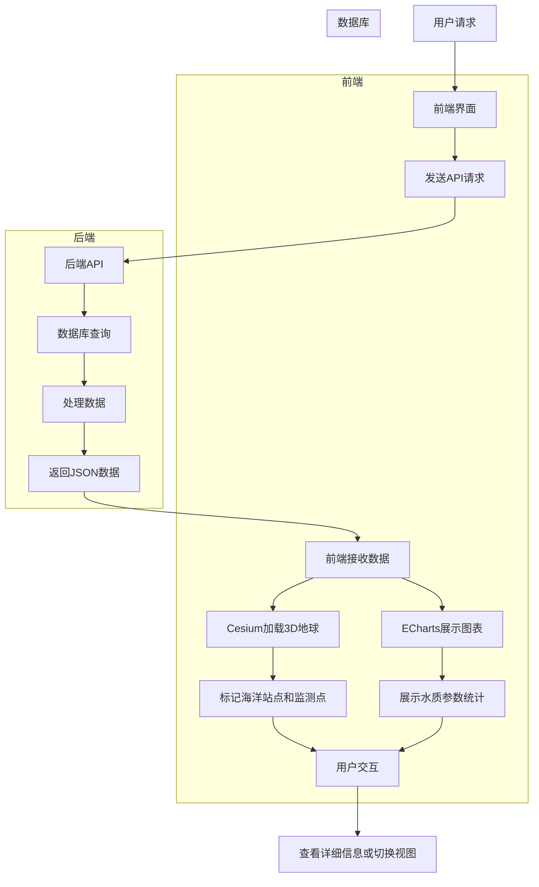


# 3

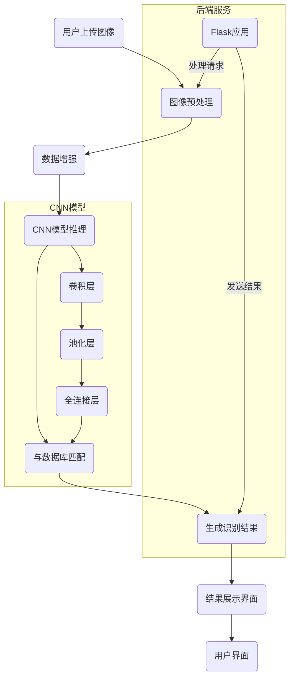
# 4

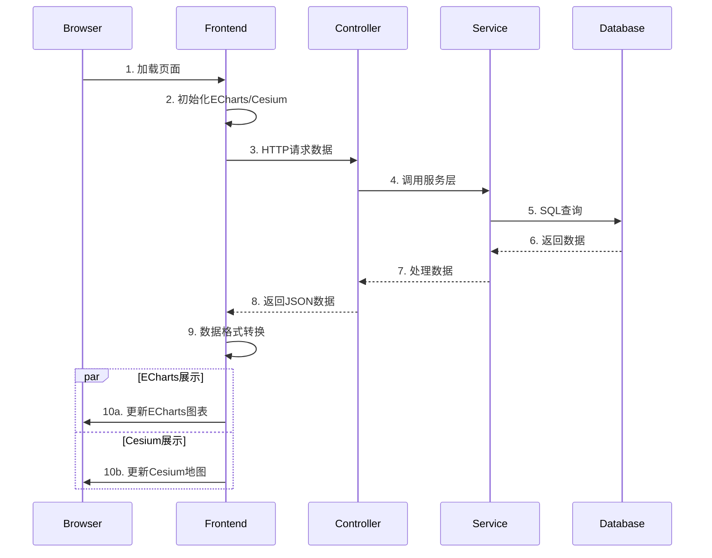
# 5
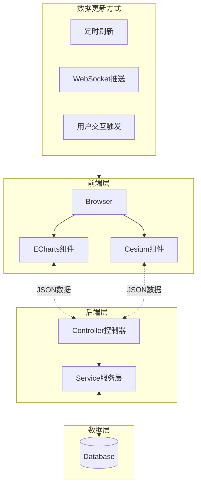

# 6
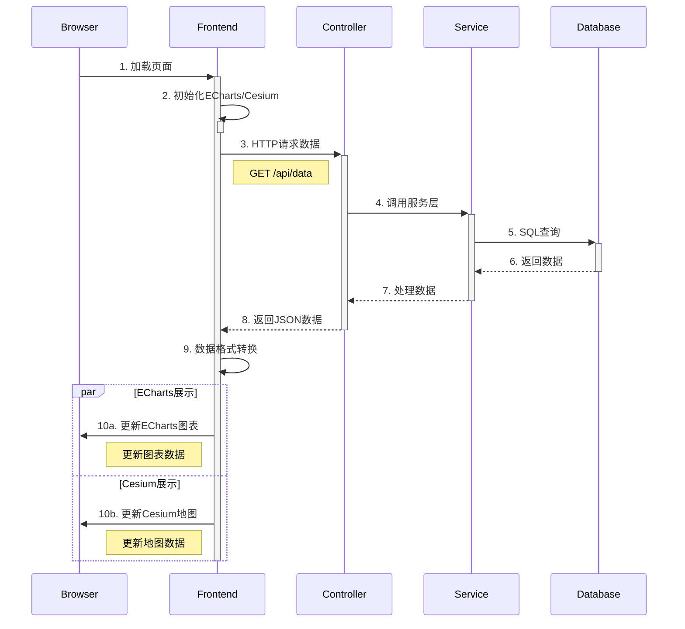
# 7

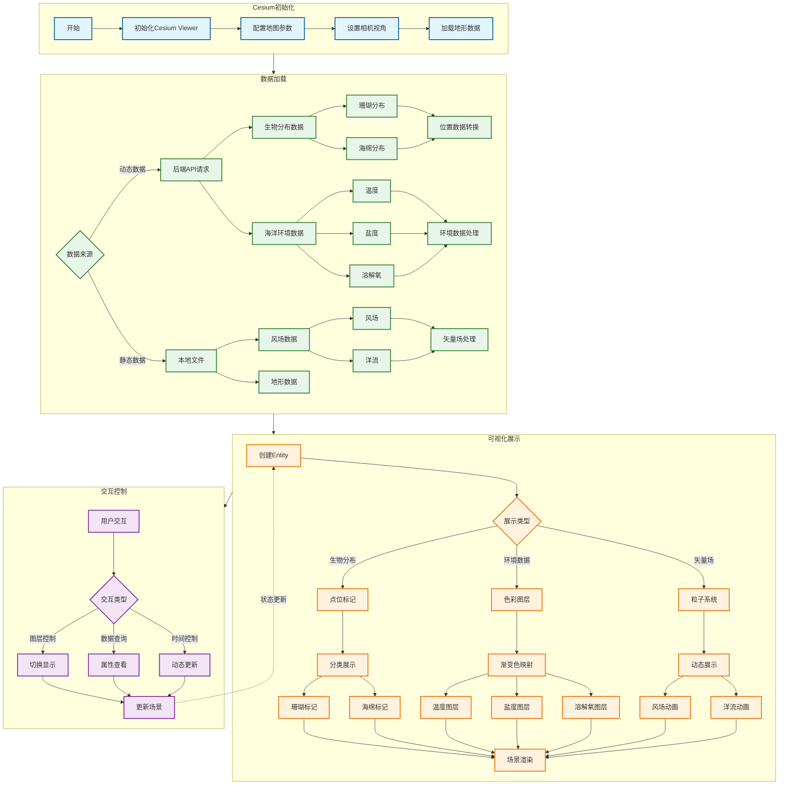
# 8

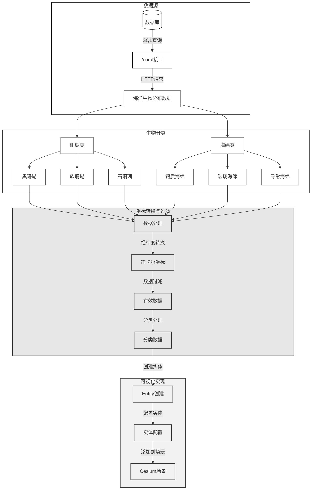
# 9

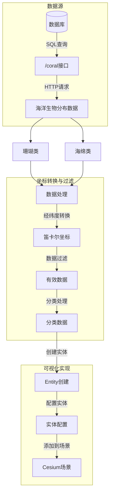
# 10
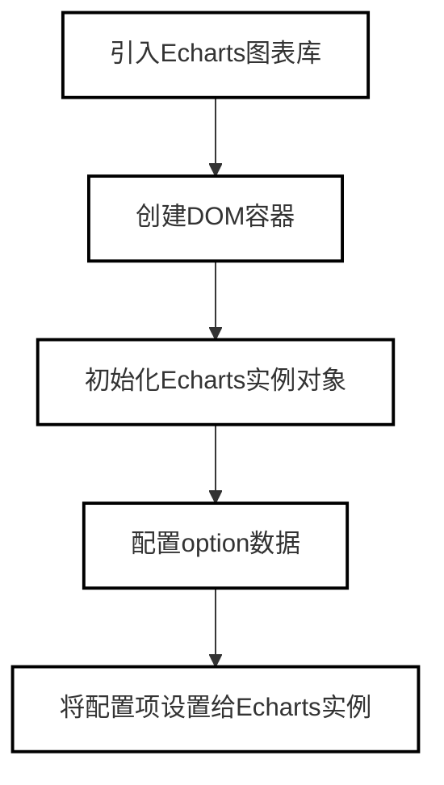

# 11
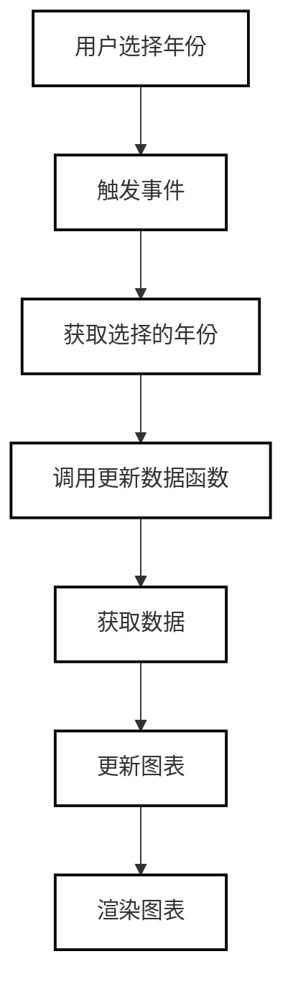

# 12
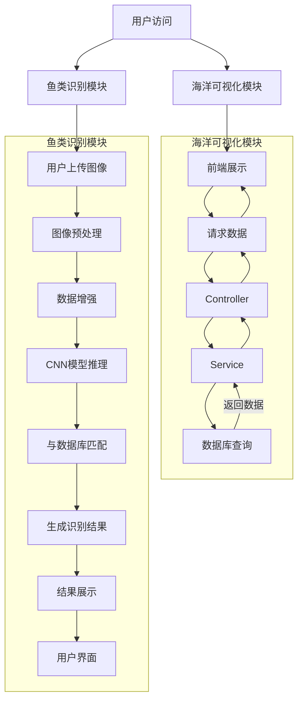

## 13
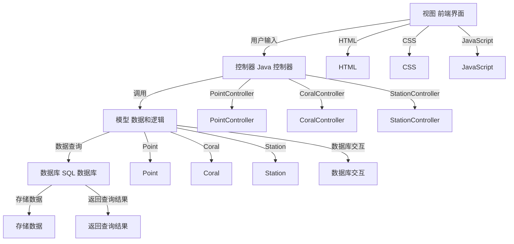

## 14
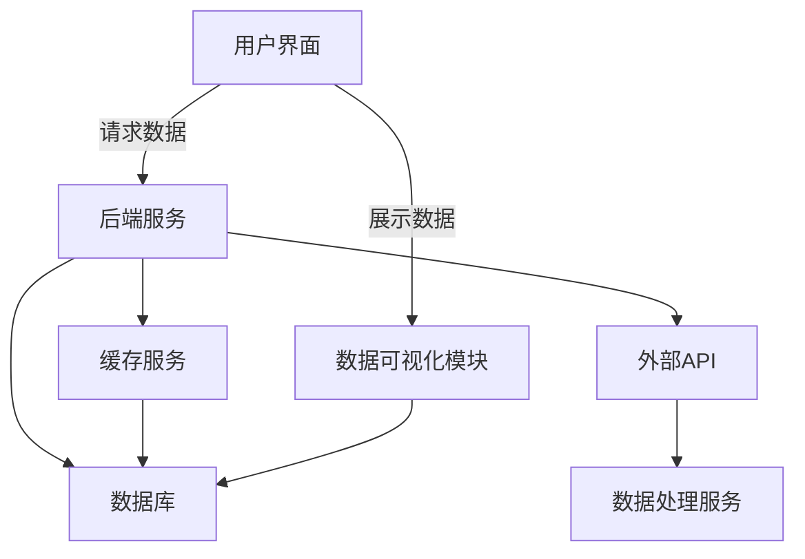

## 15
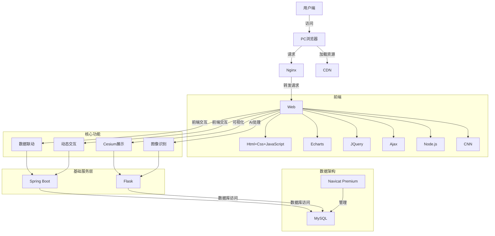

## 16
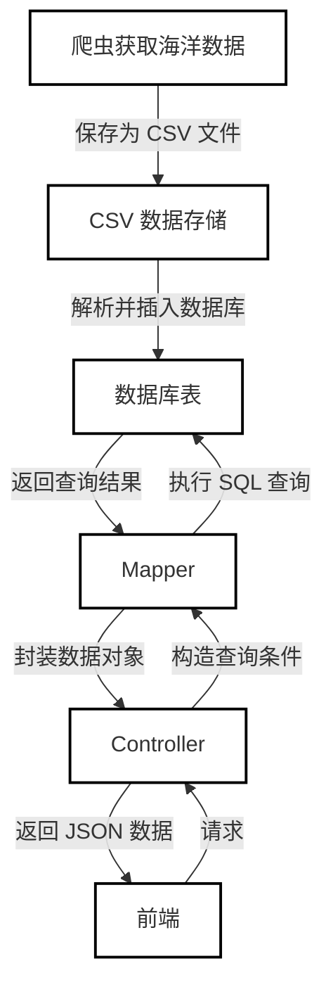

## 17
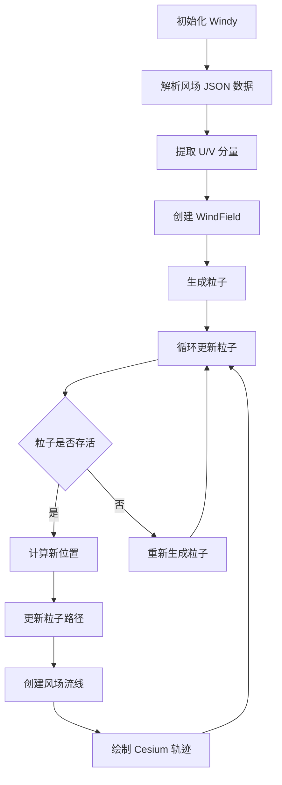

## 18
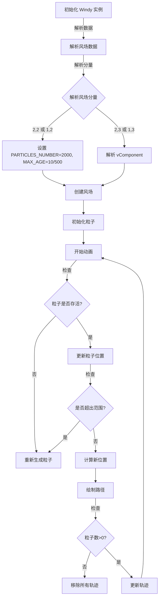

## 19
```mermaid
flowchart TD
    A[设置图像提供者为"otherOption"] --> B[关闭热力图条]
    B --> C[关闭盐度条]
    C --> D[关闭溶解氧条]
    D --> E[隐藏时间]
    E --> F[禁用时钟动画]
    F --> G[移除'onTick'事件监听器]
    G --> H[发起AJAX GET请求获取洋流数据]
    H --> I[请求成功后，初始化'Windy'对象，传入数据和Viewer]
    I --> J[调用重绘函数定时刷新洋流动画]
    J --> K[触发'其他选择'函数]

```

##　20
```mermaid
graph TD;
    A[数据准备] -->|收集鱼类图片数据| B[数据预处理];
    B -->|归一化、增强| C[模型训练];
    C -->|TensorFlow 训练 CNN| D[保存模型];
    D -->|导出 saved_model| E[加载模型];
    
    E -->|app.py: Flask 服务器| F[用户上传图片];
    F -->|存入 static/ 目录| G[模型推理];
    G -->|调用 classify_fish()| H[返回分类结果];
    H -->|展示到 index.html| I[用户查看];

    E -->|test.py: 本地测试| J[读取本地图片];
    J -->|调用 classify_fish()| K[输出分类结果];
    K -->|终端显示| L[测试完成];
```

## 21
```mermaid
graph TD;
    A[加载数据集] -->|读取鱼类图片数据| B[数据预处理];
    B -->|归一化、数据增强| C[划分训练集 & 测试集];
    C -->|构建 CNN 模型| D[模型初始化];
    D -->|前向传播| E[计算损失];
    E -->|反向传播 & 更新权重| F[优化模型];
    F -->|循环训练多轮| G[模型训练完成];
    G -->|验证模型| H[计算准确率];
    H -->|评估测试集表现| I[模型保存];
    I -->|导出为 saved_model| J[完成训练];

```

## 22
```mermaid
graph TD;
    A[开始] --> B[加载数据集 train_dir]
    B -->|成功| C[数据增强/归一化]
    B -->|失败| X[报错: 无法加载数据]

    C --> D[构建 CNN 模型]
    D --> E[编译模型 Adam + categorical_crossentropy]
    E --> F[训练模型 epochs=10]
    
    F --> G{训练完成?}
    G -->|是| H[保存模型 model.h5]
    G -->|否| F

    H --> I{是否进行推理?}
    I -->|是| J[加载模型]
    I -->|否| Z[结束]

    J --> K[读取并预处理图像]
    K --> L[进行推理, 获取预测结果]
    L --> M[取最大概率索引 argmax]
    M --> N[映射为类别标签]
    N --> O[输出预测结果]
    
    O --> Z[结束]
```

## 23
```mermaid
graph TD;
    A[用户上传鱼类图像] --> B[图像预处理]
    B --> C[卷积神经网络模型推理]
    C --> D[获取预测类别]
    D --> E[匹配鱼类资料]
    E --> F[展示识别结果]
    F --> G[用户查看详细信息]
```

## 24
```mermaid
graph TD;
    A[数据预处理] --> B[数据增强与归一化]
    B --> C[模型构建]
    C --> D[模型训练]
    D --> E[模型评估]
    E --> F{准确率是否足够？}
    F -- 否 --> C[调整模型并重新训练]
    F -- 是 --> G[保存模型]
    G --> H[推理（Inference）]
    H --> I[鱼类种类分类]
    I --> J[结果展示]

```

## 25
```mermaid
graph LR
Input(64,64,3) -->|3×3 conv| Conv1(62,62,32)
Conv1 -->|2×2 pool| Pool1(31,31,32)
Pool1 -->|3×3 conv| Conv2(29,29,64)
Conv2 -->|2×2 pool| Pool2(14,14,64)
Pool2 -->|3×3 conv| Conv3(12,12,64)
Conv3 --> Flatten(9216)
Flatten --> Dense(64)
Dense --> Output(4)
```

## 26
```mermaid
graph TD
    A[开始训练] --> B[数据预处理]
    B --> C[构建CNN模型]
    C --> D[配置优化器与损失函数]
    D --> E[加载训练/验证数据]
    E --> F[初始化训练参数]
    F --> G[开始epoch循环]
    G --> H[前向传播计算]
    H --> I[反向传播更新权重]
    I --> J[验证集评估]
    J --> K{验证损失下降?}
    K -- 是 --> L[保存当前最佳模型]
    K -- 否 --> M[触发学习率衰减]
    L --> N{连续5周期未提升?}
    M --> N
    N -- 是 --> O[恢复最佳权重]
    O --> P[终止训练]
    N -- 否 --> G
    P --> Q[保存最终模型]
    Q --> R[结束]
```

## 27
推理流程图
```mermaid
graph TD
    A[开始推理] --> B[加载SavedModel]
    B --> C[遍历图像目录]
    C --> D{检测到图像文件?}
    D -- 是 --> E[批量读取图像]
    D -- 否 --> F[抛出路径错误]
    E --> G[统一缩放至64x64]
    G --> H[像素归一化]
    H --> I[构建输入张量]
    I --> J[执行前向传播]
    J --> K[解析概率分布]
    K --> L[取argmax得类别]
    L --> M[匹配分类标签]
    M --> N[输出预测结果]
    N --> O[结束]
```

## 28
```mermaid
graph TD
    A[ImageNet预训练模型] --> B[冻结卷积层]
    B --> C[特征提取]
    C --> D[全局平均池化]
    D --> E[全连接层]
    E --> F[Dropout]
    F --> G[Softmax分类]
    style A fill:#ffffff,stroke:black
    style B fill:#ffffff,stroke:black
    style C fill:#ffffff,stroke:black
    style D fill:#ffffff,stroke:black
    style E fill:#ffffff,stroke:black
    style F fill:#ffffff,stroke:black
    style G fill:#ffffff,stroke:black

```

## 29
```mermaid
flowchart LR
    A[ImageNet 图像数据] --> B[预训练 CNN 模型 MobileNetV2]
    B -->|冻结权重，提取通用特征| C[特征提取层]
    C --> D[全局平均池化]
    D --> E[自定义分类器：全连接层、Dropout、Softmax]
    E --> F[输出：鱼类分类结果]

    subgraph 微调阶段
        C
        D
        E
    end

    style A fill:#FFF2CC,stroke:#999
    style B fill:#F0F0F0,stroke:#555,stroke-width:2px
    style C fill:#D5E8D4
    style E fill:#D0E0FF,stroke:#2980b9,stroke-width:2px
    style F fill:#C0FFC0,stroke:#2ecc71,stroke-width:2px


```
